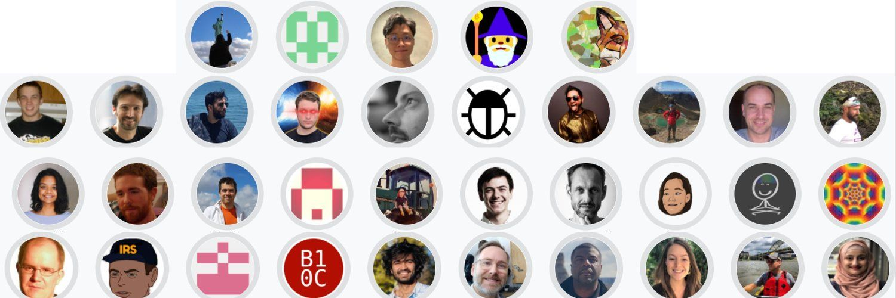

## Purpose

Introduce university students to bitcoin open-source development and design.

## Why

**Misallocation of Resources**

<figure>

<figcaption>Lone excavator trying to refloat a giant cargo ship</figcaption>
</figure>
> “several hundred PRs, open issues in bitcoin core...  
> the number of people doing good, consistent review and testing is surprisingly low.  
> when i describe this situation to people, even to established ones in the bitcoin space,  
> they tend to be astonished at how few people the system is depending on.”  
>  [Jon Atack, Bitcoin Core Contributor](https://jonatack.github.io/articles/on-reviewing-and-helping-those-who-do-it?ref=blog.summerofbitcoin.org)

Store of Value, Sound Money, Bitcoin. These are arguably some of the most important problems to work on in the 21st century: fix the money, fix the world.

Over a million students every year enroll in a computer science undergraduate program in India. As per GitHub, India is the fastest growing country in the world in terms of new developers contributing to open source. Its developer community on GitHub is 5.8 million-strong. In the last year alone, 1.8 million more Indian developers joined the platform and contributed considerably more than their global peers. For a country that is a world leader in producing software developers, how many of these Indian developers work on Bitcoin as full-time contributors? You can count them on one hand!

Bitcoin needs a lot more work ahead. With a prestige advantage and enough cash to offer enormous starting salaries, Big Tech stakes out computer science students across the globe. The growth of coding boot camps has given rise to a class of web developers but isn't translating to a new cohort of open-source Bitcoin and Lightning developers.

Despite the bull run, there hasn't been that much of an uptick in new developers finding their way to critical projects. In fact, finding a foothold to attract university students in the post "blockchain not bitcoin" era can be downright frustrating. Other cryptocurrency projects with centralized foundations spend lavishly to market in the form of education via hackathons, certificate courses, and grants. When it comes to places like India and Africa, the narrative is that bitcoin is old, boring, and obsolete.

India accounts for 17% of the world’s population. The whole of Africa is another 17%. Together with China, they make up 51% of the world’s population.  How many developers from India, Africa and China are securing a potential reserve currency of the world? How many from other smaller nations? How many in total? Not enough.

**Cultural and Regulatory Schizophrenia**

India has one of the most ancient and deeply sacrosanct relationships with sound money. Its value system fosters an unflinching desire in every Indian household to acquire gold as a means of protecting one's wealth. It’s a country of 1.4 billion people with 300 million households that own gold, understand gold and continue to accumulate gold.

<figure>

<figcaption>Stacking gold?</figcaption>
</figure>

Yet, few in India are probing the deeper promise of sound money in the form of bitcoin. What’s worse is the government’s schizophrenic outlook on bitcoin and the prevalence of a swindling get-rich-quick narrative about cryptocurrencies.

<figure>

<figcaption>Ponzi or digital gold?</figcaption>
</figure>

Furthermore, bitcoin has attracted zero interest from universities and remains illegitimate in the eyes of students and their families. Again, not just true for India, but in a majority of nations across the world.

**Crossing the Bitcoin Chasm**

<figure>

<figcaption>Going mainstream</figcaption>
</figure>

Bitcoin today is where the internet was in 1995. At the time, the internet was a nascent, experimental technology yet to be widely adopted. The decades that followed saw every individual, corporation and government adopt the internet to exchange information. As a global, non-political store of value and settlement network, bitcoin is poised to follow the same trajectory as the internet, eventually adopted by every individual, corporation and government to exchange value anywhere in the world, in real time, 24/7, 365 days of the year. But today, most individuals, corporations and governments simply don’t know the what, why and how of bitcoin.

Bitcoin does not cross the chasm or go mainstream without the tools, resources and advocates it needs to enable widespread adoption.

## Introducing Summer Of Bitcoin

<figure>

<figcaption>I was made for sunny days</figcaption>
</figure>

Summer of Bitcoin is a global, online summer internship program focused on introducing university students to bitcoin open-source development and design.  
  
Students get involved in and write code for projects matching their interests, earn bitcoin as stipend and put their summer break to good use. The project communities provide mentors who guide students through the entire summer, helping students learn about the community and contribute code.  
  
The program strives to bring in a diverse cohort of students every year. We started in India this summer. Next summer, the program will be open for students globally, from Asia and Africa to the Americas and Europe. From underrepresented regions to underserved demographics of women and people of color. After all, Bitcoin should be for everyone and by everyone.

### What’s in it for students?

1. Learn about bitcoin and open source development
2. Build a network with bitcoiners around the world
3. Earn bitcoin, pseudonymously if they prefer
4. Become full-time open source contributors or join the bitcoin industry
5. Contribute to monetary revolution

### What’s in it for participating projects and their associated mentors?

1. More code and more code reviews
2. Identify and bring in new full-time contributors
3. Contribute to monetary revolution

## Summer of Bitcoin fixes it

We serve to

1. **Grow the developer community** by helping university students learn about and contribute to bitcoin
2. **Catalyze a cultural and regulatory shift** by making acolytes out of a rising constituency of youth
3. **Bridge the gap** by building tools and resources to help individuals, corporations and governments cross the bitcoin chasm

## Our 2021 program

Back in June, we launched a pilot program for university students in India. It was intended to gather data and better understand the moving pieces of a university program. We imagined 5 to 10 students signing up for an open-source program loosely modeled on [Google Summer of Code](https://summerofcode.withgoogle.com/?ref=blog.summerofbitcoin.org) and started by sending out five emails to a few Indian universities with which we had contacts. The response was unexpected. Instead of a trickle, we got a flood of applications -- 4,816 in 10 days.  
After a grueling code challenge, we narrowed the field to 580 students who were then asked to complete an exercise testing their ability to navigate through ambiguity, demonstrate bias for action and work independently. We selected 120 students for a final round of video interviews assessing their communication skills and their interests in bitcoin and open source development.

51 students, across 26 engineering universities in India, with backgrounds in computer science, electrical engineering and mathematics were accepted into the first Summer of Bitcoin program.

Next, we had to find them open-source bitcoin projects to work on. Organized mentorship in the Bitcoin community is rare. And yet, we were encouraged by the positive response we received from our request for volunteers. We found Bitcoin FOSS contributors quite open to the idea of donating their time and energy. They just needed to be asked.

We signed up 40 mentors across 22 open-source projects related to Bitcoin and the Lightning Network for an intense 12 weeks of open-source development.

<figure>

<figcaption>It takes a village...</figcaption>
</figure>

This summer was a learning experience for everyone involved. The students were eager but very green when it came to Bitcoin. During the first week of the program, we invited guest speakers from the Bitcoin ecosystem to [talk](https://www.youtube.com/playlist?list=PLdW8AKJtqW7sPd8h6pnFW1FatzzhGgUR1&ref=blog.summerofbitcoin.org) about Bitcoin, what it means to them and why it's important.

To get them up and running on the mechanics of bitcoin, we invited [Kalle Rosenbaum](https://twitter.com/kallerosenbaum?ref=blog.summerofbitcoin.org), author of [Grokking Bitcoin](https://www.manning.com/books/grokking-bitcoin?ref=blog.summerofbitcoin.org), for an intense week-long technical crash course on Bitcoin. Students learnt about hash functions, digital signatures, blockchain, transactions, wallets, proof-of-work, peer-to-peer network, segwit and all technical aspects that go into Bitcoin. The [course](https://www.youtube.com/playlist?list=PLdW8AKJtqW7u7JKzkiXsDxNFlOrmjGwDJ&ref=blog.summerofbitcoin.org) is now available to everyone for free.

We also organized a 2-day [workshop](https://www.youtube.com/playlist?list=PLdW8AKJtqW7tfrxzLHIBnQjXYzeinZifZ&ref=blog.summerofbitcoin.org) with [thunderbiscuit](https://twitter.com/thunderB__?ref=blog.summerofbitcoin.org) to build Bitcoin wallets on android using [BDK](https://bitcoindevkit.org/?ref=blog.summerofbitcoin.org). We hope to see a flurry of wallets for local markets across Asia and Africa in the near future and think that students would be a great group to get things going.

The students ran through the [Chaincode Seminar](https://chaincode.gitbook.io/seminars/?ref=blog.summerofbitcoin.org) and we rounded things out with office hours and even some game nights. But none of that had the same impact as that of [40 mentors](https://www.summerofbitcoin.org/mentors?ref=blog.summerofbitcoin.org) spanning twenty-two different bitcoin-related projects. This program wouldn't be possible without them and we will be eternally grateful for letting us experiment while they filled in the gaps.

For the students, organizers, mentors and projects themselves, this summer has been anything but typical. Very few among the students had any background in bitcoin or open-source and some even thought it was a ponzi scheme. Today, they are [fixing](https://github.com/0xB10C/bitcoin/pull/1?utm_campaign=Summer%20of%20Bitcoin&utm_medium=email&utm_source=Revue%20newsletter) [issues](https://github.com/bitcoin/bitcoin/pull/22565?utm_campaign=Summer%20of%20Bitcoin&utm_medium=email&utm_source=Revue%20newsletter) in Bitcoin Core, [helping](https://github.com/rust-bitcoin/rust-miniscript/commits?author=SarcasticNastik&utm_campaign=Summer%20of%20Bitcoin&utm_medium=email&utm_source=Revue%20newsletter) with Bitcoin scripts, [improving](https://github.com/shobhitaa/Joinmarket-SOB/commits/main?utm_campaign=Summer%20of%20Bitcoin&utm_medium=email&utm_source=Revue%20newsletter) privacy, [improving](https://github.com/dgarage/NBXplorer/commits?author=sageprogrammer&utm_campaign=Summer%20of%20Bitcoin&utm_medium=email&utm_source=Revue%20newsletter) [payments](https://github.com/btcpayserver/btcpayserver/pull/2764?utm_campaign=Summer%20of%20Bitcoin&utm_medium=email&utm_source=Revue%20newsletter), building [wallets](https://github.com/spesmilo/electrum/pull/7453/files?utm_campaign=Summer%20of%20Bitcoin&utm_medium=email&utm_source=Revue%20newsletter), [adding](https://github.com/RCasatta/rust-bitcoincore-rpc/pull/1?utm_campaign=Summer%20of%20Bitcoin&utm_medium=email&utm_source=Revue%20newsletter) [support](https://github.com/bitcoindevkit/bdk/pull/402?utm_campaign=Summer%20of%20Bitcoin&utm_medium=email&utm_source=Revue%20newsletter) for taproot in Bitcoin Dev Kit, [building](https://github.com/search?q=org%3Abitcoindevkit%20DarthBenro008&type=commits&utm_campaign=Summer%20of%20Bitcoin&utm_medium=email&utm_source=Revue%20newsletter) on Lightning, [adding](https://github.com/rustyrussell/bolt12/commits?author=adi2011&since=2021-07-31&until=2021-08-23&utm_campaign=Summer%20of%20Bitcoin&utm_medium=email&utm_source=Revue%20newsletter) support for bolt12, the [list goes on](https://www.summerofbitcoin.org/program-details?recordId=recb5dFNrRPnjHrWy&ref=blog.summerofbitcoin.org). They are excitedly talking about Bitcoin among their parents, peers and neighbors, educating them about the 21 million hard-cap, proof-of-work, how Bitcoin is decentralized and why it's arguably the most important problem to work on in the 21st century.

This summer was far from perfect. We made plenty of mistakes but we are still encouraged by the results and we are excited to do more. We hope this is the start of something big. Something global. Something we can all be proud of.

## A note of thanks

We are incredibly thankful for the generous financial support of [Spiral](https://spiral.xyz/?ref=blog.summerofbitcoin.org) who sponsored the entirety of this summer’s program, including the student stipends and an annual grant for [Adi](https://twitter.com/adi_shankara_?ref=blog.summerofbitcoin.org) to help grow it into a thriving global program. Spiral has pioneered a revolutionary model for supporting bitcoin open-source development and we’re excited by their ambition to make bitcoin the planet’s preferred currency.

We are grateful to [Chaincode Labs](https://chaincode.com/?utm_campaign=Summer%20of%20Bitcoin&utm_medium=email&utm_source=Revue%20newsletter) for supporting us with their time, resources and invaluable experience in organizing a transformative learning program for bitcoin.

Thank you to [Ledger](https://www.ledger.com/?utm_campaign=Summer%20of%20Bitcoin&utm_medium=email&utm_source=Revue%20newsletter), [XBTO](https://www.xbto.com/?utm_campaign=Summer%20of%20Bitcoin&utm_medium=email&utm_source=Revue%20newsletter), [StableHouse](https://www.stablehouse.io/?utm_campaign=Summer%20of%20Bitcoin&utm_medium=email&utm_source=Revue%20newsletter), [NYDIG](https://nydig.com/?utm_campaign=Summer%20of%20Bitcoin&utm_medium=email&utm_source=Revue%20newsletter) and [Gemini](https://www.gemini.com/?utm_campaign=Summer%20of%20Bitcoin&utm_medium=email&utm_source=Revue%20newsletter) for giving us your time, understanding our purpose and choosing to support us financially. A special note of thanks to Ledger who also donated enough hardware wallets for all our students and [Unchained Capital](https://unchained-capital.com/?utm_campaign=Summer%20of%20Bitcoin&utm_medium=email&utm_source=Revue%20newsletter) for helping us with a multisig account.

To the mentors, thank you for your time and commitment. We threw a lot at you without much guidance.

To the community, thank you for cheering us.

## What's next

Next year, Summer of Bitcoin is going global. University students all over the world will be eligible to apply for a summer internship program to work on open-source bitcoin projects. Scaling mentorship is going to be a challenge. We were so incredibly lucky to have so many mentors volunteer. Discovering how to retain high-performing students as student-mentors to supplement the existing Bitcoin/Lightning developers is going to be part of the adventure.

But the last few weeks have proven that this can be done. Summer of Bitcoin is hope. Hope that we can compete for university students amongst the many temptations being offered to them. Hope that we can change the narrative. Hope that we can further decentralize the pipeline of developers contributing to bitcoin in the future.

If you are a university student curious about bitcoin, applications for Summer of Bitcoin 2022 open in January next year and we encourage you to apply. If you have questions or ideas for the program or just want to talk to us, send us an email at hello<at>summerofbitcoin.org.

Adi  
Lead, Summer of Bitcoin
