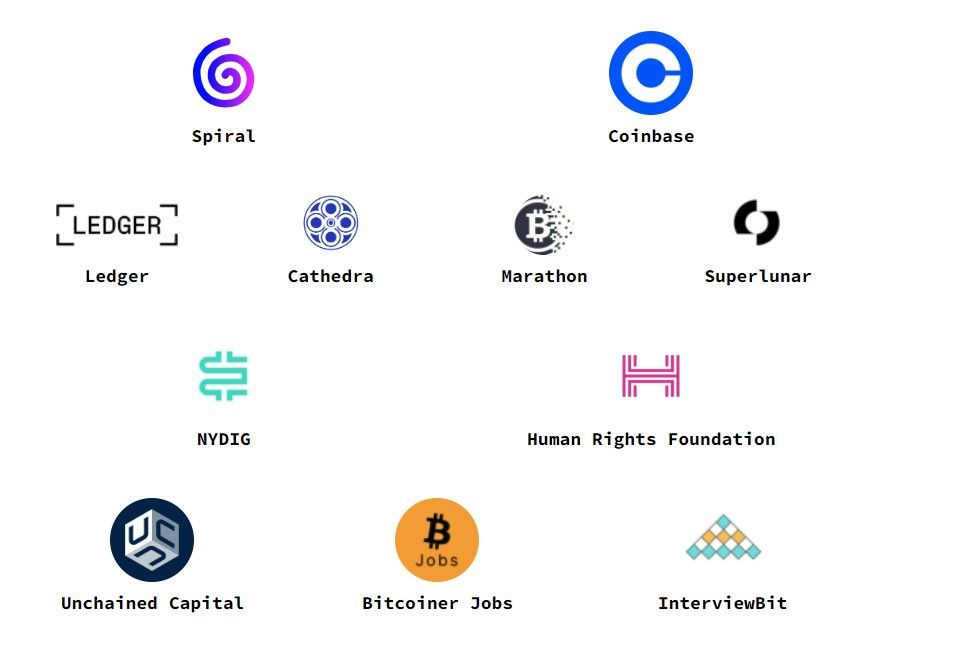

Thank you to all the students who applied for Summer of Bitcoin 2022!

We are excited to announce that 29 open-source bitcoin projects, with 60 open-source bitcoin developers and designers as mentors, have selected their students for the Summer of Bitcoin 2022 program. Here are some notable results from this year’s application process:

* 20317 student applications
* Students from 51 countries applied
* 83 students were selected from 15 countries

<figure>

<figcaption>For the 2022 program, we’re thrilled to include a designer track for the first time for students interested in contributing to open-source bitcoin design and UX! Out of 83 students selected, 9 students will contribute to open-source bitcoin design and 74 students will contribute code. You can view each of their project proposals at [2022 Student Projects](https://www.summerofbitcoin.org/2022-project-ideas?ref=blog.summerofbitcoin.org).</figcaption>
</figure>

Selected students come from countries around the world including Argentina, Brazil, Canada, China, Egypt, Finland, Germany, Greece, India, Italy, Mexico, Nigeria, Poland, Singapore and the United States. The highest number of accepted students are from India. All students will receive a stipend of $3000 in BTC on successful completion of their projects.

All 83 students are paired with a mentor to begin planning their projects and milestones. For the first few weeks, students will get acquainted with their mentor, engage with the project’s open-source community and finalize their project plans. Work then begins on May 23rd, continuing through the summer until August 15th. Students will also participate in bitcoin and lightning protocol development seminars [curated](https://chaincode.gitbook.io/seminars/?ref=blog.summerofbitcoin.org) by Chaincode Labs, apart from several talks from notable guest speakers in the bitcoin industry.

<figure>

<figcaption>Sponsors and Partners for Summer of Bitcoin 2022</figcaption>
</figure>

We are incredibly thankful to [Spiral](https://spiral.xyz/?ref=blog.summerofbitcoin.org) and [Coinbase](https://www.coinbase.com/?ref=blog.summerofbitcoin.org), our principal sponsors for the 2022 program, for their generous financial support. We’re also supported by our community sponsors [Ledger](https://www.ledger.com/?ref=blog.summerofbitcoin.org), [Cathedra](https://www.cathedra.com/?ref=blog.summerofbitcoin.org), [Marathon](https://marathondh.com/?ref=blog.summerofbitcoin.org), [Superlunar](https://www.superlunar.com/?ref=blog.summerofbitcoin.org), [NYDIG](https://www.nydig.com/?ref=blog.summerofbitcoin.org) and [Human Rights Foundation](https://hrf.org/?ref=blog.summerofbitcoin.org) and by our partners [Unchained Capital](https://www.unchained.com/?ref=blog.summerofbitcoin.org), [Bitcoiner Jobs](https://bitcoinerjobs.com/?ref=blog.summerofbitcoin.org) and [InterviewBit](https://interviewbit.com/?ref=blog.summerofbitcoin.org). A special note of thanks to [Spiral](https://spiral.xyz/?ref=blog.summerofbitcoin.org) for funding our program operations and to [Ledger](https://www.ledger.com/?ref=blog.summerofbitcoin.org) for donating hardware wallets to this year's cohort.

For the students who could not make it, there are other ways to pursue your interests in bitcoin open-source development and design. Staying connected with the project communities is a good first step and sets the stage for future opportunities. A great resource is our [student guide](https://guide.summerofbitcoin.org/being-turned-down?ref=blog.summerofbitcoin.org), which has suggestions on what to do if you weren’t selected for this year’s program. It also has a chapter on ‘Getting started with an organization and project’ which is helpful whether you would like to connect now with projects on your own or decide to apply to Summer of Bitcoin in the future - which we hope you do!  
  
Here’s to the 2nd year of Summer of Bitcoin!