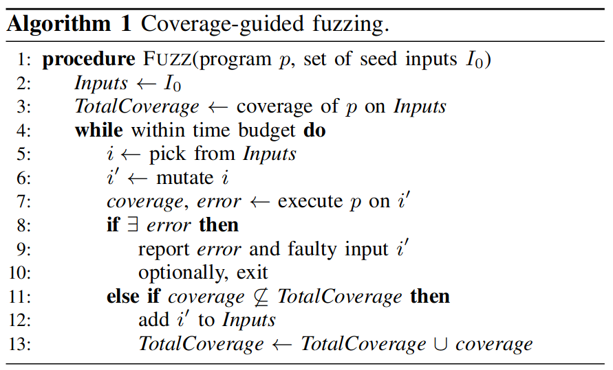
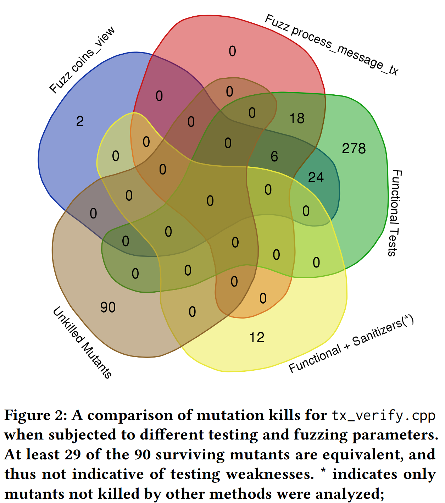

## Abstract

Bitcoin is a widely used distributed system that is time-tested and recognized to be secure. However, most of the existing research focus on its theoretical security model, while ignoring the possible vulnerabilities in its software implementation. This article will review how fuzzing, an increasingly popular automated vulnerability detection method, has been used in practice and refined stage by stage by Bitcoin Core developers. In addition, we will describe recent work published in ICSE 2022 that analyzes three different software testing techniques and summarizes their practical effects when applied to Bitcoin Core.

## Intro

Bitcoin is one of the most prominent distributed software systems in the world, and a key part of a potentially revolutionary new form of decentralized financial (DeFi) tool, cryptocurrency. Due to its distributed nature, Bitcoin in some sense is the sum of the operations of the code executed by many independent nodes rather than the original software created by Satoshi Nakamoto. There are several different implementations of Bitcoin written in various programming languages, like [btcd](https://github.com/btcsuite/btcd?ref=blog.summerofbitcoin.org), [bcoin,](https://github.com/bcoin-org/bcoin?ref=blog.summerofbitcoin.org) and [bitcoin-s](https://github.com/bitcoin-s/bitcoin-s?ref=blog.summerofbitcoin.org). However, Bitcoin Core, written in C++, is the *reference implementation* of the Bitcoin system, meaning that it is the authoritative reference on how each part of the technology should be implemented. To a significant degree, the code of Bitcoin Core is Bitcoin, so we may mix these two terms in this paper. The main Bitcoin Core repo on GitHub has over 64,000 stars and has been forked more than 32,000 times.

Because of Bitcoin's fame and the high monetary value, the Bitcoin protocol and its implementations are a high-value target for hackers. Though many works have been done to analyze the security model of Bitcoin, most of them focused on theory but ignore software implementation. This paper will describe how Bitcoin Core, as a popular open-source software (OSS), uses fuzzing to secure its codebase against potential vulnerabilities. Our main contributions are:

* We present the first insight into the long-term evolution of Bitcoin Core's fuzzing infrastructure by investigating every footprint left by developers on GitHub
* We describe the survey presented at ICSE 2022 about different software testing techniques and how they improve Bitcoin's fuzzing effect

## Background

Among the many software testing techniques available today, fuzzing has remained highly popular due to its conceptual simplicity, its low barrier to deployment, and its vast amount of empirical evidence in discovering real-world software vulnerabilities. At a high level, fuzzing refers to a process of repeatedly running a program with generated inputs that may be syntactically or semantically malformed. It is necessary to provide background on coverage-guided fuzzing and OSS-Fuzz.

### Coverage-guided Fuzzing

Coverage-guided fuzzing (CGF), implemented by tools such as AFL, libFuzzer, and honggfuzz, is a popular bug detection method. CGF uses genetic search to find inputs that maximize code coverage. Algorithm 1 describes CGF at a high level. The algorithm maintains a pool of *Inputs* and the *TotalCoverage* of program $p$ on Inputs. The user provides seed inputs to instantiate *Inputs*. The fuzzer repeatedly picks an input $i$ from the pool of Inputs and applies a mutation (e.g., increment, bit flip, or user-defined mutations) to produce $i′$. The fuzzer then executes program $p$ on mutated input $i′$ to gather the coverage of program $p$ on $i′$ and detect any error, such as crashes, assertion violations, timeouts, memory leaks, etc. If $i′$ does not trigger an error and discovers new coverage that is not previously seen in *TotalCoverage*, then add $i′$ to *Inputs* and update *TotalCoverage*. By finding inputs that cover new code, CGF aims to test as much of the program as possible.



Fuzzers need an entrypoint into the program to provide test inputs; such an entrypoint is often called a fuzz target. libFuzzer-style fuzz targets — which AFL and honggfuzz also support and OSS-Fuzz uses — are functions that take in fuzzer-generated arbitrary bytestream input, transform the input to program-usable input data if needed, and execute the program under test with the input.

### Continuous Fuzzing and OSS-Fuzz

Continuous fuzzing uses fuzzing as part of a continuous testing strategy to find regressions as software evolves. Several organizations incorporate fuzzing as part of their quality assurance strategy or offer tools that provide continuous fuzzing as a service.

OSS-Fuzz is Google’s continuous fuzzing service for open source software projects, which combines modern fuzzing techniques with scalable, distributed execution. OSS-Fuzz uses ClusterFuzz, Google’s scalable fuzzing infrastructure as its back-end. Figure 1 illustrates OSS-Fuzz’s workflow. Developers in a participating OSS project write fuzz targets and provide instructions for building the software. OSS-Fuzz continuously builds the software and uploads it to ClusterFuzz. ClusterFuzz finds fuzz targets and uses the coverage-guided fuzzers AFL, libFuzzer, and honggfuzz to fuzz the software. Upon detecting a bug, ClusterFuzz checks whether the bug is a duplicate of any previously found bugs, minimizes the bug inducing input, and bisects the range of commits in which the regression occurred. If the bug is not a duplicate, then ClusterFuzz files a bug report on Monorail, an issue tracker. ClusterFuzz periodically verifies whether any previously found bugs are fixed; if so, OSS-Fuzz updates fixed bugs’ report.

<figure>

<figcaption>## Bitcoin Fuzzing Infrastructure</figcaption>
</figure>

### History


#### Stage 1: Proof of Concept (2013-2016)

Neither Bitcoin nor fuzzing has a long history. The first piece of code about fuzzing was introduced by [Gavin Andresen](https://github.com/gavinandresen?ref=blog.summerofbitcoin.org) in [PR#3173](https://github.com/bitcoin/bitcoin/pull/3173?ref=blog.summerofbitcoin.org), which just added a simple protected method in the `CNode` class. All it can do is randomly corrupt 1-of-N sent messages. It was understandably primitive, since AFL, the widely-used generic fuzzer, does not even exist until 2 months later in 2013.

Three years later in 2016, [Patrick Strateman](https://github.com/pstratem?ref=blog.summerofbitcoin.org) first attempted to bring a simple fuzzing framework to Bitcoin in [PR#7940](https://github.com/bitcoin/bitcoin/pull/7940?ref=blog.summerofbitcoin.org), but he did not make the code merged. Luckily, [laawj](https://github.com/laanwj?ref=blog.summerofbitcoin.org) resurrect pstratem's fuzzing framework as part of Bitcoin's test code in [PR#9172](https://github.com/bitcoin/bitcoin/pull/9172?ref=blog.summerofbitcoin.org). This simple fuzzing framework test deserialization by reading input from `stdin`, which makes it compatible with AFL.

#### Stage 2: Standardized Fuzzing (2017 - 2018)

In May 2017, Google announced rewards for open source projects that integrate fuzz targets into OSS-Fuzz. As a quick response, contributor [practicalswift](https://github.com/practicalswift?ref=blog.summerofbitcoin.org) proposed making Bitcoin ready for it in [Issue#10364](https://github.com/bitcoin/bitcoin/issues/10364?ref=blog.summerofbitcoin.org), where developers made lots of discussions. He also added two more tests for deserialization routines used by `ProcessMessage` in [PR#10409](https://github.com/bitcoin/bitcoin/pull/10409?ref=blog.summerofbitcoin.org), brought libFuzzer support in [PR#10440](https://github.com/bitcoin/bitcoin/pull/10440?ref=blog.summerofbitcoin.org), and made fuzzing ~200x faster by enabling AFL's deferred forkserver and persistent mode in [PR#10415](https://github.com/bitcoin/bitcoin/pull/10415?ref=blog.summerofbitcoin.org). Thanks to his efforts, Bitcoin has made big progress in setting up fuzz testing suites, but that is still not enough for production due to low code coverage. Besides, OSS-Fuzz's policy about short bug disclosure period is not agreed upon by all members.

Another interesting thing that happened in 2017 is that [Guido Vranken](https://github.com/guidovranken?ref=blog.summerofbitcoin.org), known for [fuzzing cryptographic libraries](https://github.com/guidovranken/cryptofuzz?ref=blog.summerofbitcoin.org), offered his [13 different fuzzers](https://github.com/guidovranken/bitcoin/tree/fuzzing/fuzzers?ref=blog.summerofbitcoin.org) implemented as libFuzzer fuzz targets in [Issue#11045](https://github.com/bitcoin/bitcoin/issues/11045?ref=blog.summerofbitcoin.org). However, the existing simple fuzzer of Bitcoin is just a single binary that decides on the first few bits of the buffer what target to pick. This ineffective approach of switching between tests based on input is criticized for confusing the fuzzer with unnecessary re-use of fuzzing inputs, making it quite hard to see which fuzzers are still hitting new paths. It was not until Jan 2019 that [MarcoFalke](https://github.com/MarcoFalke?ref=blog.summerofbitcoin.org) managed to build fuzz targets into separate executables in [PR#15043](https://github.com/bitcoin/bitcoin/pull/15043?ref=blog.summerofbitcoin.org) by using different C preprocessor macros. He also renamed `test/fuzz/test_bitcoin_fuzzy.cpp` to `test/fuzz/deserialize.cpp` in [PR#15399](https://github.com/bitcoin/bitcoin/pull/15399?ref=blog.summerofbitcoin.org), which allows more fuzz targets that test different parts of Bitcoin code to be added in the future.

#### Stage 3: Scaling with the community (2019-2020)

2019 witnessed huge growth of Bitcoin's fuzzing infrastructure. To make fuzzing easily integrated with CI tests, [MarcoFalke](https://github.com/MarcoFalke?ref=blog.summerofbitcoin.org) added *test\_runner.py*, a script which is still used now, in [PR#15295](https://github.com/bitcoin/bitcoin/pull/15295?ref=blog.summerofbitcoin.org). He also simplified Makefile in [PR#15504](https://github.com/bitcoin/bitcoin/pull/15504?ref=blog.summerofbitcoin.org) by linking against `BasicTestingSetup`, which was shared with unit tests. After that, [practicalswift](https://github.com/practicalswift?ref=blog.summerofbitcoin.org) and he made lots of contribution to add more fuzzing harness for other part of Bitcoin's code, of which [PR#17009](https://github.com/bitcoin/bitcoin/pull/17009/?ref=blog.summerofbitcoin.org) is the first newly added fuzz harness.

The increased number of fuzz targets also brings several downsides as discussed in [Issue#20088](https://github.com/bitcoin/bitcoin/issues/20088?ref=blog.summerofbitcoin.org). Having many targets not only slowing down build process with coslty disk space and CPU time, but also makes writing new fuzz tests unnecessarily hard. In Decemeber 2020, [MarcoFalke](https://github.com/MarcoFalke?ref=blog.summerofbitcoin.org) made a huge refactoring with change of 100 files to link all targets once in [PR#20560](https://github.com/bitcoin/bitcoin/pull/20560?ref=blog.summerofbitcoin.org). By specifying environment variables, different fuzz targets can bde executed using only one binary. He proved that the single binary approach does not effect the fuzzing performance by showing benchmark results. So the basic architecture has not changed since then.

#### Stage 4: Embracing OSS-Fuzz (2021 - Present)

In May 2021, Bitcoin Core made its [initial integration](https://github.com/google/oss-fuzz/pull/5699?ref=blog.summerofbitcoin.org) into OSS-Fuzz. Till May 2022, [34 pull requests](https://github.com/google/oss-fuzz/pulls?q=is%3Apr+bitcoin+is%3Aclosed&ref=blog.summerofbitcoin.org) have been submitted to OSS-Fuzz for further improvement.

As Bitcoin Core participates in Google's [OSS-Fuzz](https://github.com/google/oss-fuzz/tree/master/projects/bitcoin-core?ref=blog.summerofbitcoin.org) program, there is a dashboard of [publicly disclosed vulnerabilities](https://bugs.chromium.org/p/oss-fuzz/issues/list?q=bitcoin-core&ref=blog.summerofbitcoin.org). Generally, vulnerabilities are disclosed as soon as possible after they are fixed to give users the knowledge they need to be protected. However, because Bitcoin is a live P2P network, and not just standalone local software, not every issue may be disclosed within Google's standard [90-day disclosure window](https://google.github.io/oss-fuzz/getting-started/bug-disclosure-guidelines/?ref=blog.summerofbitcoin.org) if a partial or delayed disclosure is important to protect users or the function of the network.

By reviewing the history of Bitcoin's fuzzing evolution, we can learn that it is not easy for Bitcoin, which is probably the most running distributed software in the world, to build its fuzzing infrastructure and integrate with OSS-Fuzz. Maintainers have to take many factors into consideration before accepting code changes.

### Case Study of Fuzz Target `process_message`

Fuzz target `process_message` is introduced in [PR#17989](https://github.com/bitcoin/bitcoin/pull/17989?ref=blog.summerofbitcoin.org), which enables high-level fuzzing of the P2P layer. All code paths reachable from this fuzzer can be assumed to be reachable for an untrusted peer so it worth taking a look at.

To achieve optimal results when using coverage-guided fuzzing, there are both one general fuzzing binary (`process_message`) which handles all messages types and specialized fuzzing binaries per message type (`process_message_addr`, `process_message_block`, `process_message_blocktxn` , etc.) The reason to have all message types in one fuzzers is to allow auto-detection bring auto-detection and thus fuzzing of newly introduced messages types without updating the fuzzer. The reason to have also have per-message-type fuzzers is largely for the same reason that we have one fuzzing binary per deserialization: to make it relatively easier for coverage guided fuzzers to reach deep.

```shell
void fuzz_target(FuzzBufferType buffer, const std::string& LIMIT_TO_MESSAGE_TYPE)
{
    FuzzedDataProvider fuzzed_data_provider(buffer.data(), buffer.size());

    ConnmanTestMsg& connman = *static_cast<ConnmanTestMsg*>(g_setup->m_node.connman.get());
    TestChainState& chainstate = *static_cast<TestChainState*>(&g_setup->m_node.chainman->ActiveChainstate());
    SetMockTime(1610000000); // any time to successfully reset ibd
    chainstate.ResetIbd();

    const std::string random_message_type{fuzzed_data_provider.ConsumeBytesAsString(CMessageHeader::COMMAND_SIZE).c_str()};
    if (!LIMIT_TO_MESSAGE_TYPE.empty() && random_message_type != LIMIT_TO_MESSAGE_TYPE) {
        return;
    }
    CNode& p2p_node = *ConsumeNodeAsUniquePtr(fuzzed_data_provider).release();

    connman.AddTestNode(p2p_node);
    g_setup->m_node.peerman->InitializeNode(&p2p_node);
    FillNode(fuzzed_data_provider, connman, *g_setup->m_node.peerman, p2p_node);

    const auto mock_time = ConsumeTime(fuzzed_data_provider);
    SetMockTime(mock_time);

    // fuzzed_data_provider is fully consumed after this call, don't use it
    CDataStream random_bytes_data_stream{fuzzed_data_provider.ConsumeRemainingBytes<unsigned char>(), SER_NETWORK, PROTOCOL_VERSION};
    try {
        g_setup->m_node.peerman->ProcessMessage(p2p_node, random_message_type, random_bytes_data_stream,
                                                GetTime<std::chrono::microseconds>(), std::atomic<bool>{false});
    } catch (const std::ios_base::failure&) {
    }
    {
        LOCK(p2p_node.cs_sendProcessing);
        g_setup->m_node.peerman->SendMessages(&p2p_node);
    }
    SyncWithValidationInterfaceQueue();
    g_setup->m_node.connman->StopNodes();
}
```

The basic idea is simple:

* On initialization, create a few blocks
* On each input, create a few random network peers
* Then receive random messages from those random peers

### Fuzz Trophies

A collection of bugs found by developers via fuzzing can be found at [https://github.com/bitcoin-core/bitcoin-devwiki/wiki/Fuzz-Trophies](https://github.com/bitcoin-core/bitcoin-devwiki/wiki/Fuzz-Trophies?ref=blog.summerofbitcoin.org). Some of them are actually exploitable vulnerabilities. For instance, [CVE-2017-18350](https://nvd.nist.gov/vuln/detail/CVE-2017-18350?ref=blog.summerofbitcoin.org) is a buffer overflow vulnerability which allows a malicious SOCKS proxy server to overwrite the program stack on systems with a signed `char` type (including common 32-bit and 64-bit x86 PCs). The vulnerability was introduced in 2012 and kept unknown until practicalswift used fuzzing to find it and disclosed it to security team in 2017. [PR#19203](https://github.com/bitcoin/bitcoin/pull/19203/?ref=blog.summerofbitcoin.org) added a regression fuzz harness for it.

## Software Testing Techniques To Improve Fuzzing

Although Bitcoin Core has put much effort into fuzzing, it seemed that the fuzzing was stuck: neither code coverage nor found bugs were increasing with additional fuzzing time. This is a common phenomenon called ***saturation*** when fuzzing software. That is, at first a particular fuzzer applied to a system will tend to continuously increase both coverage and discovery of previously-unknown bugs. But, at some point, the number of new bugs found by the fuzzer drops off, eventually approaching zero.

The underlying reason for saturation is that any fuzzer can explore a space of generated tests determined by a complex probability distribution. Some bugs lie in the high-probability portion of this space, and other bugs lie in very low probability or even zero probability parts of the space.

Groce, Alex, et al. present their work *Looking for Lacunae in Bitcoin Core's Fuzzing Efforts* at ICSE 2022, which describes how researchers of [Chaincode Labs](https://chaincode.com/?ref=blog.summerofbitcoin.org) applied various kinds of techniques to solve the problem. This section is a paraphrase of their work.

### Enhancing Diversity by Ensemble fuzzing

Ensemble fuzzing is an approach that recognizes the need for diverse methods for test generation, at least in the context of fuzzing; using multiple fuzzers to seed each other and avoid saturation is a core motivation for ensemble fuzzing. Inspired by ensemble methods in machine learning, ensemble fuzzing runs multiple fuzzers, and uses inputs generated by each fuzzer to seed the other fuzzers.

Note that in one important sense Bitcoin Core is using ensemble fuzzing, in that OSS-Fuzz runs multiple fuzzers, including libFuzzer, AFL, and Honggfuzz) with different compilation flags and sanitizers. Additionally, the Bitcoin Core team has servers running different fuzzers. All of these are coordinated via the qa-assets repository to which our Eclipser-based tests were added. This is, however, a more manual and less controlled process than true ensemble cross-seeding on-the-fly during a fuzzing campaign, and there are suggestions that a well-chosen coordination strategy can significantly improve ensemble effectiveness.

### Increasing Variance by Swarm Fuzzing

Swarm testing is a method for improving test generation that relies on identifying *features* of tests, and disabling some of the features in each test. For instance, if features are API calls, and we are testing a stack with `push`, `pop`, `top`, and `clear` calls, a non-swarm random test of any significant length will contain multiple calls to all of the functions. In swarm testing, however, for each test some of the calls (with a certain probability for each call) will be disabled, but different calls will be disabled for each generated test. This produces less variance between calls *within* tests, but much more variance *between* tests. Practically, in the stack example, it will enable the size of the stack to grow much larger than it ever would have any chance of doing in non-swarm testing, due to some tests omitting `pop` and/or `clear` calls.

The picture below shows the basic logic of [swarm testing](https://agroce.github.io/issta12.pdf?ref=blog.summerofbitcoin.org). There is a 1,000×1,000 array of pixels, where each 10×10 block represents a sequence of 100 function calls in an API sequence test. Each pixel is a call to a function, and the calls to five different functions are coded by color (black, white, red, green, and blue).
<figure>

</figure>

The top half of the figure is what traditional sequence generation will tend to do in such a setting, assuming each call is given equal probability: every test will look like every other test. The details will vary, but at a certain level the arrangement will be very homogeneous; in fact, the eye can’t tell where one test ends and another begins! Let’s call this the kitchen-sink approach to testing: every test generated throws in everything it can, at least potentially.

The bottom half of the figure represents *swarm testing*. In swarm testing, function calls in each test are not always included but potentially picked with a probability. On average, the diversity between calls within each test is *much worse* for the swarm portion of the testing. However, it is easy to tell tests apart, with practical consequences. Behind the visually obvious impact of swarm testing, there is simple statistical reality. While it is *possible* for a single method to be called 100 times using the kitchen-sink approach, the most instances of any single call we observed was 37. For the swarm tests, of course, each method was called more than 50 times (and in fact 100 times) in multiple tests.

Swarm testing probably works because most coverage targets, and most bugs, likely rely on including some test features (e.g., function calls), which can be designated *triggers*, but also are *prevented* by other function calls (designated *suppressors*).

In [Issue#22628](https://github.com/bitcoin/bitcoin/issues/22628?ref=blog.summerofbitcoin.org), Alex Groce tried swarm fuzzing on fuzz target `process_messages` for four weeks but he found the new coverage generated was minimal. Because there is a fuzz target `process_message` which only generate one type of message when running. The ability to run `process_message` with a single message type and the frequent introduction of the resulting inputs into `process_messages` (and the generic, unconstrained `process_message` fuzzing) probably, in a less automated way, also achieves many of the benefits of swarm testing itself: mixing complex lengthy runs of a single type or mix of types. It does show that some advanced fuzzing strategies can be anticipated by particularly savvy and capable fuzz engineers, willing to directly use raw fuzzing data, and write tools to support that kind of low-level hand-tuning of fuzz corpuses.

### Oracle Problem and Mutation Testing

Many efforts have been done to generate various test input that could reach more code. However, sometimes code coverage is already high enough and no bugs could be found because fuzzers actually know nothing about correctness. What is a bug? That is the question to fuzzers.

The only kind of bug that can be found easily without additional work is program crash, which is also the only behavior that AFL considers to be a bug. But programs can do bad things other than crash. For instance, a hello-world program will never crash, but it always fail to do the expected jobs.

In software testing, we use ***oracle*** to describe a source of insight into whether a program run did what it was supposed to do. The general term for a way to decide if a particular execution of a program is “good” or “bad” (if a test fails or passes, for example) is **oracle**.

Adding *assert* statements is one well-established way to make programs have oracle power. An assert just checks that something that *ought* to be true at runtime *is true*, and crashes the program if it isn’t. Another way to get more crashes automatically is to compile a program with a sanitizer. For example when using clang, adding `-fsanitize=address` will make the program crash if it performs a variety of unsafe memory operations that might otherwise not cause a problem, or at least not an obvious problem leading to a crash.

Mutation testing, compared with coverage, can provide more valuable information on oracle power. The basic idea of mutation testing is very simple: add new fake bugs by making small changes to the program then grade the testing effort according to how many bugs can be found.

To perform mutation analysis on Bitcoin, researchers generated mutations for code in the `tx_verify.cpp` file. Fuzzing covers 96 of 98 lines of code, 8 of 8 functions, and 74 of 102 branches for this file, guaranteeing that mutation testing will not primarily reflect missing coverage. Comparing coverage to that for functional testing, the fuzz testing has very slightly lower branch coverage, but the numbers are almost identical (72.5% vs. 73%), and the fuzz testing covers different branches than the functional testing. The missing lines are different for functional and fuzz testing as well. Figure 2 summarizes mutation analysis of the file `tx_verify.cpp`, which is critical to checking transactions for correctness.



Fuzzing adds only two unique mutant kills beyond those produced by the functional testing. This raises the question: why fuzz if we already have functional tests with high code coverage? The answer lies in the fact that, even in the presence of such high-quality tests, fuzzing uncovers subtle bugs that functional tests designed by humans will almost never detect, e.g. [https://github.com/bitcoin/bitcoin/issues/22450](https://github.com/bitcoin/bitcoin/issues/22450?ref=blog.summerofbitcoin.org). A major purpose of fuzzing is to address limits in more traditional functional testing, where known inputs are paired with expected behavior. While functional or unit testing is very powerful, the kinds of bugs found in vulnerabilities often involve the kind of inputs that don’t appear in normal unit/functional tests, as shown by the success of fuzzing and security audits. Fuzzing is not a replacement for functional/unit tests, and functional/unit tests are not a replacement for fuzzing too.

## Conclusion and Future Work

One conclusion is that the most effective way to improve fuzzing at present might be not to focus on covering the code and state space, but to focus on increasing the oracle power of all Bitcoin Core testing. Arguably, the greatest weakness of traditional code coverage is that it focuses too much attention on the input side of testing and too little on the oracle side, which is easier for even dedicated testing efforts to neglect in the pursuit of covering every branch and path.

Bitcoin Core is a open source software, which means everyone can contribute to its fuzzing infrastructure. Luckily, I got selected as one of the 83 students that will participate in [Summer of Bitcoin 2022](https://blog.summerofbitcoin.org/summer-of-bitcoin-2022/). Under the guidance of [MarcoFalke](https://github.com/MarcoFalke?ref=blog.summerofbitcoin.org), I will add a specific fuzz target for orphan transaction handling, which was the source of several DoS attack vectors in the past. By contributing to Bitcoin Core, I can learn a lot about transaction relay in the Bitcoin P2P network and hopefully find potential security issues in the code.

## Acknowledgements

Thanks to Marco Falke and all the other Bitcoin developers for their excellent demonstration of open source collaboration, which was the basis for my research into the evolution of Bitcoin development.

Thanks to the Summer of Bitcoin event organizing committee and sponsors like Chaincode Labs for guiding and supporting students in bitcoin development.

Thanks to Professor Alex Groce of Northern Arizona University for his contributions to software security analysis and fuzzing. His papers and blogs are really informative and lively.

## Reference

Groce, Alex, and Kush Jain. 2022. “Looking for Lacunae in Bitcoin Core’s  
Fuzzing Efforts.” *International Conference on Software Engineering*, 2.

“Bug Disclosure Guidelines.” n.d. *OSS-Fuzz*.  
[https://google.github.io/oss-fuzz/getting-started/bug-disclosure-guidelines/](https://google.github.io/oss-fuzz/getting-started/bug-disclosure-guidelines/?ref=blog.summerofbitcoin.org).

Chen, Yuanliang, Yu Jiang, Fuchen Ma, Jie Liang, Mingzhe Wang, Chijin  
Zhou, Xun Jiao, and Zhuo Su. 2019a. “EnFuzz: Ensemble Fuzzing with Seed  
Synchronization Among Diverse Fuzzers.” In *USENIX Security Symposium*.

“EnFuzz: Ensemble Fuzzing with Seed Synchronization Among  
Diverse Fuzzers.” In *28th USENIX Security Symposium (USENIX Security  
19)*, 1967–83. Santa Clara, CA: USENIX Association.  
[https://www.usenix.org/conference/usenixsecurity19/presentation/chen-yuanliang](https://www.usenix.org/conference/usenixsecurity19/presentation/chen-yuanliang?ref=blog.summerofbitcoin.org).

“ClusterFuzz.” n.d. *ClusterFuzz*.  
[https://google.github.io/clusterfuzz/](https://google.github.io/clusterfuzz/?ref=blog.summerofbitcoin.org).

“CVE-2012-3789.” n.d. *CVE-2012-3789 - Bitcoin Wiki*.  
[https://en.bitcoin.it/wiki/CVE-2012-3789](https://en.bitcoin.it/wiki/CVE-2012-3789?ref=blog.summerofbitcoin.org).

Dietterichl, Thomas G. 2002. “Ensemble Learning.” In *The Handbook of  
Brain Theory and Neural Networks*, edited by M. Arbib, 405–8. MIT Press.

Fioraldi, Andrea, Dominik Maier, Heiko Eißfeldt, and Marc Heuse. 2020.  
“{AFL++}: Combining Incremental Steps of Fuzzing Research.” In *14th  
USENIX Workshop on Offensive Technologies (WOOT 20)*.

Garay, Juan, Aggelos Kiayias, and Nikos Leonardos. 2015. “The Bitcoin  
Backbone Protocol: Analysis and Applications.” In *Annual International  
Conference on the Theory and Applications of Cryptographic Techniques*,  
281–310. Springer.

Google, Project Zero team at. 2015. *Feedback and Data-Driven Updates to  
Google’s Disclosure Policy*.  
[https://googleprojectzero.blogspot.com/2015/02/feedback-and-data-driven-updates-to.html](https://googleprojectzero.blogspot.com/2015/02/feedback-and-data-driven-updates-to.html?ref=blog.summerofbitcoin.org).

Groce, Alex, Chaoqiang Zhang, Mohammad Amin Alipour, Eric Eide, Yang  
Chen, and John Regehr. 2013. “Help, Help, i’m Being Suppressed! The  
Significance of Suppressors in Software Testing.” In *2013 IEEE 24th  
International Symposium on Software Reliability Engineering (ISSRE)*,  
390–99. [https://doi.org/10.1109/ISSRE.2013.6698892](https://doi.org/10.1109/ISSRE.2013.6698892?ref=blog.summerofbitcoin.org).

Groce, Alex, Chaoqiang Zhang, Eric Eide, Yang Chen, and John Regehr.  
2012. “Swarm Testing.” In *Proceedings of the 2012 International  
Symposium on Software Testing and Analysis*, 78–88. ISSTA 2012. New  
York, NY, USA: Association for Computing Machinery.  
[https://doi.org/10.1145/2338965.2336763](https://doi.org/10.1145/2338965.2336763?ref=blog.summerofbitcoin.org).

Groce, Posted byAlex. 2021. “Oracles and Mutation Testing: Adding Bugs  
to Code for Fun and Profit.” *How to Test It*.  
[https://howtotestit.wordpress.com/2021/03/31/oracles-and-mutation-testing-adding-bugs-to-code-for-fun-and-profit/](https://howtotestit.wordpress.com/2021/03/31/oracles-and-mutation-testing-adding-bugs-to-code-for-fun-and-profit/?ref=blog.summerofbitcoin.org).

“Honggfuzz.” n.d. *Honggfuzz*. [https://honggfuzz.dev/](https://honggfuzz.dev/?ref=blog.summerofbitcoin.org).

Imtiaz, Muhammad Anas, David Starobinski, and Ari Trachtenberg. 2020.  
“Characterizing Orphan Transactions in the Bitcoin Network.” In *2020  
IEEE International Conference on Blockchain and Cryptocurrency (ICBC)*,  
1–9.

Nakamoto, Satoshi. 2008. “Bitcoin Whitepaper.” *URL: [Https://Bitcoin](https://bitcoin/?ref=blog.summerofbitcoin.org).  
Org/Bitcoin. Pdf-(: 17.07. 2019)*.

“Oss-Fuzz: Five Months Later, and Rewarding Projects.” n.d. *Google Open  
Source Blog*.  
[https://opensource.googleblog.com/2017/05/oss-fuzz-five-months-later-and.html](https://opensource.googleblog.com/2017/05/oss-fuzz-five-months-later-and.html?ref=blog.summerofbitcoin.org).

Papadakis, Mike, Marinos Kintis, Jie Zhang, Yue Jia, Yves Le Traon, and  
Mark Harman. 2019. “Chapter Six - Mutation Testing Advances: An Analysis  
and Survey.” In, edited by Atif M. Memon, 112:275–378. Advances in  
Computers. Elsevier.  
[https://doi.org/](https://doi.org/?ref=blog.summerofbitcoin.org)[https://doi.org/10.1016/bs.adcom.2018.03.015](https://doi.org/10.1016/bs.adcom.2018.03.015?ref=blog.summerofbitcoin.org).

Regehr, John. n.d. *The Saturation Effect in Fuzzing*.  
[https://blog.regehr.org/archives/1796](https://blog.regehr.org/archives/1796?ref=blog.summerofbitcoin.org).

Serebryany, Kosta. 2016. “Continuous Fuzzing with Libfuzzer and  
Addresssanitizer.” In *2016 IEEE Cybersecurity Development (SecDev)*,  
157–57. IEEE.

Serebryany, Kostya. 2017. “OSS-Fuzz - Google’s Continuous Fuzzing  
Service for Open Source Software.” Vancouver, BC: USENIX Association.

Sompolinsky, Yonatan, and Aviv Zohar. 2016. “Bitcoin’s Security Model  
Revisited.” *arXiv Preprint arXiv:1605.09193*.
