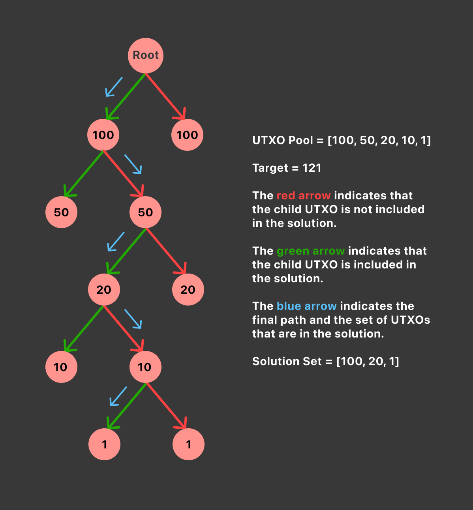

This is the first part of the seven-part blog series titled *Coin Selection for Dummies.*

* **Part 1:** Overview of Coin Selection Algorithms
* **Part 2:** Branch and Bound Coin Selection
* **Part 3:** Knapsack Coin Selection
* **Part 4:** A new coin selection algorithm proposed and implemented in Bcoin
* **Part 5:** Waste metric in Bitcoin
* **Part 6:** Comparison of different selection algorithms
* **Part 7:** How does fee estimation work?

## **What is a UTXO?**

UTXO or Unspent Transaction Output is a technical term for a coin. Bitcoin was developed to resemble cash, so UTXOs are coins that can be spent by a user for purchase of goods or services.

In more technical terms, a UTXO is an output that is generated as a result of a transaction. Every transaction in Bitcoin has some **inputs** (coins being spent or “***destroyed***”) and **outputs** (new coins being “***created***”).

For example, imagine that you have a single coin (***UTXO***) of 50000 satoshis in your wallet and you want to buy a coffee which costs 40000 satoshis. You will create a transaction that pays 40000 satoshis to the coffee-shop owner and pay yourself 10000 satoshis as a change output. So this transaction will take one UTXO, spend (***destroy***) it, and create two new UTXOs. After this transaction is confirmed, your wallet will contain a single coin (***UTXO***) of 10000 satoshis.

💡 Note: The total value of UTXOs destroyed in a transaction must be greater than or equal to the total value of UTXOs created in a transaction.
  

## **What is Coin Selection?**

Coin Selection refers to the decision process of choosing **UTXOs** (or “*coins*”) to use as inputs when making an on-chain bitcoin payment.

All Bitcoin wallets manage the private keys of their users. Thus, a wallet can associate the private keys with their respective UTXOs to create a UTXO pool. A UTXO pool consists of all the UTXOs or coins that a user can spend.

Coin selection is an important part of the payment process. Without coin selection, a user would have no way to optimally select UTXOs and would end up using all UTXOs in a single transaction. Thus, producing a large change output and paying unnecessary transaction fees.

## **The goals of Coin Selection**

Coin Selection is an important process to optimize our bitcoin payments for either cost, speed, or privacy. These are some of the goals that a coin selection algorithm tries to achieve:

### **Confirmation Time**

Since the block space is a scarce resource, miners select the transaction on the basis of fee per byte (satoshi per byte) to maximize their revenue. A higher fee will increase the likelihood of a transaction getting included in the next block and thus result in faster confirmation.

### **Transaction Fee**

Users are interested in minimizing the transaction fee and just pay enough fee to get their transaction included in a block. A good coin selection algorithm should not only reduce the transaction fee for the current transaction but also focus on minimizing the transaction fee in the long run. This can be accomplished by spending more UTXOs when the fee rate is low.

### **Privacy**

Since the Bitcoin blockchain is a public distributed ledger, everyone has access to every transaction that has ever taken place. This can sometimes result in a breach of financial privacy. Data miners and third-party observers shouldn’t be able to get access to a user's data such as the total balance or economic activity of a user. A good coin selection algorithm should use as few addresses together as possible.

### **Dust ouptuts**

A dust output is a transaction output whose effective value is similar to the cost of spending. Generally, a small UTXO will spend a significant chunk of its value on transaction fees. Therefore, we shouldn’t create change outputs of small value. If the change output is very small, it is often dropped to fees.

### **Reduce UTXO set size**

Since Bitcoin is P2P distributed network, every node has to maintain a UTXO pool. It would be preferable if transactions used more inputs than the outputs they produce. This will result in a reduction of UTXO set in the long run. As the adoption of Bitcoin increases, it is very important to keep a check on the size of the UTXO set.

## **Contrasting Goals**

Some of the goals mentioned are contrasting. For example, minimizing the transaction fee and minimizing confirmation time is antagonal. We need to pay more fees to reduce confirmation time. Thus, it is important to find an optimal balance between these goals.

## **Common Coin Selection Algorithm**

These are some of the most common coin selection algorithms:

* Oldest First (*FIFO*) or Pruned Oldest First (used in some lightweight mobile wallets) - Pick UTXOs in order of descending confirmation count.
* Newest First (*LIFO*) - Pick UTXOs in order of ascending confirmation count.
* Single Random Draw (used by Bitcoin Core) - Pick UTXOs randomly with equal chance from all available UTXOs.
* Branch and Bound (used by Bitcoin Core) - Search UTXOs in a depth first fashion and select the least wasteful change-avoidant input set.
* Knapsack (used by Bitcoin Core) - Sort all UTXOs by value and run 1000 iterations of selections randomly picking UTXOs with a 50% chance from largest to smallest
* Greedy - smallest first or largest first (used in some lightweight mobile wallets) - Pick UTXOs in ascending or descending order of value.

## **Overview of Bitcoin Core’s coin selection algorithm**

Currently Bitcoin Core uses 3 algorithms - Branch and Bound, Knapsack, and Single Random Draw. The selection result of these algorithms is compared on the basis of a ***waste metric***. We finally select the input set which produces the least waste.

### **Advantages**

* Often avoids change by finding exact solutions
* Spends more inputs at low fee rates, fewer at high fee rates reducing total fees in the long term
* Patterns are difficult to find especially in cases when Single Random Draw is used

### **Disadvantages**

* Implementation and testing are very complicated
* Computationally intensive

### **What is Waste Metric?**

Waste metric is a heuristic used in Bitcoin Core’s wallet to compare different possible input sets and select the set which produces the smallest waste score. Often there are multiple ways to fund a transaction, waste metric finds the most optimal input set based on fee rate, cost of producing a change and excess selection amount. (watch out for a deep-dive article on Waste Metric in part 5 of this series)

In the next article, we will do a deep-dive into the mechanics of [Branch and Bound Coin Selection Algorithm](https://blog.summerofbitcoin.org/coin-selection-for-dummies-2/).
