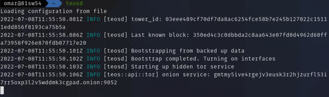
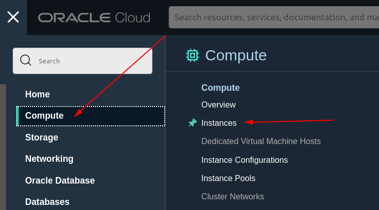
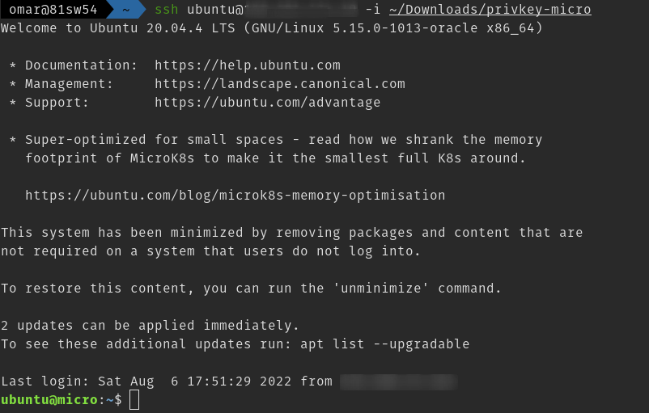
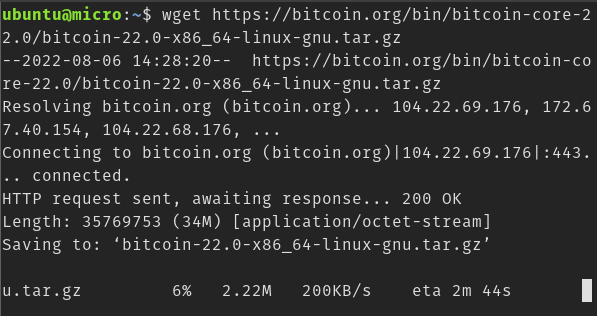
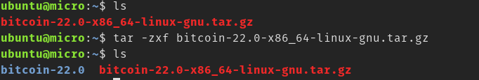
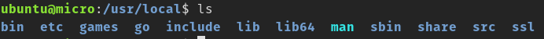
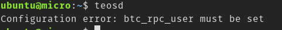
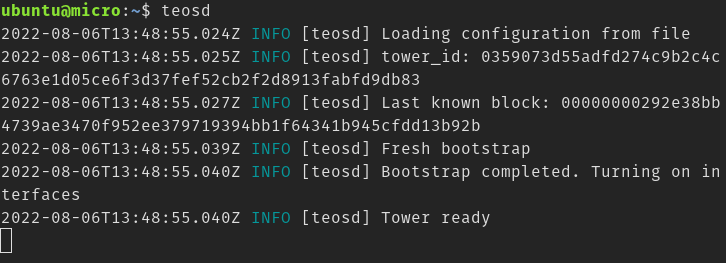
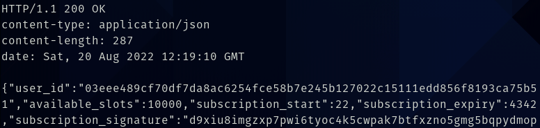

# Introduction

Lightning Network ([LN](https://en.wikipedia.org/wiki/Lightning_Network?ref=blog.summerofbitcoin.org)) is a layer 2 protocol on top of Bitcoin. It fixes Bitcoin's scalability issues. Bitcoin at the moment can process ~7 transactions per second (which can never serve 8 billion people :v)

LN on the other hand can process ~1M transactions per second. This is because lightning transactions don't make it to the blockchain, they happen off-chain (except the ransactions for opening and closing the lightning channels).

Channel partners start with an on-chain funding transaction, this is the transaction that opens a channel between these two partners. After the channel is open and confirmed on the blockchain, they can start transferring funds to each other with what's called a commitment transaction. This transaction basically updates the funds distribution that was originally set in the funding transaction. Each time a partner wants to pay the other, they create a new commitment transaction updating the fund distribution of the past commitment transaction.  
These commitment transactions doesn't get broadcasted to the blockchain, meaning that one can send and receive funds from that partner without sluggishing the network and totally fee-free (unless the payment passes through multiple hops)

But how is this off-chain interaction safe? Commitment transactions can be used to close the lightning channel anytime by either channel parties. All the old and yet to come commitment transactions are valid channel closing transactions and could be used to close the channel. Thus, One could broadcast an old commitment transaction that suggests an old fund distribution that favors one party (cheating). Ethically, when closing a lightning channel, the latest commitment transaction should be the one to broadcast to the Bitcoin network. Should we now assume everybody is ethical and start **trusting** each other, heh. Of course no.

Each commitment transaction has backdoors for each of the two parties that let each of them take out all the funds of the channel. This backdoor on transaction N isn't revealed for each of the parties until the commitment transaction N+1 is created.

Lightning achieves the off-chain security with this backdoor plus some [timelock](https://en.bitcoin.it/wiki/Timelock?ref=blog.summerofbitcoin.org) magic. Said simply, the broadcaster of the channel closing transaction (a commitment transaction) must wait some amount of time before spending their share of the funds that were in the channel. This gives  
time to the other party of the channel to notice the broadcasted closing transaction and assert that their counter party didn't cheat on them (use an old/revoked commitment transaction). If one party cheats the other will have some time to punish them through the backdoor and take out all the funds of the channel with a transaction called penalty (or justice) transaction.

With this setup, you should always watch the blockchain and never go offline or all your open channels are compromised. This is the problem watchtowers are for.

## Watchtowers

A watchtower is a third party service that keeps an eye on your lightning channels and reacts if they were breached (your channel partner tried to cheat on you).

How would they know if your channel is breached?

This is mentioned in details in [BOLT 13](https://github.com/sr-gi/bolt13?ref=blog.summerofbitcoin.org) (still WIP). But basically, the client (one channel party) supplies the tower with all the information it needs to act upon any breach. The client also won't have to compromise their privacy with exposing penalty transactions to the tower. They can send it encrypted and the tower won't be able to decrypt it unless a breach has  
actually occured.

## The Eye of Satoshi

The Eye of Satoshi ([TEOS](https://github.com/talaia-labs/rust-teos?ref=blog.summerofbitcoin.org)) is a BOLT 13 compliant lightning watchtower written in Rust and was written [in python](https://github.com/talaia-labs/python-teos?ref=blog.summerofbitcoin.org) before.

There is no docker image for the project at the moment not is it packaged, so you will have to build it from source. Install Rust from [here](https://www.rust-lang.org/tools/install?ref=blog.summerofbitcoin.org) to build the project.

TEOS consists of two main binaries:

* `teosd` which is the tower deamon that watches the blockchain and is running on top of `bitcoind`.
* `teos-cli` which is a CLI for controlling the tower and querying it. This is used by the tower owner.

The tower has recently got Tor support, which means the clients of the tower can interact with the tower over Tor for more privacy.

To run the tower, you need to:

* Make sure `bitcoind` is running.
* Setup TEOS config in `~/.teos/teos.toml`.
* Head to the project directory and run `cargo install --path teos` to install the watchtower daemon on your system.
  + **This also installs the CLI `teos-cli`.**
* Run `teosd` to start the watchtower daemon.

The output would be something like this:  


To stop the tower run `teos-cli stop`.

With the tower being setup, you can interact with it using its http endpoint:

* `/register` to register yourself with the tower. This will cost no money since the tower is offering an altruistic only service at the moment. But tower owners can setup their towers with subscription fees.
* `/add_appointment` to send a watch request to the tower. The appointment consists of a locator that is used to locate the revoked commitment transaction on the blockchain and the encrypted penalty transaction that the tower should broadcast in case of breach. The tower won't be able to decrypt the penalty transaction unless it has found the revoked transaction on the blockchain.
* `/get_appointment` to request a previously sent appointment to the tower. This is crucial to assure that the tower doesn't be lazy and delete appointment to free up some space.
* `/get_subscription_info` to know how much of the subscription is left so you decide whether to top-up your registration/subscription.

It's really hard to craft http requests and send it to the tower say using something like `curl`. There is an open [PR](https://github.com/talaia-labs/rust-teos/pull/53?ref=blog.summerofbitcoin.org) right now that will add a new crate to the project, namely, `watchtower-client`. It is a [Core Lightning](https://github.com/ElementsProject/lightning?ref=blog.summerofbitcoin.org) plugin that will send your appointments to the tower in your behalf on each commitment transaction revocation.

This way, you can make your lightning transactions and go on a vacation feeling safe. That said, it's recommended to register with more than one tower and give them the same appointments. It's redundant but more failure proof.

# Setting Up Your Own Eye

## What will we be doing?

I will teach you how to setup your own Lightning watchtower **TEOS** (The Eye of Satoshi watchtower) and run it on a server on the cloud. A watchtower shouldn't ideally run on a personal computer, since at some point, you will shutdown that computer and a watchtower should never go offline. We will setup our watchtower on a cloud server so it never goes offline and put our open lightning channel in danger. The best place to deploy a personal watchtower in my opinion though is in a homelab or a personal server. But you shouldn't only rely on one watchtower. Use your friends' towers, let them use yours, and maybe subscribe to a third party one.

For this tutorial, we will be using Oracle Cloud. Oracle Clouds offers the best [free tier](https://www.oracle.com/cloud/free/?ref=blog.summerofbitcoin.org) I could find, and we want to spend as little as possible to get our service up and running.

Note that the service will be altruistic and available for anybody to use and not just you. TEOS doesn't charge users on the provided service as of now ([care to help?](https://github.com/talaia-labs/rust-teos/issues/39?ref=blog.summerofbitcoin.org)). It's a lot fun anyways to let people use your stuff rather than using it alone. You can surely figure out a way to stop others from using your service if you want (e.g. put an authentication reverse proxy on the line), but I wouldn't recommend that.

## Setting Up Our Server

We will setup our server on Oracle Cloud. You will need a credit card to register for the first time (and you will be charged and then refunded $1 US for security purposes).  
You will be given the always free resources found [here](https://www.oracle.com/cloud/free?ref=blog.summerofbitcoin.org) + $300 US for the first month. Our setup will, unfortunately, exceed the free resources limit so you will need to upgrade after a month (this is because the blockchain is about 500GB and the free tier limit offers a maximum of 200GB as of August 8th 22). A 1TB of storage with no disk optimization from Oracle will cost about $25 a month.

Once the account is setup, head to compute, then instances.  


You will see a table like this, but with no running instances:  


Our goal is to have an instance like `micro` with 1TB of storage to run the watchtower on the mainnet Bitcoin network. The mainnet is where real bitcoins are. There are also other networks like signet and testnet, which are for testing purposes.

Click `Create instance` to being creating the instance we need. Make sure to assign a public IP address for that instance so you and other people can reach it from all over the world. Also, you will need to `Specify a custom boot volume size` with enough disk storage for the mainnet requirements. We can also use block storage instead and have no disk optimization for a lower charge per month, but then we will have to manage many disks inside the server. Select the instance shape `VM.Standard.E2.1.Micro`. This shape has two threads, 1GB ram, and is included in the always-free tier.

You can use any OS image for your server, but the one I recommend is Ubuntu 22.04 (preferably the minimized edition since we won't need all that bloat anyways). Other Linux images might need some work to get Bitcoin and TEOS installed on them successfully.

Once you have configured and created the instances, go to the subnet settings and allow access to ports `22/ssh` and `9814/tcp`. Port `9814` is the default port on which the tower listens for user requests.

Now ssh to your server using the key given by Oracle while creating it:

```
ssh ubuntu@YOUR_SERVER_NAME -i PATH/TO/SSH/KEY

```

You will be greeted with something like this:  


You might want to add some swap memory since the server might crash often with this low amount of ram. A 2GB of swap space would be a pretty solid choice:

```
# Run this in the VM after sshing to it
sudo su                         # To run as root
fallocate -l 2G ~/2gb.swap      # Let's create the swap file in root's home directory
chmod 600 ~/2gb.swap            # Adjust the permission for the swap file
mkswap ~/2gb.swap               # Actually convert it to a swap file
swapon ~/2gb.swap               # Plug the swap on
exit                            # This is to exit from `sudo su` state we are in, since `sudo su` is dangerous!

```

If you run `free -h` you will see your swap space listed there.  
Now the server is ready to host the watchtower ;).

### Setting Up `bitcoind`

TEOS depends on `bitcoind` so we will need first to download it. Head to [bitcoin.org downloads page](https://bitcoin.org/en/download?ref=blog.summerofbitcoin.org) and choose a build for the machine you are using. For our micro Oracle Cloud instance we will use the `x86_64` build:

```
wget https://bitcoin.org/bin/bitcoin-core-22.0/bitcoin-22.0-x86_64-linux-gnu.tar.gz

```



Now extract the binaries with this command:

```
tar -zxf bitcoin-22.0-x86_64-linux-gnu.tar.gz

```



The directory structure of `bitcoin-22.0` looks like this:  


Looks the same as the directory structure for `/usr` or `/usr/local`:  


To install `bitcoind` on the system, copy the `bitcoin-22.0` directory content to `/usr/local`:

```
sudo cp -r bitcoin-22.0/* /usr/local

```

***Note: You need `sudo` because only root can write to `/usr/local` and `-r` for `cp` means to recursively copy the directories.***

Now if you run `bitcoind` you will see this:  


`bitcoind` now is successfully installed and running (`Ctrl+C` to stop it). It is downloading the entire blockchain which is about 500GB.  
Right now, we can't use `bitcoind` with TEOS. Some configuration options are missing.  
Create a `~/.bitcoin/bitcoin.conf` file and populate it using the instructions found [here](https://github.com/talaia-labs/rust-teos/blob/master/DEPENDENCIES.md?ref=blog.summerofbitcoin.org).

***You should create strong rpcuser & rpcpassword.***

Now run `bitcoind` again and let it sync. It might take up to a couple of days for the entire blockchain to be downloaded. You can check the number of blocks downloaded till moment by runnig the command `bitcoin-cli getblockchaininfo`.

## Setting Up The Eye

First, you need to have cargo (Rust package manager) installed on your system.  
Head up to [www.rust-lang.org/tools/install](https://www.rust-lang.org/tools/install?ref=blog.summerofbitcoin.org) and follow along to get Rust and cargo installed on your system. TEOS might publish static builds in the future so users won't have to install Rust and cargo to get their tower up.

Then, run the following commands to install TEOS (you will need to have `git` installed):

```
cd ~                                                    # Go to the home directory
git clone https://github.com/talaia-labs/rust-teos.git  # Clone the project
cd rust-teos                                            # Change directory to inside the project directory
cargo install --path teos                               # Install the binaries found in `teos` directory on the system. This will install `teosd` & `teos-cli`

```

cargo will start compiling the watchtower and it might take about 7~8 minutes in a poor CPU like Oracle Cloud's micros. After that, you will be able to run `teosd` or `teos-cli` from your terminal.

If you run `teosd`, you will get this error message:  


That's because `teosd` needs to be configured just like `bitcoind`. Create the configuration file `~/.teos/teos.toml` and populate it with `teosd` configuration options. You can find sample configuration options that you can copy from [here](https://github.com/talaia-labs/rust-teos/blob/master/teos/src/conf_template.toml?ref=blog.summerofbitcoin.org).

Note that you will need to match some `teosd` and `bitcoind` options (e.g. the Network, RPC user, and RPC password).

Now when you run `teosd` from the terminal you will see:  


**Congratulations!!** You have successfully setup your own watchtower and can go on a vacation knowing that your lightning channels are safe ;).

Send a test request to the tower using the following command:

```
curl -i -H "Accept: application/json" -H "Content-Type: application/json" -d '{"user_id": "03eee489cf70df7da8ac6254fce58b7e245b127022c15111edd856f8193ca75b51"}' -X POST TOWER_PUBLIC_IP:9814/register

```

This request will register a dummy user `03eee489cf70df7da8ac6254fce58b7e245b127022c15111edd856f8193ca75b51` with the tower. The response should be like this:  


You can use `bitcoin-cli stop` and `teos-cli stop` commands to shutdown `bitcoind` and `teosd` respectively.

Right now, `teosd` doesn't have a daemon option like `bitcoind`. To run it in the background, start it, then press `Ctrl + Z` (this will stop `teosd` and give you the terminal back), then run `bg` in the terminal to continue the stopped job in the background, then finally run `disown` to disown the running job (this will keep the background job alive even after you exit the SSH session).
