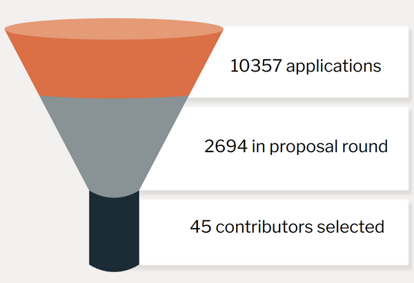
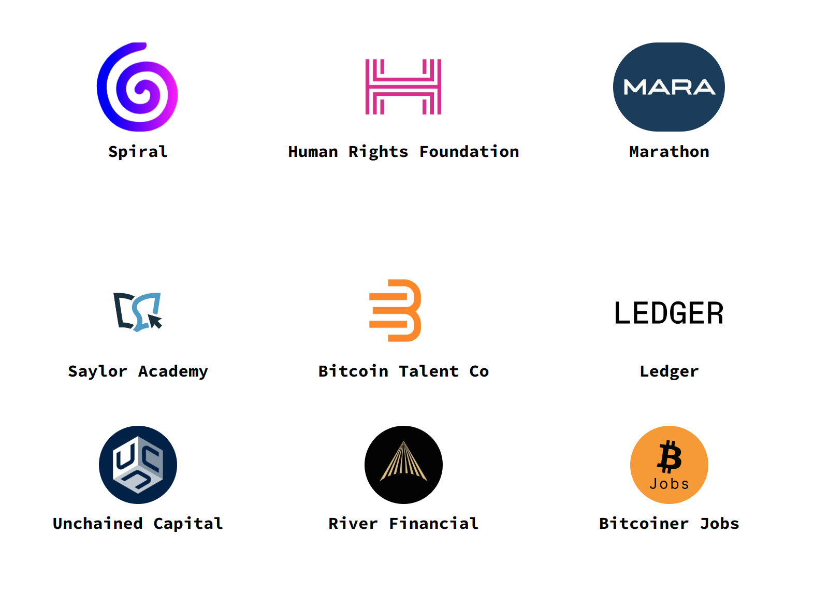

We are excited to announce the results for Summer of Bitcoin 2023.

Over the last few weeks, 24 open-source bitcoin and lightning organizations, comprising of 40 mentors, evaluated several applicants and their project proposals to select this year's new cohort of Summer of Bitcoin contributors.

Here are some notable results from this year’s application process:

* 10,357 applicants from 74 countries
* 2694 applicants passed the screening round
* 786 proposals submitted
* 45 contributors from 8 countries accepted

<figure>

<figcaption>10357 students from 74 countries applied to Summer of Bitcoin 2023</figcaption>
</figure>

<figure>

<figcaption>45 student contributors from 8 countries were accepted to Summer of Bitcoin 2023</figcaption>
</figure>

Out of the 45 contributors accepted, 3 contributors will contribute as UX designers, and 42 contributors will contribute code as developers. Selected contributors come from countries around the world including Brazil, China, Egypt, Germany, India, Italy, Nigeria and United States. Like the previous year, the highest number of accepted contributors are from India. Details of the accepted contributors including their project proposals have been published at [Summer of Bitcoin 2023 Accepted Projects](https://www.summerofbitcoin.org/program-details/2023/r/reckGTBbHuT6Amdhk).

All student contributors are paired with a mentor to begin planning their projects and milestones. Over the next few days, students will get acquainted with their mentors, engage with the project’s open-source community and finalize their project plans. Project period will continue through the summer until August 15. Students will also participate in weekly seminars to discuss the history of money, bitcoin fundamentals and philosophy and future developments on bitcoin. We look forward to hosting several talks from notable guest speakers in the bitcoin ecosystem. All student contributors will receive a stipend of $3000 in BTC on successful completion of their projects.

---

We are incredibly thankful to [Spiral](https://spiral.xyz/?ref=blog.summerofbitcoin.org), [Human Rights Foundation](hrf.org) and [Marathon](https://marathondh.com/?ref=blog.summerofbitcoin.org), our sponsors for the 2023 program, for their generous financial support towards funding student stipends and operations.

Special thanks to [Saylor Academy](https://www.saylor.org/2023/02/saylor-academy-summer-of-bitcoin-partner-to-encourage-students-into-open-source-careers/?ref=blog.summerofbitcoin.org) for supporting us as an education partner throughout the application period. About 2700 students from around the world completed the bitcoin courses on [saylor.org](https://saylor.org/?ref=blog.summerofbitcoin.org). Without it, we would not have achieved the level of quality education needed for our students to understand bitcoin as a breakthrough technology and contribute to it.

We’re also thankful to our service partners, namely [Bitcoin Talent Co](https://www.bitcointalent.co/?ref=blog.summerofbitcoin.org) for their recruitment services, [Unchained Capital](https://www.unchained.com/?ref=blog.summerofbitcoin.org) for their custody services, [River Financial](https://river.com/?ref=blog.summerofbitcoin.org) for their brokerage services and [Bitcoiner Jobs](https://bitcoinerjobs.com/?ref=blog.summerofbitcoin.org) for their job listing services. A special note of thanks to [Ledger](https://www.ledger.com/?ref=blog.summerofbitcoin.org) for generously donating hardware wallets to this year's cohort, for the third consecutive year!

<figure>

<figcaption>Summer of Bitcoin 2023 Sponsors</figcaption>
</figure>

To the thousands of applicants from all over the world who applied to the program, thank you and congratulations. You invested an incredible amount of time and effort to reach out to our mentoring organizations and submit proposals. You now have an idea of how bitcoin works and why it’s an important deal. You have gained a vast understanding of the various projects in the bitcoin ecosystem. We hope you will continue to stay engaged with your favorite open-source bitcoin communities and help move bitcoin forward.

For the students who could not make it, we would like to point you to our [student guide](https://guide.summerofbitcoin.org/being-turned-down?ref=blog.summerofbitcoin.org), which has suggestions on what to do if you weren’t selected for this year’s program. It also has a chapter on [Getting started with an organization and project](https://guide.summerofbitcoin.org/the-proposal-round/getting-started-with-an-organization-and-project?ref=blog.summerofbitcoin.org) which is helpful whether you would like to connect now with projects on your own or decide to apply to Summer of Bitcoin in the future - which we hope you do!

---

<figure>

</figure>

This year, we have partnered with Bitcoin Talent Co for the [Bitcoin Industry Apprenticeship (BIA) program](https://www.bitcointalent.co/bitcoin-industry-apprenticeship-program?ref=blog.summerofbitcoin.org) that aims to offer industry internships to university students at leading bitcoin companies in North America and Europe, with opportunities to convert to full-time job offers. If you haven't applied yet, what are you waiting for? [Apply now!](https://www.bitcointalent.co/bitcoin-student-intern-application-2023?ref=blog.summerofbitcoin.org) If you're a bitcoin company or organization interested in hiring interns this summer, [sign up](https://www.bitcointalent.co/bitcoin-industry-apprenticeship-program?ref=blog.summerofbitcoin.org) for BIA 2023 today!

Here’s to the 3rd year of Summer of Bitcoin!
