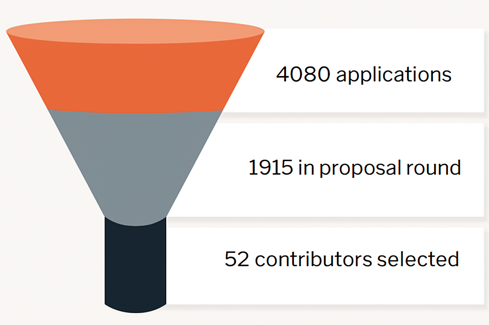

We are thrilled to unveil the results for Summer of Bitcoin 2024!

Over the last few weeks, open-source bitcoin and lightning organizations and their mentors have reviewed numerous applications and project proposals to select this year's new cohort of Summer of Bitcoin contributors.

Here are some notable results from this year’s application process:

*   4,080 applicants from 63 countries
*   1,915 applicants passed the screening round
*   254 proposals submitted
*   52 contributors from 11 countries accepted

<figure>

<figcaption>52 student contributors from 11 countries were accepted to Summer of Bitcoin 2024</figcaption>
</figure>

Selected contributors come from countries around the world. Like the previous year, the highest number of accepted contributors are from India. Details of the accepted contributors including their project proposals have been published at [Summer of Bitcoin 2024 Accepted Projects](https://www.summerofbitcoin.org/program-details/2024/r/rectcEvzVdwHh7gwb).

All student contributors are paired with a mentor to begin planning their projects and milestones. Over the next few days, students will get acquainted with their mentors, engage with the project’s open-source community and finalize their project plans. The project period will continue through the summer until August 15. Students will also participate in weekly seminars to discuss the history of money, bitcoin fundamentals and philosophy and future developments on bitcoin. We look forward to hosting several talks from notable guest speakers in the bitcoin ecosystem. Upon successful completion of their projects, all student contributors will receive a stipend in BTC. The total stipend amount is calculated based on the student's location using a Purchasing Power Parity (PPP) model. For exact stipend amounts, please refer to the [stipends section on our guide](https://guide.summerofbitcoin.org/about/is-it-a-paid-internship#stipend-amounts).

---

We are incredibly thankful to our sponsors for the 2024 program, **Spiral**, **Human Rights Foundation (HRF)**, **Marathon**, and **OpenSats**, for their generous financial support towards funding student stipends and operations.

We’re also thankful to our service partners, namely **Unchained Capital** for their custody services, **River** for their brokerage services and **Bitcoiner Jobs** for their job listing services. A special note of thanks to **Blockstream Corporation** for generously donating Jade hardware wallets to this year's cohort, who were totally excited to receive and store their first bitcoin in them!

---

To the thousands of applicants from all over the world who applied to the program, thank you and congratulations. You invested an incredible amount of time and effort to reach out to our mentoring organizations and submit proposals. You now have an idea of how bitcoin works and why it’s an important deal. You have gained a vast understanding of the various projects in the bitcoin ecosystem. We hope you will continue to stay engaged with your favorite open-source bitcoin communities and help move bitcoin forward.

For the students who could not make it, we would like to point you to our [student guide](https://guide.summerofbitcoin.org/being-turned-down), which has suggestions on what to do if you weren’t selected for this year’s program. It also has a chapter on [Getting started with an organization and project](https://guide.summerofbitcoin.org/the-proposal-round/getting-started-with-an-organization-and-project) which is helpful whether you would like to connect now with projects on your own or decide to apply to Summer of Bitcoin in the future - which we hope you do!

---

Here’s to the 4th year of Summer of Bitcoin!