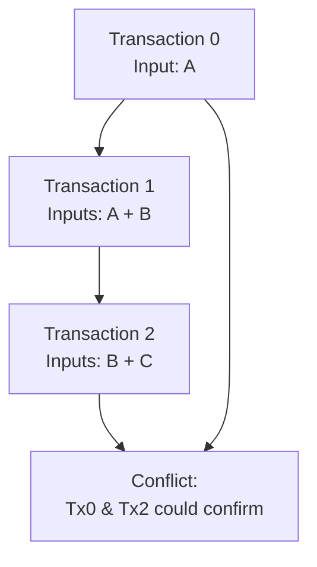

## Introduction

As part of my Summer of Bitcoin open source fellowship, I've been working on creating the caravan-fees package and an important feature of this package was to give developer's the ability to implement Replace-By-Fee (RBF) functionality in their wallets. 

This blog post will delve into the technical details of our implementation, focusing on how we've built this feature and how users can extend it for more advanced use cases.

## Understanding RBF

Replace-By-Fee is a protocol that replaces unconfirmed transactions with new versions that include higher fees. This feature is crucial for adapting to changing network conditions and ensuring timely confirmation of transactions. However, RBF comes with specific rules that can make fee calculation challenging.

## Key RBF Rules for Fee Calculation

### 1. The Higher Fee Rule

**Core Requirement**: The new transaction must pay a higher fee than the original.

| Transaction Type | Fee Amount | Status | Description |
|-----------------|------------|---------|-------------|
| Original Tx | 1000 satoshis | Baseline | Initial transaction |
| Valid RBF Tx | 1100 satoshis | ✅ Valid | Higher fee, accepted |
| Invalid RBF Tx | 900 satoshis | ❌ Invalid | Lower fee, rejected |

#### Interesting Edge Cases

##### The Minimal Increase Problem
```plaintext
Transaction Sequence:
Original    → 1000 satoshis
Replacement → 1001 satoshis (+1 sat)
Issue       → Valid but potential DDoS vector
```

##### Fee Rate vs Absolute Fee Comparison

| Metric | Original Transaction | New Transaction | Impact |
|--------|---------------------|-----------------|---------|
| Size | 1000 bytes | 1500 bytes | 🔺 Increased |
| Total Fee | 2000 satoshis | 2100 satoshis | 🔺 Higher absolute |
| Fee Rate | 2 sat/byte | 1.4 sat/byte | 🔻 Lower rate |
| Miner Appeal | Baseline | Potentially less attractive | ⚠️ Trade-off |

### The Pinning Problem Explained

```plaintext
Alice's Initial Transaction (B):
┌────────────────────────┐
│ Input:  1.5 BTC        │
│ Output: 1 BTC → BigEx  │
│ Change: 0.49995 BTC    │
│ Fee:    5,000 sats     │
└────────────────────────┘
           ⬇
BigEx's Sweep Transaction (C):
┌────────────────────────┐
│ Input 1:  1 BTC (Alice)│
│ Input 2+: 99 BTC       │
│ Output:   99.9999 BTC  │
│ Fee:      10,000 sats  │
└────────────────────────┘
```

> **Challenge**: Alice must now pay 15,000 satoshis (sum of both fees) to replace her transaction

### 2. The Input Control Rule

This rule prevents "fee sniping" by restricting unconfirmed input usage.

| Transaction Type | Inputs Used | Status | Explanation |
|-----------------|-------------|---------|-------------|
| Original | A (confirmed), B (unconfirmed) | Base | Initial state |
| Valid RBF | A, B, C (confirmed) | ✅ | Maintains unconfirmed inputs |
| Invalid RBF | A, B, D (unconfirmed) | ❌ | Introduces new unconfirmed input |

#### The Replacement Cycle Attack



### 3. The Bandwidth Payment Rule

**Formula for Minimum Fee Calculation**:
```
Required Fee = Original Fee + (Incremental Relay × Replacement Size)
```

Historical Context:
```plaintext
BIP-125 (2015):
├── Original Focus: Absolute fees
├── Current Reality: Fee rates more important
└── Primary Purpose: Anti-DDoS protection
```
### Deep Dive: The Bandwidth Rule Mystery

> 💭 "The replacement transaction must pay for its own bandwidth at or above the rate set by the node's minimum relay fee setting..."

Let's break down this puzzling rule that had me scratching my head:

#### The Rule in Simple Terms
```plaintext
If:
- Minimum relay fee = 1 sat/byte
- Replacement tx size = 500 bytes
Then:
- Must pay ≥ 500 sats more than original
```

#### Initial Assumptions vs Reality

| What We Thought | What It Actually Is |
|-----------------|---------------------|
| Higher fee rate requirement | Anti-DDoS measure |
| Miner incentive mechanism | Network protection |
| Modern fee market adaptation | Historical artifact from 2015 |

#### Historical Context
```plaintext
Timeline:
2015 (BIP-125 Era)
├── Miners: Focused on absolute fees
├── Network: Different priorities
└── Context: Pre-modern fee market

2024 (Current)
├── Miners: Prioritize fee rates
├── Network: More sophisticated
└── Result: Rule feels misaligned
```

#### The Anti-DDoS Angle

Consider this attack scenario:
```plaintext
Original Tx Fee:     1000 sats
Replacement 1:       1001 sats (+1)
Replacement 2:       1002 sats (+1)
Replacement 3:       1003 sats (+1)
...and so on

Problem: Network spam with minimal fee increases
Solution: Force meaningful fee increases with:
Fee = original_fee + (incremental_relay × replacement_size)
```

### The Rule Redundancy Question

> 🤔 **Question**: If Rule #4 (bandwidth) encompasses Rule #3 (higher fee), why have both?

#### Answer: Code-Level Separation

```cpp
// Rule #4: Economic rationality check
bool sufficientFee = pool.GetModifiedFee(ptx) >=
    pool.GetModifiedFee(origTx) + extraFeePaid;

// Rule #3: Base fee requirement check
for (const CTxMemPool::txiter it : allConflicting) {
    if (nModifiedFees < it->GetModifiedFee()) {
        return state.DoS(0, false,
            REJECT_INSUFFICIENTFEE, "insufficient fee");
    }
}
```

#### Why Two Checks?

| Rule | Purpose | Check Type |
|------|---------|------------|
| Rule #4 (Bandwidth) | Anti-DDoS | System Protection |
| Rule #3 (Higher Fee) | Basic Requirement | Economic Incentive |

> 💡 **Key Insight**: The separation provides both clarity and robustness in the fee-bumping mechanism

This layered approach ensures:
1. Basic economic incentives are maintained
2. Network is protected from abuse
3. Code remains clear and maintainable
4. Each rule serves a distinct purpose

## Implementation in caravan-fees

### Core Fee Calculation Algorithm

```javascript
// Base fee calculation
const minRequiredFee = BigNumber.max(originalTxFee, targetFeeForNewSize);

// RBF fee rate determination
get rbfFeeRate(): string {
  return new BigNumber(this.minimumRBFFee).dividedBy(this.vsize).toString();
}

// Minimum RBF fee calculation
get minimumRBFFee(): Satoshis {
  const minReplacementFee = new BigNumber(this.feeRate)
    .plus(this._incrementalRelayFeeRate)
    .multipliedBy(this.vsize);

  const targetFeeBasedOnUserRate = new BigNumber(
    this.targetFeeRate,
  ).multipliedBy(this.vsize);

  return BigNumber.max(minReplacementFee, targetFeeBasedOnUserRate)
    .integerValue(BigNumber.ROUND_CEIL)
    .toString();
}
```

### Implementation Scenarios

#### Scenario 1: Smaller Replacement Transaction

| Aspect | Original Tx | Replacement Tx | Notes |
|--------|------------|----------------|--------|
| Size | 500 vbytes | 300 vbytes | 🔻 40% smaller |
| Fee | 5,000 sats | 5,000 sats | Minimum required |
| Fee Rate | 10 sat/vbyte | ~16.67 sat/vbyte | 🔺 Higher effective rate |
| Calculation | - | max(5000, 300×15) | Using original as minimum |

#### Scenario 2: Larger Replacement Transaction

| Parameter | Original | Replacement | Change |
|-----------|----------|-------------|---------|
| Size | 500 vbytes | 700 vbytes | +40% |
| Fee | 5,000 sats | 8,400 sats | +68% |
| Fee Rate | 10 sat/vbyte | 12 sat/vbyte | +20% |
| Required | - | max(5000, 8400) | 8,400 required |

### RBF Strategies

#### Cancellation Approach
```plaintext
Original Transaction:
┌────────────────────────┐
│ Inputs: 0.3 BTC total  │
│ Outputs: Split payment │
│ Fee: 5,000 sats        │
└────────────────────────┘

Cancellation Transaction:
┌────────────────────────┐
│ Same inputs            │
│ Single output          │
│ Higher fee: 6,000 sats │
└────────────────────────┘
```

#### Acceleration Strategy
```plaintext
Original Transaction:
┌────────────────────────┐
│ Input: 0.5 BTC         │
│ Payment: 0.4 BTC       │
│ Change: 0.09995 BTC    │
│ Fee: 5,000 sats        │
└────────────────────────┘

Accelerated Transaction:
┌────────────────────────┐
│ Inputs: 0.6 BTC total  │
│ Same payment           │
│ Adjusted change        │
│ Fee: 15,000 sats       │
└────────────────────────┘
```

## Advanced Development Techniques

### 1. Dynamic Fee Strategy
```javascript
class DynamicFeeStrategy extends BaseFeeStrategy {
  calculateFee(mempool, transaction) {
    // Mempool-aware fee calculation
  }
}
```

### 2. Privacy-Enhanced UTXO Selection
```javascript
function selectPrivacyEnhancingUTXOs(availableUTXOs, targetAmount) {
  // Privacy-focused selection logic
}
```

### 3. Batch RBF Processing
```javascript
function createBatchRBF(transactions, newFeeRate) {
  // Multi-transaction replacement logic
}
```

### Success Metrics

| Objective | Implementation | Benefit |
|-----------|---------------|----------|
| RBF Rule Compliance | Fee validation checks | ✅ Network acceptance |
| Fee Rate Optimization | Dynamic calculation | ✅ Cost efficiency |
| Transaction Size Handling | Adaptive fee scaling | ✅ Flexibility |
| Security | Input validation | ✅ Attack prevention |

---

This implementation in caravan-fees provides a robust foundation for RBF functionality, balancing the technical requirements of the Bitcoin network with practical usability concerns.

```