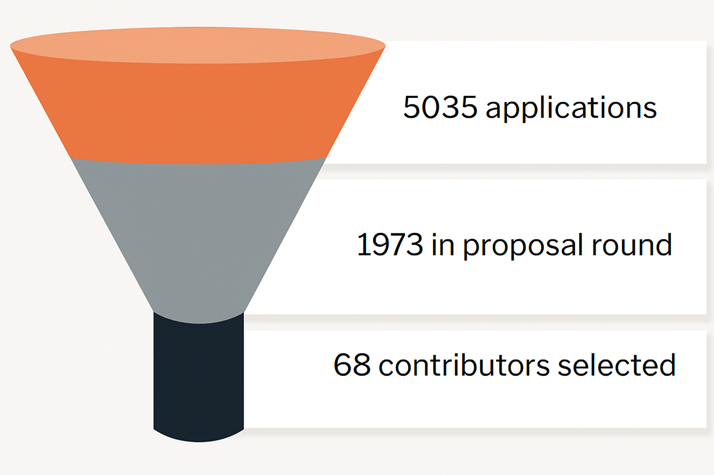

We are excited to announce the results for Summer of Bitcoin 2025!

This year, applicants went through some of the most rigorous screening we have ever had. Candidates were assessed on high standards, undergoing a thorough evaluation of their programming abilities, open-source contributions, and communication skills. Once screened, they participated in a challenging 4-week bootcamp designed to further refine their skills. Only the top contenders who demonstrated exceptional programming and design expertise and deep bitcoin knowledge made it through.

Here are some notable results from this year’s application process:

*   5,035 applicants from 71 countries
*   1,973 applicants passed the initial screening
*   1,345 proposals submitted
*   68 student contributors from 9 countries accepted to 33 open-source bitcoin organizations

<figure>

<figcaption>68 student contributors from 9 countries were accepted to Summer of Bitcoin 2025</figcaption>
</figure>

Selected contributors come from countries around the world. Like the previous year, the highest number of accepted contributors are from India. Details of the accepted contributors including their project proposals have been published at [Summer of Bitcoin 2025 Accepted Projects](https://www.summerofbitcoin.org/2025-accepted-projects).

As they enter the program, these interns are capable of contributing independently to their projects with minimal hand-holding. Mentors can primarily focus on reviewing their code and unblocking them when necessary, ensuring that the program fosters truly self-sufficient contributors to the bitcoin open-source ecosystem.

This year, we are also proud to see several alumni returning as mentors. In fact, **1 in 4 of our mentors this year is a former Summer of Bitcoin student**, guiding the next generation across projects like Alby, Galoy, Zeus, Saving Satoshi, VLS, ChatBTC, BDK, Demand, Bitcoin Design and Fedimint. This reinforces a positive flywheel effect in the bitcoin open-source ecosystem.

All student contributors are paired with a mentor to begin their work. Over the next few days, students will connect with their mentors, engage with their project’s community, and finalize their project plans. The project period will continue through the summer until August 15. Students will also participate in seminars given by former Summer of Bitcoin students on bitcoin, careers in the bitcoin industry and more! Upon successful completion of their projects, all student contributors will receive a stipend in BTC, calculated based on their location using a Purchasing Power Parity (PPP) model.

---

We are incredibly thankful to our sponsors for the 2025 program, **HRF**, **OpenSats**, **Spiral**, and **BTrust**, for their generous financial support towards funding student stipends and operations.

We’re also thankful to our service partners: **Unchained Capital** for their custody services, **River** for their brokerage services, and **Bitcoiner Jobs** for their job listing services. A special note of thanks to **Blockstream Corporation** for once again generously donating Jade hardware wallets to this year's cohort, who are totally excited and looking forward to receive and store their first bitcoin in them!

---

To the thousands of applicants from all over the world who applied to the program, thank you for your incredible effort. You now have a deeper understanding of how bitcoin works and have gained a vast knowledge of the various projects in the ecosystem. We hope you will continue to stay engaged with your favorite open-source bitcoin communities.

For the students who could not make it, we would like to point you to our [student guide](https://guide.summerofbitcoin.org/being-turned-down), which has suggestions on what to do if you weren’t selected for this year’s program. It also has a chapter on [Getting started with an organization and project](https://guide.summerofbitcoin.org/the-proposal-round/getting-started-with-an-organization-and-project) which is helpful whether you would like to connect now with projects on your own or decide to apply to Summer of Bitcoin in the future - which we hope you do!

---

Here’s to the 5th year of Summer of Bitcoin!