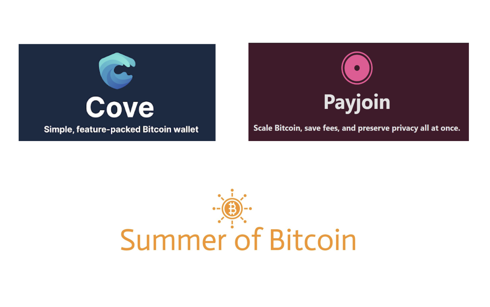
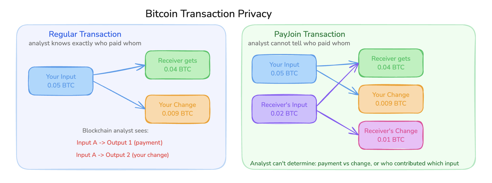
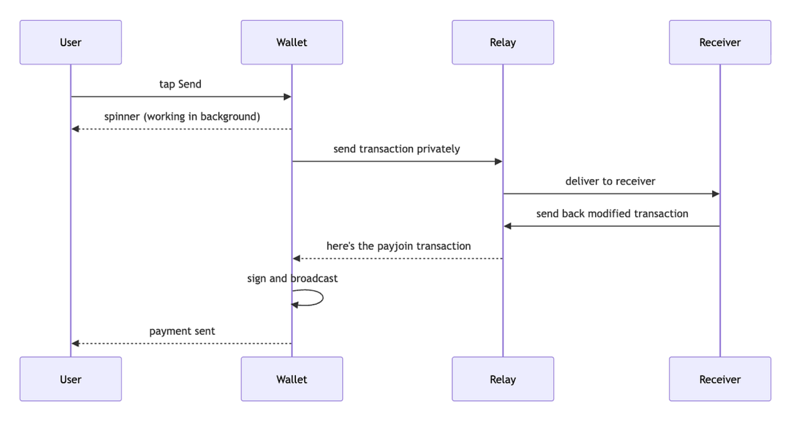

<figure>

</figure>

Hey everyone, I'm Sandip, and I'm excited to share my Summer of Bitcoin 2026 journey with you all. This summer, I built sender-side PayJoin for [Cove](https://covebitcoinwallet.com/), an open source Bitcoin wallet. What started as a privacy feature quickly became a deeper lesson in reliability, failure recovery, and building Bitcoin software for the real world.

## How It Started

I got into Bitcoin last year. Not the trading side, the actual tech. Cryptography, protocols, how the whole thing actually works under the hood.

Somewhere along the way, I found out Summer of Bitcoin was a thing — a program that pays students to contribute to real Bitcoin projects under actual Bitcoin developers, so I applied immediately.

I got in, and my project is to add sender-side PayJoin to Cove, a Bitcoin wallet for iPhone and Android. My mentor is [Praveen Perera](https://github.com/praveenperera), the person who actually built Cove.

## What is PayJoin, and Why Should You Care?

Here's something most people don't realize about Bitcoin: every transaction you make is public forever.

When you send Bitcoin to someone, that transaction gets recorded on the blockchain, a public ledger anyone can read. Blockchain analytics companies make millions analyzing these transactions to figure out who's paying whom, how much, and when. Exchanges use this data. Governments use this data. It's a privacy problem most Bitcoin users don't think about.

PayJoin is one of the most elegant solutions to this. Bull Bitcoin made a great explainer if you want to see it in action before diving into the details:

[Watch this short PayJoin explainer by Bull Bitcoin](https://x.com/BULLBITCOIN_/status/2027079436269392342)

Normally when you send Bitcoin, the transaction has your inputs (the money you're spending) and two outputs: one going to the person you're paying, one coming back to you as change. An analyst looks at this and immediately knows one person sent money to another.

PayJoin changes this by having the receiver also add one of their inputs to the transaction. Now there are two inputs from two different people and the outputs are mixed. This breaks the common-input-ownership heuristic, the main assumption chain-analysis firms rely on to cluster wallets and trace payments. The transaction looks like two people pooling money, or a business consolidating funds, making it significantly harder to determine who paid whom or how many parties are involved. It doesn't defeat every analysis method, but it removes the single most relied-upon one.

The beautiful part is this is completely invisible to anyone not involved. Nothing on chain flags it as a PayJoin. And as a bonus, the receiver gets to consolidate their own Bitcoin in the process, saving on future fees.

<figure>

<figcaption>Regular transaction vs PayJoin - same payment, far less information leaked</figcaption>
</figure>

## The Protocol I Had to Implement

The original PayJoin design required the sender and receiver to be online at the same time. You send your transaction, the receiver's server responds instantly with the modified version. Simple, but it breaks if the receiver is offline.

BIP77 (the protocol I was implementing) solves this with an asynchronous design. Think of it like a dead drop. The sender leaves their transaction at a relay server. The receiver checks the relay when they're ready, picks up the transaction, adds their input, and leaves the modified version back. The sender checks later and picks it up.

BIP77 separates two roles: the PayJoin directory, which stores encrypted messages between sender and receiver, and the OHTTP relay, which forwards requests so the directory can't see the sender's IP address. The PayJoin payload itself is end-to-end encrypted between sender and receiver, so neither the relay nor the directory can read the transaction details. The relay sees the sender's IP address and request timing, but cannot decrypt the encapsulated request. The directory can decrypt the OHTTP layer to process the session, but OHTTP hides the sender's IP from it. A compromised directory could learn when sessions are created and correlate sender and receiver activity, but not the sender's network identity. The threat model is narrower than full anonymity — OHTTP protects the sender's network identity from the directory, not against all possible attacks on the system.

> My job was to build the sender side of this into Cove: detecting when a payment request supports PayJoin, running the protocol automatically in the background, and making sure the user's money was safe no matter what went wrong.

## The Reality of Shipping It

### Months of research before a single line of code

Before I wrote anything, I spent weeks just reading. The BIP77 spec. The Rust library that implements it. How other Bitcoin wallets had approached similar things. Review threads from developers who'd tried this before.

This felt slow. I wanted to code. But skipping it would have cost me more time later. I'd have built the wrong thing.

The research taught me something early: PayJoin looks simple until you think about failure. What if the app crashes mid-negotiation? What if the relay is down? What if the receiver never responds? What if the user closes the app mid-send? Every one of these scenarios involves someone's real money.

### Building in an existing codebase

Cove is a production app with real users. I wasn't building from scratch. I was adding to something that already existed and worked. That's a very different challenge.

The Rust core of Cove uses an actor architecture — think of it as different workers in an office, each handling their own inbox of tasks without interrupting each other. The wallet actor handles signing and broadcasting transactions. I needed to add a PayJoin actor that could run the negotiation in the background without blocking anything else.

When a user taps Send on a PayJoin-enabled payment, the wallet actor spawns a PayJoin actor and immediately returns. The UI stays responsive, the spinner appears, and behind the scenes the negotiation runs. When it's done, the PayJoin actor sends a message back to the wallet actor, which updates the UI.

<figure>

<figcaption>How a PayJoin send works, the wallet handles everything in the background while you just tap Send</figcaption>
</figure>

### The safety guarantee I had to get right

The single most important thing: the user's money cannot get stuck.

Think about what happens during a PayJoin send. We sign the original transaction first. Then we start the negotiation. If anything goes wrong (network error, relay down, receiver unresponsive, phone dies, anything) we need to be able to broadcast that original signed transaction. The payment goes through as a normal transaction. No funds lost.

I spent a lot of time making sure every error path ended in this fallback. Code review later confirmed I had most of it right, and caught the places I didn't. And it was the review process where I actually learned.

### The review process where I actually learned

This wasn't one big PR that got merged. It was step-by-step PRs, each building on the last. And every single one went through review.

Praveen reviewed all of them, pushing back on structure, naming, how things fit together. Dan Gould, the person who actually wrote BIP77, reviewed too.

I was polling the relay every 5 seconds, checking "any update?" over and over. Turns out the relay holds the connection open itself. I was doing six times more work than needed, and on top of that creating a timing pattern that could be used to identify PayJoin transactions. The whole point of this is privacy. That was a bad miss.

He also caught a security gap on the BIP 78 backward-compatible path where I was silently dropping a flag that protects against a malicious directory substituting transaction outputs to redirect funds. Not a theoretical issue, an actual attack vector. (Cove later removed that v1 compatibility path entirely in [PR #778](https://github.com/bitcoinppl/cove/pull/778), eliminating the attack surface.)

By the end, the code looked nothing like what I started with. And genuinely, every change made it better. That's the thing about open source, you can't hide sloppy work. Someone will find it.

## What I've Learned So Far

When you're working on code that touches real money, you stop cutting corners. Not because someone told you to — you just do. A bug here isn't a bad user experience, it's someone's funds.

Reading before coding is never wasted time. Every week I spent understanding the protocol before touching the codebase paid back later.

I used to see review as a hurdle. Now it's the best part. What Praveen caught across every PR taught me more than I'd have figured out on my own in months.

The Bitcoin open source community is also just good. I was a student with no reputation reaching out to the author of the spec I was implementing. He responded, reviewed my code, explained his reasoning. That doesn't happen everywhere.

## Where Things Stood at Midterm

The PayJoin sender was live in Cove. The remaining work was all ahead of me: crash recovery, relay configuration, anti-probing protections, and the user-facing send experience.

Everything below is what happened next.

## The Second Half: Making It Production-Ready

After midterm, the work shifted from building the core protocol to making it survive the real world.

The biggest question was crash recovery. What happens when the app dies mid-negotiation? Before this work, the answer was: you lose the session and fall back. I built persistence using redb, writing session state to disk at every transition. The recovery logic follows a one-way state machine — once the session commits to a proposal, it can never transition back to "send fallback." If it could, a crash-then-restart could silently change what gets broadcast without the user knowing.

That state machine also forced a real design decision. When the app finds a stored proposal on restart, signing could fail. The easy answer is to fall back to the original transaction. But if we already committed to the proposal, broadcasting something different silently changes what the user sent. So the call was: if signing fails on recovery, retain the session and show an error. The user has to reopen and retry. Protocol correctness over convenience.

Then came the layer between the protocol and the user. PayJoin negotiation takes time, and users need to see what's happening. I added a live countdown showing how long the wallet will wait for the receiver, a cancel button that cleanly aborts the session, and proper state handling for success, failure, and timeout. The send flow also needed better error messages. It had a single generic error type for sign-and-broadcast failures, so I split it into typed variants the UI could actually act on.

On the security side, I added anti-probing protection. A malicious receiver could send fake PayJoin requests to figure out which UTXOs belong to the sender. The fix was persistent UTXO tracking in redb. Once a UTXO has been offered in a session, it gets recorded, and the wallet won't offer it again in a different session.

The last pieces were configuration and ship readiness. Users should be able to choose which OHTTP relay they trust, so I built card-based settings screens on both iOS and Android with custom relay support and cloud backup. And since PayJoin isn't shipping to users yet, I added compile-time feature gating so the entire code path can be conditionally included or excluded from builds.

## Final Status

The agreed scope was to build sender-side PayJoin (BIP77 v2) for Cove. All major deliverables are complete: URI detection in the send flow, the async sender with OHTTP relay transport, automatic fallback on any failure, session persistence with crash recovery, anti-probing protection against UTXO ownership leaks, configurable OHTTP relay settings with cloud backup, a waiting UI with live countdown and cancel button, typed send error variants, v1 cleanup, and a feature gate for ship readiness. Nothing was dropped or left incomplete.

Three PRs are open and awaiting maintainer review: OHTTP relay settings ([#842](https://github.com/bitcoinppl/cove/pull/842)), anti-probing ([#863](https://github.com/bitcoinppl/cove/pull/863)), and the waiting UI ([#869](https://github.com/bitcoinppl/cove/pull/869)). All code is written and CI passes. They're pending merge.

## All Contributions

> **PayJoin PRs:**
>
> - [#738 — Wire payjoin endpoint through to send flow state](https://github.com/bitcoinppl/cove/pull/738) (merged)
> - [#752 — Wire payjoin endpoint through confirm send flow](https://github.com/bitcoinppl/cove/pull/752) (merged)
> - [#772 — BIP77 v2 async payjoin sender](https://github.com/bitcoinppl/cove/pull/772) (merged)
> - [#778 — Drop payjoin v1 feature and pjos parsing](https://github.com/bitcoinppl/cove/pull/778) (merged)
> - [#809 — Persist payjoin sender session and resume on cold restart](https://github.com/bitcoinppl/cove/pull/809) (merged)
> - [#838 — Gate payjoin at the Rust layer](https://github.com/bitcoinppl/cove/pull/838) (merged)
> - [#842 — Add payjoin OHTTP relay settings with cloud backup](https://github.com/bitcoinppl/cove/pull/842) (approved)
> - [#863 — Add anti-probing check for offered inputs](https://github.com/bitcoinppl/cove/pull/863) (in review)
> - [#864 — Split sign-and-broadcast error into typed variants](https://github.com/bitcoinppl/cove/pull/864) (merged)
> - [#869 — Add cancellable payjoin polling countdown](https://github.com/bitcoinppl/cove/pull/869) (in review)

For the complete list including pre-selection contributions, see [all my Cove PRs](https://github.com/bitcoinppl/cove/pulls?q=is:pr+author:Sandipmandal25).

## A Note on My Mentor

[Praveen Perera](https://github.com/praveenperera) built Cove and has been my mentor through Summer of Bitcoin.

His reviews were thorough and specific. He caught real issues like race conditions and stale state bugs, not surface-level feedback. When something was critical, he'd push fixes directly to the branch instead of just commenting. He was always available on Discord and pointed me toward Dan Gould and the payjoin community for protocol questions instead of gatekeeping.

He gave me real ownership of the work. When he pushed back on my code, he'd explain the reasoning, and I'd come out of it understanding something I didn't before. It felt like actual collaboration, not task assignment.

If I'm asked what could have been different: nothing. I had everything I needed throughout the program.

## What I'm Taking Away

The shift in how I think about correctness is the most valuable thing from this program. Not just "be careful with money" — a permanent change in how I evaluate error paths, ordering decisions, and failure modes. Every time I looked at code that seemed fine, review proved it wasn't. The direction was mine; the quality came from review.

I reached out to Dan Gould, the author of the spec I was implementing, and he responded, reviewed my code, and explained his reasoning. That kind of openness is not something you find everywhere.

## What's Next

I'm planning to keep contributing to Cove after the program ends.

If you want to follow along or contribute, the code is at [github.com/bitcoinppl/cove](https://github.com/bitcoinppl/cove).

## Let's Talk

If you have any questions or just want to talk Bitcoin and open source, feel free to reach out:

- **GitHub**: [Sandipmandal25](https://github.com/Sandipmandal25)
- **LinkedIn**: [sandip-mandal25](https://www.linkedin.com/in/sandip-mandal25)
- **X**: [@SandipMandal00](https://x.com/SandipMandal00)

> And if you're even remotely interested in Bitcoin, open source, or systems programming, genuinely give Summer of Bitcoin a shot next year.
