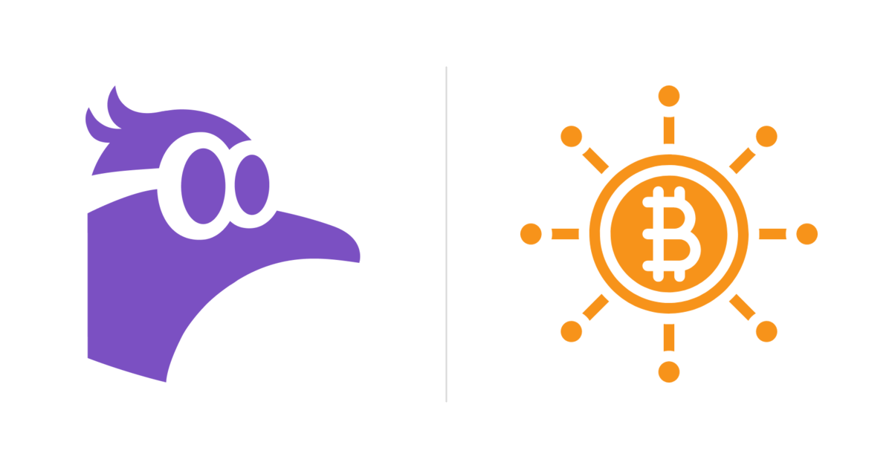

*Featured image: [Nostr](https://github.com/nostr-protocol/nostr) and
[Summer of Bitcoin](https://summerofbitcoin.org/) project symbols, composed for
this post.*

## The idea, and the part that's actually hard

This summer I'm working on **Nostr Components**, mentored by **Sai**. The project
is called *Like & Zap Buttons on X.com and YouTube*. From the outside it sounds
small: let people zap or like a post on X.com or a video on YouTube using Nostr
and Lightning.

But the hard part was never drawing the button. It's a trust question:

> When someone clicks Like or Zap on a tweet, which Nostr identity is actually
> supposed to receive it?

Get that wrong and you either send sats to the wrong person or you have to fall
back on guessing. So my mid-evaluation work split in two directions: a browser
extension that puts the Like button on X.com for real, and a backend that turns
Nostr identity data into something you can look up fast.

## The X.com extension

My first milestone was a working extension PoC — [PR #87](https://github.com/saiy2k/nostr-components/pull/87),
*Browser extension for injecting Nostr Like buttons on X.com PoC*.

It drops a custom Nostr Like button straight into X.com's reaction bar on tweet
pages. The extension detects tweet pages inside X.com's SPA navigation, watches
the DOM, and only injects a button when the tweet's author has a known verified
mapping. It talks to `window.nostr` through a page bridge for NIP-07 signing,
publishes the reaction to a curated relay set, and has loading, liked, and error
states so it doesn't feel like a hack.

For the competency-test stage I kept identity lookup simple on purpose — a local
`verified-directory.json`. I just wanted to prove the loop end to end: detect the
author, inject the action, ask the signer for a signature, publish the reaction.

That mattered because it answered the scariest question early: *can the browser
even host this UX?* Yes. What's left is feeding it correct identity data at
scale, which is a backend problem.

## The relay-directory backend

The second milestone is the backend directory system, and it's where the real
work lives. I shipped it first as one big [PR #86](https://github.com/saiy2k/nostr-components/pull/86)
(*Add relay directory crawler*), then closed it and split it into three PRs —
one per runtime — because each one was doing too many unrelated things:

- **backfill** ([PR #99](https://github.com/saiy2k/nostr-components/pull/99)) —
  crawls past `kind:10011` and `kind:0` events with resumable relay/kind cursors
  and checkpointing
- **live monitoring** ([PR #100](https://github.com/saiy2k/nostr-components/pull/100)) —
  keeps WebSocket subs open for new events, with its own reconnect backoff,
  heartbeat, and clean shutdown
- **projection** ([PR #101](https://github.com/saiy2k/nostr-components/pull/101)) —
  turns stored raw events into lookup-ready directory documents

The whole point is to do the slow, expensive identity work ahead of time instead
of asking the extension to do it live. Splitting by runtime also keeps each
module's lifecycle, failure behavior, and deployment story in one place instead
of tangled together.

The pipeline stores raw events, queues projection work, writes normalized
directory records, and tracks crawler state so runs are observable and
restartable. On top of that I added the reliability bits you need before anything
like this is trustworthy to run for real: checkpointed backfills, reconnect and
heartbeat handling for the live listener, bounded dedup, buffered Firestore
writes, retry scheduling, and safeguards so a temporary X/Twitter outage or a 429
doesn't permanently reject a valid proof.

PR #101 also adds a discovery path the original crawler didn't have: opt-in **X
profile-bio scanning**. Flip it on and the worker reads a creator's public X bio
and pulls out any `npub`, `nprofile`, or NIP-05 identifier it finds, resolving
NIP-05 through `/.well-known/nostr.json` without following redirects. It only
stores the resolved identifier and its verification method — not the full bio —
so it can pick up accounts that have never published a `kind:10011` event without
loosening the trust model.

## What the real data taught me

The most useful part of this project has been finding out where my own assumptions
were wrong.

Early on I assumed the hard part would be extension engineering. After actually
working through the relay data and the proof flow, it became obvious the deeper
problem is **identity quality**, not UI.

A few things in particular:

**I had the wrong event shape.** I'd been treating identity proofs as living in
`kind:30382`. They don't. The current NIP-39 format stores identity claims in
`i` tags on `kind:10011` events. The backend also reads legacy `kind:0` profile
data for compatibility. That correction rewrote the crawler design — instead of
chasing the wrong events, the backend now pulls proof candidates from the
sources where they actually live.

**"Millions of mappings" isn't an honest starting point.** When I tested against
live data, verified X-to-Nostr mappings turned out to be much sparser than a
product pitch suggests. That matters because a Like or Zap button is only as
trustworthy as the mapping underneath it. So the architecture got more honest:
verify real proofs where they exist, label weaker signals as *claimed* rather
than *verified*, and never let a weak heuristic quietly become an auto-zap
target. I'd rather have a smaller, trustworthy directory than a huge, shaky one.

**A real zap isn't just paying an invoice.** A proper NIP-57 zap is not the same
as a plain LNURL tip. The client has to build and sign a `kind:9734` zap request,
check the recipient can actually receive Nostr zaps, then watch for the
`kind:9735` zap receipt. It was a good reminder that Bitcoin and Nostr
integrations look simple at the UI layer and hide strict protocol requirements
underneath.

## Why I think this is worth doing

This project tries to connect three things that usually stay apart: mainstream
social platforms where creators already have attention, Nostr identities that
users actually own, and Lightning payments that make value-for-value interaction
real. If the identity layer is sloppy, the whole thing is unsafe. If it's solid,
then a small button can mean something: people bringing open protocols into
closed platforms without asking those platforms for permission. That's why the
mid-evaluation work leaned on the machinery that makes the interaction
trustworthy rather than on a prettier integration.

## What's next

Second half, the plan is to wire the pieces into a more complete product path:

- replace the extension's hardcoded directory with the relay-backed service
- finish the verified lookup path for safe identity resolution
- build the zap flow with the proper NIP-57 request/receipt pair, not a tip
- start on YouTube, where channel extraction is harder than X.com — the page
  structure and the channel identity flow are genuinely different
- keep refining the trust model so verified and claimed identities stay clearly
  separated in both the data and the UX

I also want to keep this honest. If something's still exploratory by final
evaluation, the write-up should say so rather than overselling it.

## Thanks

Mid evaluation pushed me from "feature idea" to a system design that's actually
grounded in how the protocols behave. I have a working X.com PoC and three
submitted relay-directory PRs: the backfill PR has merged, while the live
monitoring and projection PRs remain open. I also have a much clearer
understanding of Nostr identity proofs, trust boundaries, and zap mechanics.

More than anything I have a better idea of what to optimize for: not convenience,
but correctness.

Thanks to **Nostr Components** and to **Sai** for letting me work on something
that sits right where frontend UX, protocol design, and Bitcoin-native payments
meet. On to the final evaluation.

## Follow the project

If you want to follow the work or contribute, visit the
[Nostr Components repository](https://github.com/saiy2k/nostr-components) and
share feedback on the identity-verification and zap flows. For more protocol
background, see [NIP-05](https://github.com/nostr-protocol/nips/blob/master/05.md),
[NIP-07](https://github.com/nostr-protocol/nips/blob/master/07.md),
[NIP-39](https://github.com/nostr-protocol/nips/blob/master/39.md), and
[NIP-57](https://github.com/nostr-protocol/nips/blob/master/57.md).

*Disclosure: This post was prepared from my project notes with assistance from
OpenAI Codex and checked against the linked project work.*
