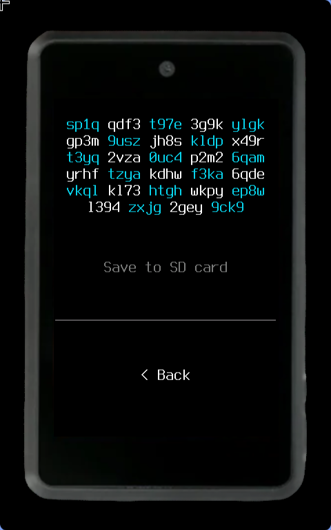

Every Bitcoin address you hand out is a small privacy leak. Post one on a donation page and anyone can watch what arrives. Reuse one across three payments and you have linked three counterparties to each other. The usual answer is to never reuse an address, which pushes the problem onto the sender: they have to ask you for a fresh one every single time, over some channel, before they can pay you.

Silent Payments ([BIP-352](https://github.com/bitcoin/bips/blob/master/bip-0352.mediawiki)) removes that back-and-forth. You publish one static `sp1...` address forever. The sender combines their own input keys with your published scan and spend keys and derives a fresh Taproot output that only you can find and only you can spend. Nothing on-chain links those payments to each other, and nothing links them to the string you published.

My Summer of Bitcoin project was to make that work on [Krux](https://selfcustody.github.io/krux/) — an air-gapped hardware signer with no network, no USB data, and a camera as its only real input channel.

## Two summers, one BIP

This is my second Summer of Bitcoin, and the second time I have ended up inside BIP-352.

In 2025 I worked with SeedSigner, where I added Silent Payment address support ([SeedSigner #769](https://github.com/SeedSigner/seedsigner/pull/769)). That was mostly the receiving half: derive the keys, render the address, prove the cryptography behaves. It was enough to understand the protocol and nowhere near enough to actually pay someone.

The gap between "the device can display an `sp1...` address" and "the device can sign a transaction that pays one, and later spend the coins it received" turned out to be most of the work. That gap is what I proposed for 2026, this time with Krux.

## What I set out to build

The goal was full BIP-352 support in Krux, in both directions:

- Send to an `sp1...` address from any Krux wallet.
- Receive to a Silent Payment wallet, and spend those coins afterwards — including to ordinary P2TR, P2WSH, P2SH and P2WPKH destinations.

That framing matters, because a wallet that can only pay Silent Payment addresses, or only receive to them, isn't usable. Silent Payments has to interoperate with everything that already exists or nobody can adopt it.

## Why an air-gapped signer makes this hard

On a hot wallet, Silent Payments is largely a key-derivation exercise. On an air-gapped signer, three constraints collide.

**The device cannot show you the destination.** When you pay `sp1qq...`, the output that lands on-chain is a fresh P2TR script that is, deliberately, unrelated to anything the recipient published. There is no address to compare against the one you were given. So Krux shows you the `sp1...` string it was asked to pay, in four-character blocks so you can actually read it off a small screen, and warns you explicitly: verify *this* string with your recipient, never the derived on-chain address.

**The signer must not finalize.** [BIP-375](https://github.com/bitcoin/bips/blob/master/bip-0375.mediawiki) has the signer attach an ECDH share and a [DLEQ proof](https://github.com/bitcoin/bips/blob/master/bip-0374.mediawiki) for each input, so the coordinator can independently verify that the derived output really belongs to the address the user asked to pay. That verification only happens if the PSBT comes back *unfinalized*. A hardware wallet that helpfully finalizes the transaction has quietly removed the recipient's protection.

**Everything travels through a QR code.** Silent Payment PSBTs carry extra fields — ECDH shares, DLEQ proofs, output data, labels — and a camera-and-screen channel has a hard bandwidth ceiling. Krux's PSBT trimming had to learn which of the new fields are load-bearing for the coordinator (`sp_ecdh_shares`, `sp_dleq_proofs`, `sp_data`, `sp_label`) and which are the device's own scratch work that should never leave it (`sp_tweak`, the SP spend derivations).

## The design decisions

### Silent Payments as a wallet policy, not a special case

The most consequential decision was to make Silent Payments a first-class **wallet policy type** in Krux, sitting alongside single-sig, multisig and miniscript, rather than a feature bolted onto the existing single-sig path.

A Silent Payment wallet genuinely behaves differently. It derives a scan key and a spend key at `m/352h/<coin>h/<account>h`. Its script type is always P2TR. It has exactly one reusable address instead of a receive branch, a change branch and a gap limit. It is described by an `sp(...)` descriptor ([BIP-392](https://github.com/bitcoin/bips/blob/master/bip-0392.mediawiki)) rather than an ordinary output descriptor, and it never loads a descriptor from a coordinator, because there is nothing for a coordinator to tell it that it cannot derive itself.

Trying to express all of that as flags on the single-sig path would have produced conditionals in every screen. Making it a policy meant each layer — key derivation, wallet, PSBT, UI — could ask one honest question and get one honest answer.

### Detection keys, so change stops looking like a stranger

Silent Payment change goes to your own SP address under label 0. On the review screen that output is, by construction, a Taproot script the wallet has never seen before — so without extra work Krux would show your own change as a payment to an unknown address, which is exactly the kind of scary-looking screen that trains people to click through warnings.

Krux now derives *detection keys* from the seed regardless of which policy is currently loaded, and matches each output against the scan key plus label-tweaked spend key. Change and self-transfers get labelled as change and self-transfers — even when you are reviewing the transaction from a different wallet loaded from the same seed.

### Building the foundation upstream, in embit

Krux does not implement Bitcoin primitives itself; it uses [embit](https://github.com/diybitcoinhardware/embit), a MicroPython-friendly Bitcoin library. Silent Payments needs a lot that embit did not have: PSBTv2 ([BIP-370](https://github.com/bitcoin/bips/blob/master/bip-0370.mediawiki)), DLEQ proofs (BIP-374), the sending and spending PSBT roles (BIP-375, [BIP-376](https://github.com/bitcoin/bips/blob/master/bip-0376.mediawiki)), and the `sp()` descriptor (BIP-392).

I could have vendored a private copy of all that inside Krux and shipped faster. I put it in embit instead, as [embit #145](https://github.com/diybitcoinhardware/embit/pull/145), because a second wallet trying to do this shouldn't have to reimplement the same six BIPs — and because a fork of the crypto layer is a maintenance burden nobody signs up for on purpose.

## The bug that taught me the most

Late in the project, sending from a Silent Payment wallet failed at the coordinator with `Silent payment output must provide valid Taproot output script`. Paying an `sp1...` address from a legacy P2WPKH wallet worked fine. Signing over SD card appeared to work too. Only the combination of Taproot inputs and the QR flow broke.

The root cause was one line in the signing path: for a Taproot key-path spend, embit set `final_scriptwitness` alongside `taproot_key_sig`. That single field made the PSBT *look* finalized. Sparrow, on receiving a finalized PSBT, merges it with `copyFinalizedFields()` instead of `combine()` — it copies the witnesses and drops the rest, including the derived output script and the ECDH/DLEQ globals that make the Silent Payment output verifiable. By the time extraction failed, the evidence had already been thrown away.

P2WPKH inputs never hit it, because they only produce `partial_sigs` and stay unfinalized. The SD card path masked it, because Sparrow opened the file as its own transaction rather than merging it — which meant it also skipped the coordinator verification entirely. Two different reasons the bug looked like it wasn't there.

The fix was to clear `final_scriptwitness` and `final_scriptsig` after signing a Silent Payment PSBT on both the QR and SD paths, and to add on-device validation that refuses finalized inputs, non-Taproot Silent Payment scripts, and missing ECDH shares or DLEQ proofs.

Then I wrote a test that asserts Krux hands back an unfinalized PSBT, with a comment saying it was asserted so an embit bump could not silently change it. Weeks later, an embit bump changed exactly that behaviour again, and that assert is what caught it. Writing down *why* a behaviour is deliberate turned out to be worth more than the fix itself.

## What shipped

- **[Krux #925](https://github.com/selfcustody/krux/pull/925)** — the main implementation: the Silent Payment policy type, address and descriptor display, BIP-375/376 PSBT signing, and output classification. Around 2,700 lines across 48 files. *Under review.*
- **[embit #145](https://github.com/diybitcoinhardware/embit/pull/145)** — the foundation: BIP-352, 370, 374, 375, 376 and 392. *Under review.*
- **[Krux #868](https://github.com/selfcustody/krux/pull/868)** — Silent Payment address and descriptor support. *Merged.*
- **[Krux #854](https://github.com/selfcustody/krux/pull/854)** and **[#870](https://github.com/selfcustody/krux/pull/870)** — earlier iterations, superseded by #925.
- **[SeedSigner #949](https://github.com/SeedSigner/seedsigner/pull/949)** — Silent Payment support in SeedSigner, on the same embit foundation. *Open.*
- **Beta firmware** at [odudex/krux_binaries](https://github.com/odudex/krux_binaries), so people can try it before the upstream merge lands.

Krux's full suite is at 1,156 passing tests, 22 of them covering Silent Payments end to end: output detection, PSBT validation, address derivation, ECDH and DLEQ signing, and change classification. I also tested by hand against real transactions with varying numbers of inputs and outputs, in both directions, across every destination script type.

Two of those PRs being superseded is not an accident I am hiding. #854 was an address generator, #870 was a broader attempt that grew tangled, and #925 is what I would have written first if I had understood the problem then. Throwing away the first two was the fastest thing I did all summer.

## What remains

The two substantial PRs are still under review. They are large, they touch signing, and the Krux maintainers have had security work of their own to prioritise this summer — a careful review here is the correct outcome, not a delay to complain about. In the meantime the beta binaries exist and the feature is testable.

## What I learned

Protocol work does not live inside the spec. It lives in the seams — between the BIP, the library that implements it, the coordinator on the other side of the QR code, and the user squinting at a 64-character address on a tiny screen. Every hard bug I hit this summer was in one of those seams, and none of them were visible from the BIP text alone.

The other lesson is that interoperability *is* the feature. A Silent Payments implementation that only talks to itself is a cryptography demo. What makes it real is that Sparrow merges the PSBT correctly, that a legacy wallet can pay an `sp1...` address, and that an SP wallet can pay a plain P2WPKH one.

My mentor made a large part of this possible — not only by pointing me at the right parts of the codebase, but by staying in the review loop and fixing bugs on top of my work rather than handing back a list. That is the kind of mentorship that makes a large change actually mergeable.

## What happens next

I want to see both PRs merged, and I intend to stay through however many review rounds that takes. After that, Silent Payments in SeedSigner is the obvious next thing, since the embit foundation is now shared. Six months from now I expect to still be doing this — the Bitcoin privacy stack has plenty of unglamorous seams left, and I have developed a taste for them.
