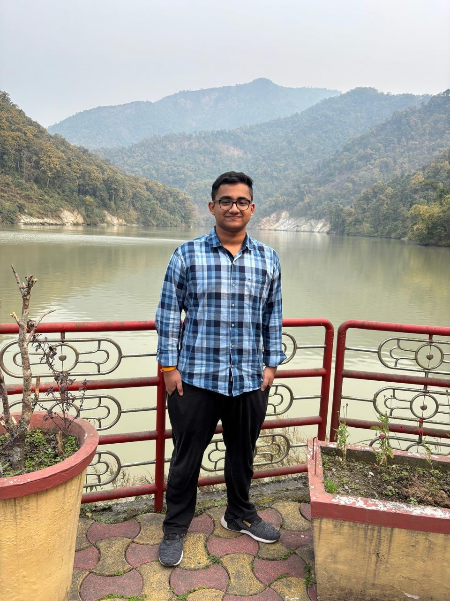
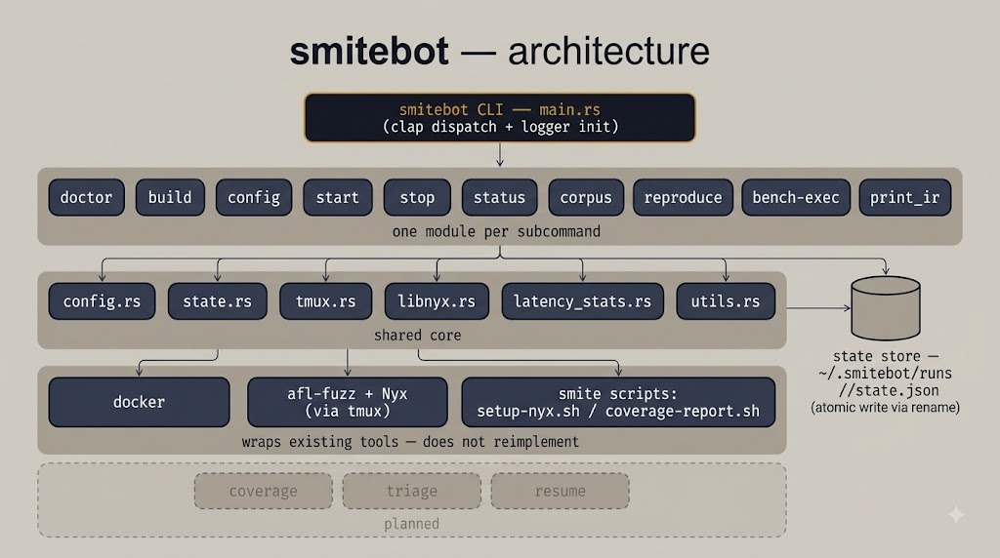
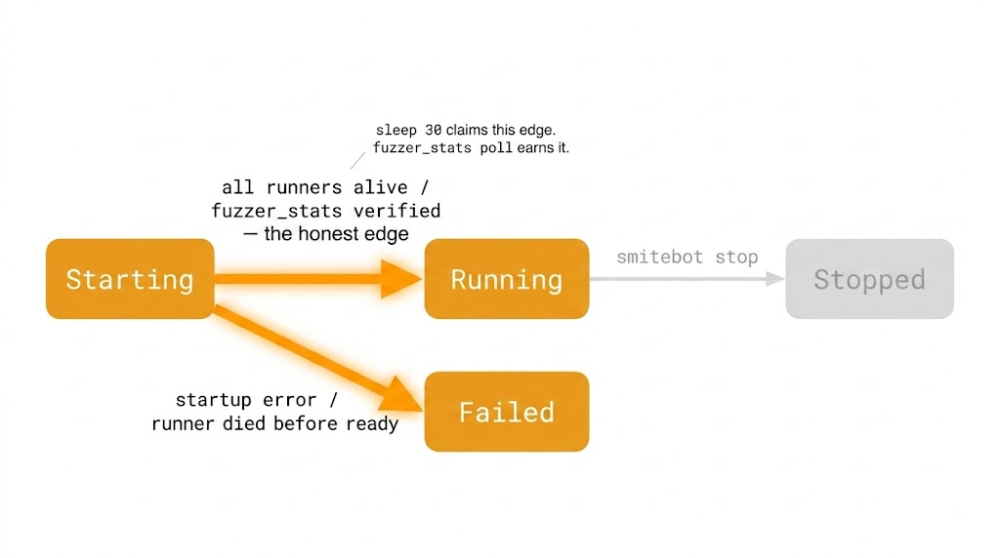
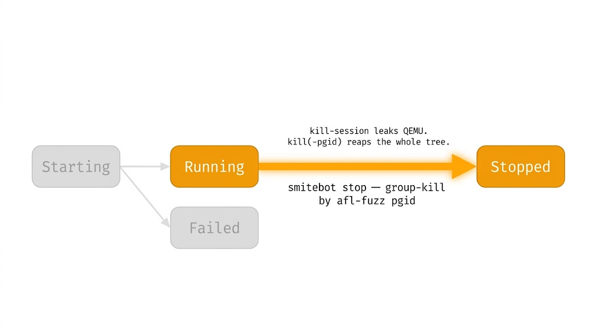

I'm Ashish Kumar Dash, a CSE undergraduate at IIT Bhilai, and for Summer of Bitcoin 2026 I worked on **smitebot** , a campaign manager for Smite, a fuzzing framework for Lightning Network implementations. This is my final report with my work, thoughts and my overall experience.

When Summer of Bitcoin started, I had a fuzzing framework in front of me and a problem nobody wanted to say out loud: running it was an annoying task. Smite fuzzes Lightning Network implementations - LND, CLN, LDK, Eclair, with AFL++ under Nyx. The fuzzing itself was solid. Everything *around* it was eleven manual steps, each a place to quietly get something wrong. Build the right image. Prep the Nyx sharedir. Launch the runners. Babysit them. Scrape the stats. Tear it all down without leaving virtual machines orphaned in the background.

My job for the summer was to make that go away. We called it **smitebot** - a campaign manager CLI that turns the whole ritual into a handful of commands. One principle from the first day: *orchestrate, don't reimplement.* Smitebot wraps the scripts and tools that already exist. It doesn't try to be smarter than them.

## The first PR humbled me

I opened my very first pull request with a beautiful skeleton - ten commands, all stubbed out, the whole surface sketched in one go. It got closed. Correctly. You can't design the tenth command before you've built the first one; dead structs are just guesses wearing confidence.

So I started over, one command per PR, and the first real one was `doctor` - the preflight check that tells you whether your machine can even fuzz. It should have been the easy one. Instead it became the longest review of my summer: seventeen files, round after round of comments, every error message and helper picked apart. There were evenings I closed the laptop genuinely unsure I was cut out for this. But that PR taught me more than any other - how this codebase breathes, what my reviewers actually cared about, and that "it works on my machine" is the beginning of the conversation, not the end. When it finally merged, it didn't feel like a checkbox. It felt like I'd earned my seat.

## What I built

After doctor, the rest came in a steady rhythm, each command its own small argument for existing:

- **`build`** — workload Docker images from a target and scenario.
- **`config`** — a validated TOML schema the rest of the tool speaks.
- **`start`** — the heart of it: build, prep the sharedir, launch N parallel runners.
- **`stop` / `status`** — clean teardown, and a live dashboard of a running campaign.
- **`corpus merge` / `minimize`** — dedup and prune inputs across runner queues.
- **`reproduce`** — replay a single input against a target (in review as I write this).

## The decisions I'm proud of

A few problems forced me to actually understand the system instead of gluing over it.

My first `start` orphaned runners into the background where you couldn't see them. It worked, and it was useless - a fuzzer you can't watch is a fuzzer you don't trust. Rebuilding it around **one tmux window per runner** meant every AFL++ screen stayed live and attachable, and a dead runner's last words stayed on screen instead of vanishing.

Then there was the leak that taught me to read process trees. Under Nyx each runner drives a QEMU child, and killing the tmux session left those QEMUs alive, reparented and forgotten. The fix wasn't a bigger hammer — it was noticing that each runner is its own process-group leader and QEMU rides along in that group, so **one group-directed kill reaps the whole thing.**

And everywhere I could, I refused dependencies I could hand-write: a six-line hash instead of a crate, the standard library instead of a convenience wrapper. Less code to own at 3am.

## What shipped, and what's left

Shipped and merged: doctor, build, config, start, stop, status, and the corpus commands. `reproduce` is open and waiting on review. Still ahead: Nyx-mode reproduction, scenario validation, then `list`, `resume`, crash triage, and
coverage. The scaffolding is done. What remains is the science.

## What I actually learned

- **Ship one honest command, not ten hopeful ones.** Scope is a kindness - to reviewers, and to yourself.
- **Disagree with a source, not a feeling.** Most of my pushback was settled by pointing at a line of code and the times I was wrong, I learned the most.
- **Slow down before irreversible git.** I closed a PR once by doing something careless with a branch. Once was enough.

## A note about my Mentors

None of this happened alone. My mentors, Matt Morehouse and  Nishant Bansal gave me the kind of exacting, patient review that quietly rebuilds how you think. A lot of what I'm proud of in this project is really their standards, absorbed. And it wasn't only about smitebot. Some of our best conversations wandered past the code - into how AI is reshaping the way open source gets built, who it lowers the barrier for, and who it quietly leaves behind. Those talks stuck with me, because they landed on more than my project. I'm secretary of OpenLake, IIT Bhilai's open-source society, where a big part of my job is helping juniors take their first real steps into contributing. The direction I picked up in these chats, how to stay valuable in an AI-shifted open-source world, is direction I now carry straight back to them. Mentorship, it turns out, compounds: what Matt and Nishant gave me doesn't stop with me. I'm grateful and proud to have had the opportunity to work under their mentorship, and looking forward to working together for the foreseeable future.

## What happens next

Summer of Bitcoin is ending, but for me smitebot isn't. I'm staying on smite — I want to take this past a tidy CLI and into the deep end: a daemon that runs campaigns on its own, triages what it finds, and helps surface *real* Lightning vulnerabilities responsibly. I'm planning to apply for a fellowship to protect real time for that work alongside university, and Matt has agreed to keep mentoring me through it.

The dream I keep coming back to is a **differential oracle** - feed the same wire message to LND, CLN, LDK, and Eclair at once and flag where they disagree, because that's exactly where the interesting, spec-level bugs hide that single-target fuzzing will never see.

I came into this summer knowing how to write code. I'm leaving it understanding,
for the first time, what it means to build something people will actually depend
on. That's the part I'm keeping.

— Ashish Kumar Dash
