# How I Fit SeedSigner on a $2 Screen

SeedSigner is an open-source DIY hardware wallet you can build yourself for under $50 using off-the-shelf parts. It's stateless by design: your private keys never touch persistent storage. You boot it, do your thing, and power off.

The catch? It needs a 240×240 pixel LCD, a camera for QR codes, and a Raspberry Pi. This dependency can lead to supply chain constraints and pricing issues for some parts of the world. To counter this, Keith, the lead developer at SeedSigner, and my mentor, has been working on porting the SeedSigner codebase to work on a microcontroller like the ESP32-P4 and a wide variety of displays to enable hardware agnosticism.

**What if the entire SeedSigner could run on a $2, 16-character-wide screen?**

That's what I built this summer. The Constrained UI Runner is a standalone Python engine that consumes the exact same JSON semantic payloads from SeedSigner's new LVGL architecture and renders them on hardware that would make most developers cringe: 16×2 character LCDs, tiny 128×32 OLEDs, E-Paper displays, and a PWM buzzer for spatial audio navigation. All of it running the real, unmodified SeedSigner, complete with seed generation, PSBT signing, multisig coordination, and passphrase entry.

No camera? No problem. We route PSBTs through an airgapped MicroSD card instead.

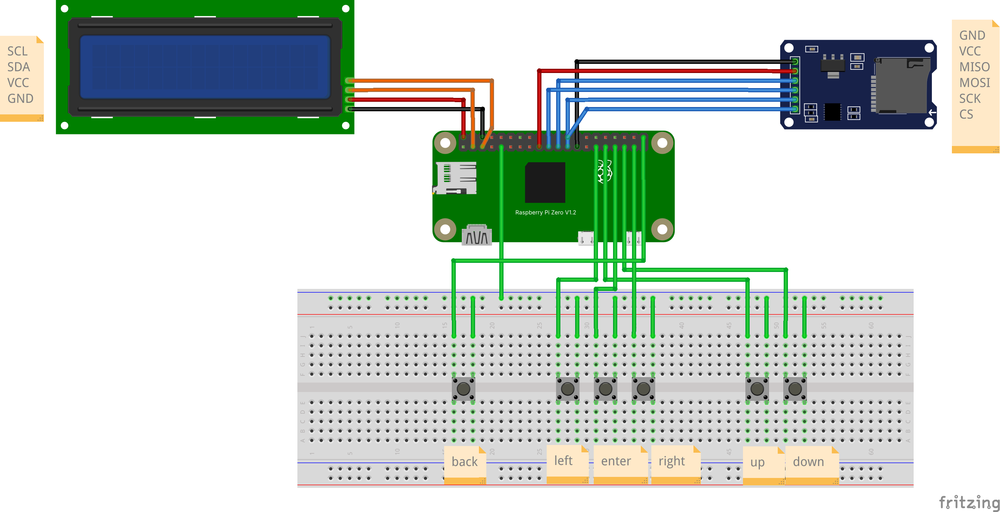
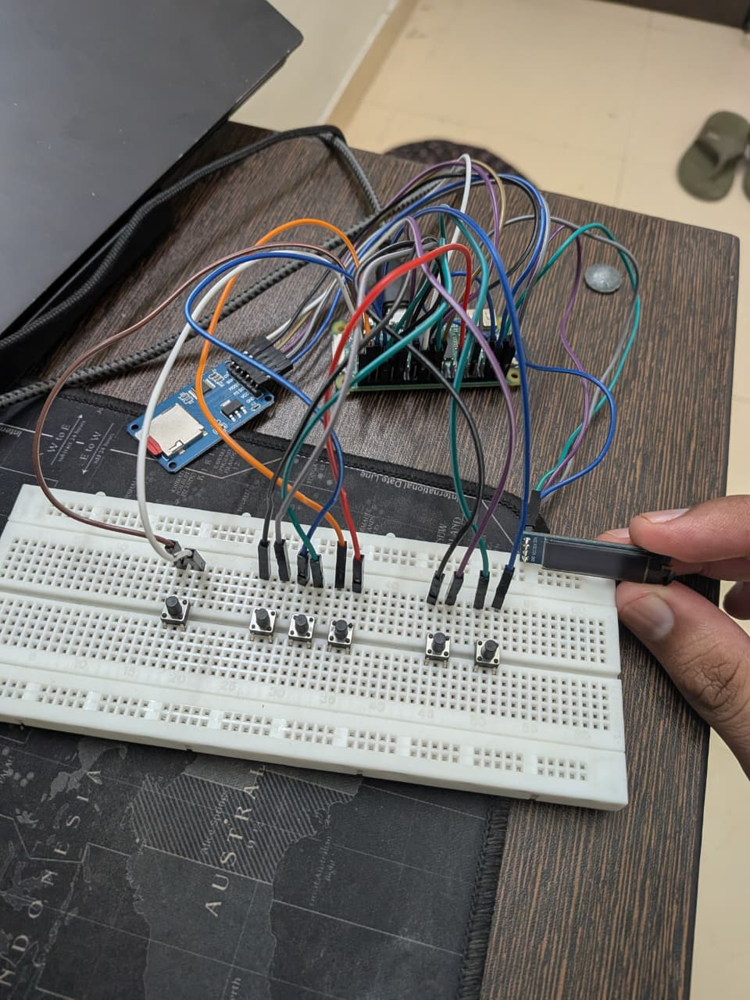


# Background: How it Started
## The Gist

Before I even submitted my proposal to Summer of Bitcoin, I did something stupid. I grabbed an Arduino UNO R3 and a 16×2 character LCD I had lying around and tried to build a SeedSigner on it.

Obviously, you can't build a real Bitcoin hardware wallet on a board with 2KB of RAM. But I wanted to see: could the UX even work? Could you navigate menus, enter seed words, and understand where you are, all on 32 characters?

The answer was yes, barely, and with a lot of tricks.

I crammed the entire BIP-39 wordlist into the Arduino's 32KB flash memory and built a search engine that fetched words one at a time. As you cycled through letters, the display instantly updated with the closest matching word. After 4 characters, it auto-completed, because no two BIP-39 words share the same first four letters.

I posted this as a [Gist](https://gist.github.com/aphrodoe/953e5fc902d5e6ec4d5a578a546f8ef1) on Telegram and the SeedSigner community appreciated it. Keith himself reacted to it. That gist shaped my proposal. Here is a peek from the original Gist that started this:

https://github.com/user-attachments/assets/b767d005-2630-4ca2-9db0-ee075a322892

## The Proposal
The core insight was deceptively simple: SeedSigner's new LVGL architecture generates a JSON semantic payload that describes what a screen intends to communicate and not how to draw it. A title, a list of buttons, a warning, a keyboard. If the payload describes intent, then any display can render it. Even a two-line LCD.

Go deep into [my proposal](https://docs.google.com/document/d/1vp2tQBpYC56JySQ9tG-C4EIZVFi5GSEgHu5GlnGXnhU/edit?usp=sharing) to understand my initial thinking of the project.

# The Design Challenge: When 32 Characters is All You Have

## Constraints as Creative Fuel
The original [SeedSigner design case study](https://bitcoin.design/guide/case-studies/seedsigner/) talks about fitting a modern UI onto a 240×240 pixel display. That's 57,600 pixels. The 16×2 character LCD gives me 32 characters. That's it. Two rows of 16. No pixels, no icons, no fonts, no colors.

To put this in perspective:
| Resolution | Characters | Ratio to SeedSigner |
|:---|:---|---:|
| Original SeedSigner 240×240 LCD | ~800 chars equivalent | **1×** |
| 16×2 Character LCD | 32 characters | **0.04×** |
| 20×4 Character LCD | 80 characters | **0.1×** |
| 128×64 OLED | ~126 characters (computed) | **0.16×** |
| 200×200 E-Paper | ~660 characters (computed) | **0.83×** |

The original SeedSigner redesign had to squeeze a smartphone-style UI into 240 pixels. I had to squeeze that same UI into 32 characters. The original design guide's constraint was pixel count. Mine was information density per character.

If you take a look at the history of SeedSigner, this text only approach was close to the roots of SeedSigner. Here is a screenshot from a pretty old text only version of SeedSigner:

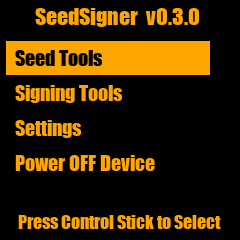

## The three-tier problem
Different displays need fundamentally different rendering strategies. A 16×2 LCD can only show one menu item at a time. A 20×4 LCD can show three items in a scrollable window. An OLED or E-Paper can show a full page.

This is a completely different interaction paradigm at each tier. The user's mental model of "where am I in this menu" changes entirely based on how many items they can see simultaneously. Also this tier system had to be coded up such that any future displays can seamlessly plug into it by writing just a custom driver.

# Architecture: How everything connects

## The JSON semantic contract
Everything starts with a JSON payload. When the SeedSigner View layer wants to show a screen, it assembles a configuration dictionary:
```json
{
  "main_menu_screen": {
    "context": {
      "top_nav": {
        "title": "Home",
        "show_back_button": false,
        "show_power_button": true
      },
      "button_list": [
        "Scan",
        "Seeds",
        "Tools",
        "Settings"
      ]
    }
  },
  "button_list_screen": {
    "context": {
      "button_list": [
        "Language",
        "Persistent settings",
        "Camera rotation",
        "Bitcoin network"
      ],
      "top_nav": {
        "title": "Settings",
        "show_back_button": true,
        "show_power_button": false
      }
    }
  }
}
```
Normally, this gets consumed by LVGL's C-extension to draw pixel-perfect widgets on various screens. Our engine intercepts it and renders it as text instead.

## The rendering pipeline
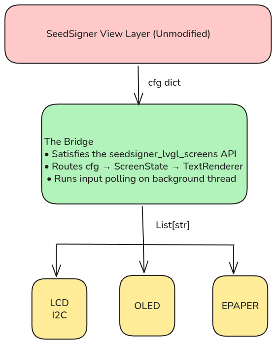

The renderer is a stateless transform. It receives an object (which tracks cursor position, scroll offset, entered text, animation ticks) and produces exactly N strings of exactly M characters each. The hardware driver's only job is to blast those strings to the display. All the intelligence lives in the algorithm.

### The bridge module
The `constrained_text_screens.py` module is the single most important file in the project. It's a drop-in built on the principles set by Keith in this [guide](https://github.com/kdmukAI-bot/seedsigner/blob/integration/lvgl-mpy/docs/architecture/view-to-screen-json-contract.md). It uses the same API that is defined in this document. It exposes the same API the upstream SeedSigner expects: screen builder functions that render immediately and return, plus a polling loop for non-blocking input. Internally, it monkey-patches the camera and QR display flows, routing camera scans to the MicroSD file picker and QR exports to SD card writes. The upstream SeedSigner code runs completely unmodified.


# Design Decisions

## Block Pagination and Sliding Window
<p align="center">
  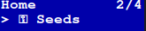
  &nbsp;&nbsp;&nbsp;&nbsp;
  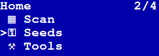
</p>

Block Pagination treats the screen like a book, and you flip through one item per "page." The [2/4] indicator tells you exactly where you are.

On a 20×4 display, we switch to a Sliding Window Viewport, the cursor stays centered while the menu scrolls around it. The renderer dynamically selects the strategy based on rows provided in the configuration. Plug in a different display, and the algorithm adapts.

## Dynamic CGRAM: 8 Slots, Infinite Icons

The HD44780 LCD controller (the chip inside every character LCD) has exactly 8 custom character slots. That's 8 tiny 5×8 pixel grids you can define at runtime. The SeedSigner UI uses icons for everything: checkmarks, warnings, seeds, tools, settings, scan. Way more than 8.

The dynamic CGRAM allocator solves this by scanning every frame and remapping the 8 hardware slots to whatever icons the current screen actually needs. If a screen only uses ✓ and ⚠, those get the first two slots. If it needs all 8, they're prioritized by visual importance. If a screen somehow needs 9+ icons (extremely rare), the lowest-priority ones gracefully degrade to ASCII equivalents.

## 1D and 2D Spatial Grids

On the smaller screens, rendering an entire keyboard is not possible. So I use a 1D spatial grid to cycle through the characters.

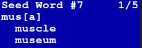

For bigger displays, the layout engine maps the upstream columns and rows values to render a fully interactive 2D grid resembling the keyboard.

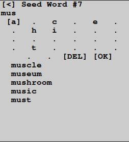

## The Back Button

On the original SeedSigner, the navigation bar has a back arrow. On a 16-character display, that arrow would eat 3 precious characters. A dedicated physical "Back" button is an alternate choice. No need to clutter menus with [BACK] items. One button press, you're out.


## Marquee Animations

Menu items get long. "Persistent Settings" is 19 characters, which is 3 too many for a 16-column display. Rather than truncate critical text, I implemented time-based marquee animations:

- The text pauses for 5 ticks
- Smoothly scrolls to reveal the full content
- Pauses again, then repeats

Selected items marquee. Unselected items stay statically truncated. This keeps the focus clear while ensuring you can always read the full label.

## Creative Liberty on Bigger Screens

<div align="center">
  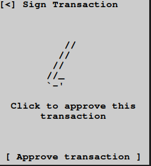
  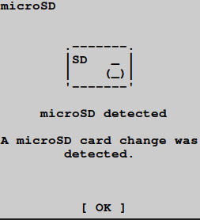
  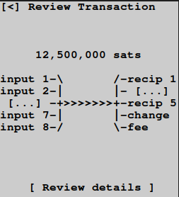
  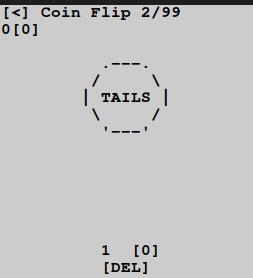
</div>

While working on the bigger screens, I have tried to create ASCII art to mimic the original SeedSigner screens. I have also taken some creative liberty: for example, the coin flip screen has an actual coin art which is not there in the original screen.

# The Airgapped MicroSD Pipeline

Constrained hardware lacks a camera. No camera means no QR codes. No QR codes means we need a different way to move PSBTs in and out of the device.

Hence the MicroSD pipeline: a dedicated MicroSD card reader wired to the Pi's SPI bus. The user loads an unsigned PSBT onto the card from their laptop, plugs it into the SeedSigner, signs the transaction, and the signed PSBT is written back atomically.

Why SPI and not USB? Because USB Gadget mode requires physically connecting the signing device to an internet-connected laptop, basically violating strict airgap policies. And because modern operating systems aggressively write hidden metadata files to USB drives, which can corrupt the binary PSBT format.

The pipeline handles hot-swapping, dirty filesystems, and atomic writes. From the user's perspective, it just works: plug in card, pick file, sign, done. To support hot-swapping without rebooting, the runner unbinds and rebinds the SPI driver, forcing the kernel to re-probe the bus on every SD card action.

# What I Finally Built

| Deliverable | Detail |
| :--- | :--- |
| **Screen types rendered** | Entire SeedSigner coverage (visual-only skipped) |
| **Display targets** | 5 (16×2 LCD, 20×4 LCD, 128×64 OLED, 200×200 E-Paper, Terminal) |
| **Platform targets** | 2 (CPython on Pi Zero, MicroPython on ESP32-S3) |
| **Bridge module** | Drop-in replacement for `seedsigner_lvgl_screens` |
| **MicroSD pipeline** | Airgapped PSBT read/write with hot-swap support |
| **Documentation** | Build Guide, Design Guide, MicroSD Guide |
| **Wiring diagrams** | Schematics (OLED, LCD, E-Paper) |
| **Test suite** | Golden snapshot tests across all tiers |

# Building for Multiple Worlds

## Pi Zero: The Primary Target
The Raspberry Pi Zero is the standard SeedSigner platform. The entire engine runs using standard Linux I2C/SPI interfaces. We use `smbus2` for character LCDs, `luma.oled` + `Pillow` for the OLED, and `waveshare-epaper` for E-Paper. The `gpiozero` library handles the physical navigation buttons.

## ESP32-S3: The Micropython Frontier
Because the rendering engine is 100% pure Python with zero standard library dependencies, it runs on MicroPython 1.27 as well. I resolved many compatibility issues: removing typing imports, converting Enum to plain class constants and replacing format patterns.

On the ESP32, I use native `machine.I2C` for LCDs and MicroPython's built-in `framebuf` module for OLEDs, so no `Pillow` is required. The ESP32-S3 port includes its own entrypoint and hardware drivers.

## Multiple Displays, One Algorithm
The beauty of the tiered architecture is that adding a new display requires exactly one thing: a thin hardware driver that accepts `List[str]` and blasts it to the screen. All layout intelligence, including pagination, scrolling, marquee, icons, address chunking, lives in the shared renderer.

| Tier | Display | Grid |
|---:|---|---|
| 0 | 16×2 Character LCD | 16 cols × 2 rows |
| 1 | 20×4 Character LCD | 20 cols × 4 rows |
| 2 | 128×64 OLED (SSD1306) | ~21 cols × 6 rows |
| 3 | 200×200 E-Paper | ~33 cols × 20 rows |

# What I Learned

Coming into this project, I assumed I'd be rewriting parts of the SeedSigner codebase to support text displays. I was wrong.

You don't touch the core. The business logic is sacred. Every line of code that handles private keys, signs transactions, or derives addresses has been audited, tested, and hardened. Introducing even a minor change creates a new attack surface. Instead, you build completely decoupled, non-invasive pipelines that sit alongside the core and intercept at well-defined boundaries.

The bridge module is the embodiment of this philosophy. It satisfies an API contract. It never sees a private key. It never modifies a transaction. It just renders text and reports button presses. The upstream SeedSigner doesn't even know it's not talking to a 240×240 LCD.

The goal isn't to build the most feature-rich hardware. It's to strip away dependencies until the software can run securely on the absolute cheapest, most primitive hardware imaginable. Making a complex Bitcoin signing flow work flawlessly on a $2 LCD is the whole point. Self-sovereignty should be affordable and accessible to literally anyone in the world.

# Impact and Future Work

This project proves that SeedSigner's new LVGL architecture is a universal rendering contract that can drive any hardware. The same JSON payload that draws pixel-perfect widgets on a 240×240 LCD now runs a fully functional signing flow on a 16×2 character display.

## What's next
- **ESP32-S3 full flow:** The MicroPython port is structurally complete. However, complete end-to-end testing remains. When Keith's MicroPython LVGL bridge matures, the text rendering engine can slot in directly.
- **Soundboard:** The next step in an audio-only UX is replacing PWM buzzer tones with actual WAV clip playback for a real audio navigation experience: "Seeds," "Settings," "Transaction Signed", announced aloud for visually impaired users.
- **Upstream integration:** The long-term goal is contributing the bridge module and rendering algorithm back to the SeedSigner project, giving the community an official "constrained mode" option.

# Acknowledgements

This project would not exist without [Keith](https://x.com/KeithMukai), whose LVGL architecture made the entire concept possible. His willingness to mentor, provide technical guidance, and let me experiment freely was invaluable.

Thanks to the SeedSigner community: SeedSigner the Man, Newtonick, Easy, and everyone on Telegram for the encouragement, feedback, and the fact that a random Arduino gist from a college student got taken seriously.

Thanks to Adi and Summer of Bitcoin for funding open-source Bitcoin development and providing me with this wonderful opportunity.

And thanks to my $2 LCD for surviving 12 weeks of being poked, prodded, and questioned whether it could actually do this. It could. It did.

# Links

- [GitHub Repository](https://github.com/aphrodoe/seedsigner-constrained-ui-runner)
- [Video Demo on X](https://x.com/akhil_dhyani/status/2086382230717579672)
- [Constrained Build Guide](https://github.com/aphrodoe/seedsigner-constrained-ui-runner/blob/main/docs/constrained_build_guide.md)
- [Design Guide](https://github.com/aphrodoe/seedsigner-constrained-ui-runner/blob/main/docs/text_ui_design_guide.md)
- [Keith's common API doc](https://github.com/kdmukAI-bot/seedsigner/blob/integration/lvgl-mpy/docs/architecture/view-to-screen-json-contract.md)