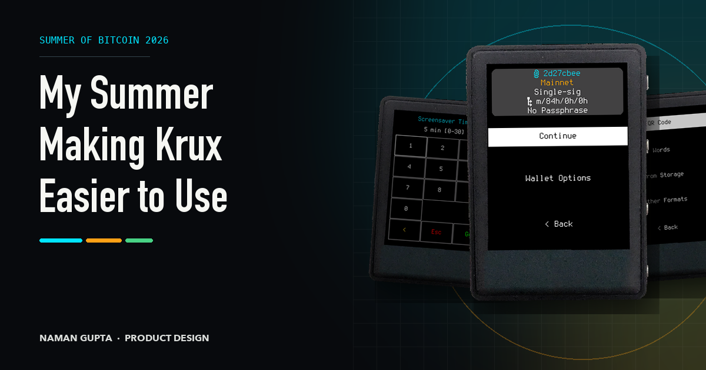

The first Krux change I shipped was a six-line method.

Before Summer of Bitcoin formally began, I opened
[PR #853](https://github.com/selfcustody/krux/pull/853) to add
`flash_success()`. Krux already flashed red for errors, but successful actions
used the ordinary foreground colour. The new method used the active theme's
green, making success visible at a glance.

It was a small contribution, but it gave me a route through the code, themes,
tests and review process. Then I bought a TZT.

With a touchscreen, five buttons and a compact metal body, the TZT turned Krux
from a simulator interface into something I could hold. Labels, taps and button
presses felt more consequential on the real device. I had begun by thinking
about what people could see. Using Krux made me notice what the interface asked
them to decide.

## What I set out to do

[Krux](https://selfcustody.github.io/krux/) is open-source firmware for
air-gapped Bitcoin signing devices. It helps people create or recover wallet
backups and approve transactions without connecting the device to the internet.
Because it supports displays ranging from touchscreens to the tiny,
button-controlled M5StickV, there is no single screen or input method to design
around.

My Summer of Bitcoin project was an accessibility and readability audit across
four areas: legibility, contrast, layout consistency and navigation clarity. I
wanted to turn the strongest findings into small changes that maintainers could
test, rather than redesign Krux or maximize my pull-request count.

Parts of my proposal were already outdated when I checked them against the
codebase. That taught me to begin with source and tests, then mark anything that
still depended on hardware or user feedback.

## Building the audit

WCAG provided useful thresholds for contrast and target size, but no checklist
could explain how to compare a touchscreen with a button-only hardware wallet. I
built the method around Krux itself.

I grouped its nine supported devices into three hardware tiers, represented by
the Amigo, TZT and M5StickV. For each audit area, I combined source checks and
measurable thresholds with simulator or hardware observations. I recorded the
affected device or theme, severity and supporting material, separating confirmed
problems from findings that still needed device testing.

I shared weekly findings, decisions and contribution status on a
[public progress site](https://naman015.github.io/krux-a11y-progress/). This
gave my mentors one place to inspect the work and made changes in direction part
of the record.

Contrast produced the clearest fixes. Krux has five themes, each with colours
for text, backgrounds, frames, warnings and actions. After converting the
display colours, I checked their combinations against WCAG ratios. In the Light
theme, mainnet and testnet labels measured 1.97:1 and 1.37:1 against white,
below the 4.5:1 target for normal text.

In [PR #879](https://github.com/selfcustody/krux/pull/879), I darkened the
affected Light colours, strengthened the CypherPink frame and added tests for
the combinations that had failed. Important network labels and interface
boundaries became easier to distinguish without changing the layouts.

One proposed colour change did not survive hardware testing. Its ratio looked
better in the simulator, but the result looked worse on a real Amigo display, so
I restored the device-specific behaviour. It was a useful reminder that a better
ratio did not automatically mean a better result on the device.

The other audit areas also told me what not to change. Legibility and layout did
not justify global font or spacing changes. Navigation, however, exposed a
problem with my method: counting menu depth and button presses could show
whether a new row fit, but not whether it deserved to be there.

## A working change that did not earn its place

[PR #894](https://github.com/selfcustody/krux/pull/894) made that weakness
obvious. I added a Settings shortcut to Home for Printer and Encryption. It
worked and saved steps after loading a wallet, but both settings were already
available beforehand. The shortcut helped in one situation while asking everyone
to consider another permanent Home option. I closed the pull request.

After that, I looked beyond path length. Did a label predict its result? Were
specialist actions competing with the common path? Did people have enough
context before committing, and could they recover from a wrong choice?

My mentors helped turn those questions into workable changes.
[odudex](https://github.com/odudex) kept pushing me towards the smallest change
that earned its place, while [qlrd](https://github.com/qlrd) helped me work
through tests, translations and small-device layouts. Their feedback changed
both the designs and the way I evaluated them.

## What I built from that lesson

The first result was [PR #909](https://github.com/selfcustody/krux/pull/909).
After generating wallet-recovery words, people reached a summary with three
equally prominent options: `Load Wallet`, `Passphrase` and `Customize`. I
changed the menu to `Continue` and `Wallet Options`, moving the less common
actions one level deeper. The summary stayed because it contains information
people should check; the existing-mnemonic flow also stayed unchanged, where
familiar wording mattered more than symmetry.

Numeric settings had a related problem. Screensaver Time and Buttons Debounce
opened as bare values without first showing their unit or accepted range. For
[PR #911](https://github.com/selfcustody/krux/pull/911), I brought information
that already existed in the settings metadata into the header, while keeping the
input, validation and stored values unchanged.

[PR #922](https://github.com/selfcustody/krux/pull/922) applies the same
principle to recovery. `Load Mnemonic` began with `Camera`, `Manual` and
`Storage`, asking how a backup would be entered before establishing its format.
I reorganized the menu around `QR Code`, `Words`, `From Storage` and
`Other Formats`. Common formats come first; specialist formats and the existing
validation remain available one level deeper.

I also contributed to the separate QR-keypad collaboration in
[PR #811](https://github.com/selfcustody/krux/pull/811). It makes QR scanning an
optional keypad action instead of asking people to choose `Type` or `Scan`
first. I tested the keypad across device sizes and designed its QR glyph and
replacement flow. Because this direction did not come from my audit, I have kept
it separate from the changes above.

## What shipped and what remains

[PR #853](https://github.com/selfcustody/krux/pull/853) and
[PR #879](https://github.com/selfcustody/krux/pull/879) merged through GitHub.
The work from [PR #909](https://github.com/selfcustody/krux/pull/909) reached
`develop` through a maintainer rebase and merge, closing issue #829.
[PR #911](https://github.com/selfcustody/krux/pull/911) is implemented and open
for review with passing checks.
[PR #922](https://github.com/selfcustody/krux/pull/922) and
[PR #811](https://github.com/selfcustody/krux/pull/811) remain open Drafts.
[PR #894](https://github.com/selfcustody/krux/pull/894) is the working change I
deliberately did not ship.

The contrast fixes meet their tested thresholds and the generated-mnemonic flow
now names its common next action. The open work shows context before numeric
input and format before input method. I did not run a formal user study, so I
cannot claim that these menu changes reduce errors or completion time. The
proposed structures still need feedback from people who use different backup
formats.

## What I learned

I began by treating accessibility mostly as a visual problem: readable text,
sufficient contrast and layouts that survived different screens. Those things
matter, but a hardware wallet also has to present the right context and keep
uncommon actions from crowding the usual path. A readable label can still be the
wrong label at the wrong moment.

Hardware could overturn simulator confidence. Source and tests were more
reliable than an old issue description. Maintainer feedback was part of the
design process, too: closing #894 protected Home from an extra choice, which was
more valuable than keeping a technically valid patch open.

## What happens next

The programme has ended, but the open work has not. I plan to continue through
review on #911, #922 and #811, gather the missing hardware evidence and keep
contributing to Krux through interface work, testing and documentation.

I started by making successful actions easier to see with a green flash. The
harder lesson came from a shortcut that worked and saved steps, yet still made
Home worse for people who did not need it. Now, whenever I consider adding
something to Krux, I ask whether it has earned its place.
