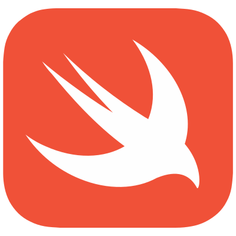
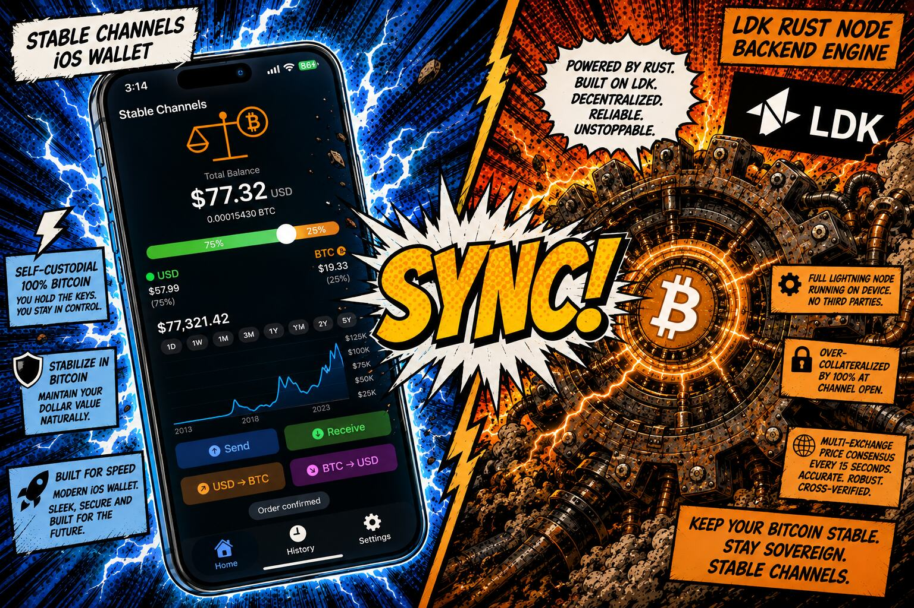
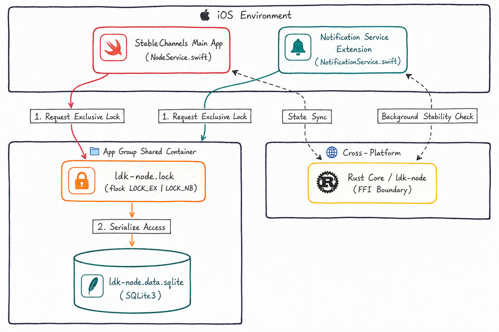
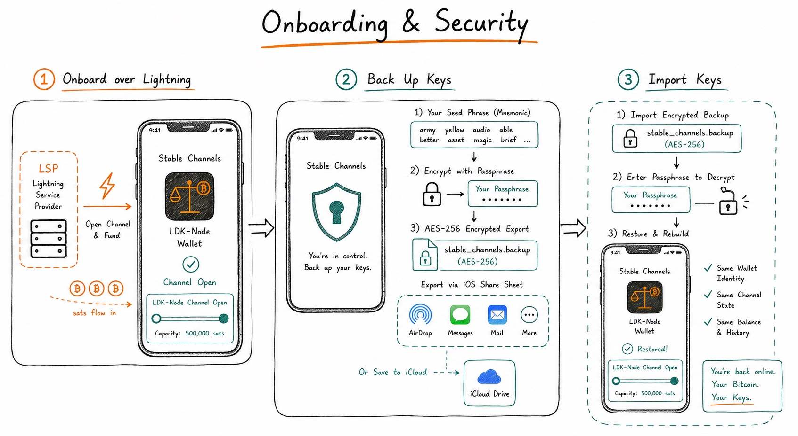
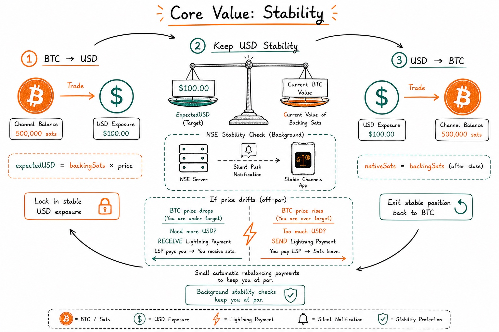
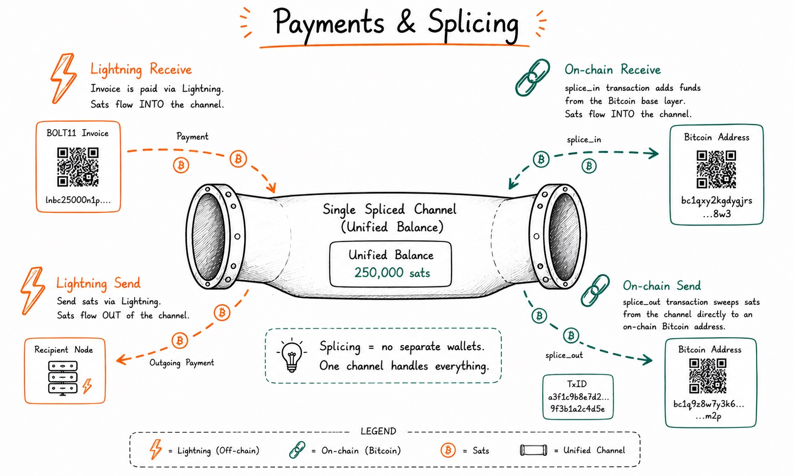
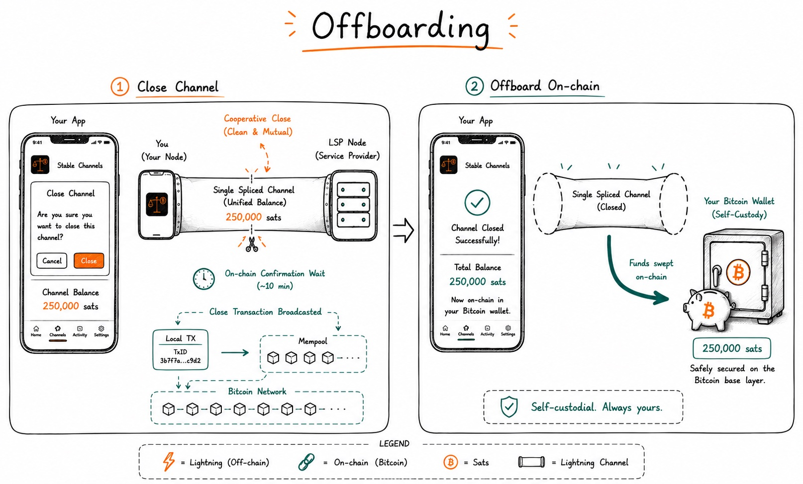
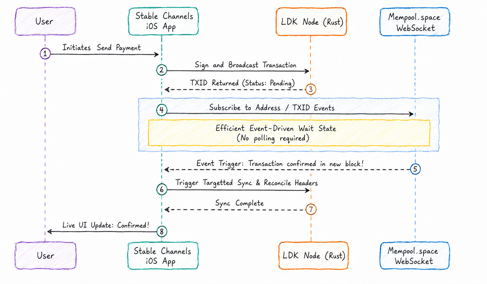
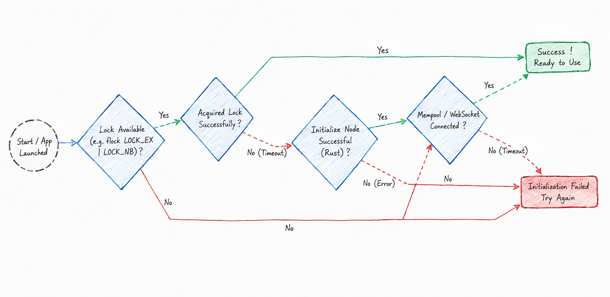

### Bringing Production-Grade Reliability to iOS Stable Channels

---

This summer, I had the incredible opportunity to work on [Stable Channels](https://stablechannels.com/) as part of [Summer of Bitcoin '26](https://www.summerofbitcoin.org/). My core mission was to take the existing iOS prototype (built on [Rust](https://rust-lang.org/) and [ldk-node](https://github.com/lightningdevkit/ldk-node)) and harden it into a production-ready, highly reliable application.

<p align="center">
   
   &nbsp;&nbsp;&nbsp;&nbsp;&nbsp;&nbsp;&nbsp;&nbsp;
   
   &nbsp;&nbsp;&nbsp;&nbsp;&nbsp;&nbsp;&nbsp;&nbsp;
   
   &nbsp;&nbsp;&nbsp;&nbsp;&nbsp;&nbsp;&nbsp;&nbsp;
   
</p>

Every technical hurdle I tackled this summer was deeply rooted in perfecting the core user experience. From the moment a user first onboards over Lightning, to converting BTC → USD for stability, seamlessly sending or receiving across Lightning and on-chain, and finally backing up their keys, the flow needed to be bulletproof. Mobile environments, especially iOS, are notoriously hostile to background tasks, but my ultimate goal was to guarantee that these critical user flows never ended in ambiguous, stuck "pending" states.

---

### What are Stable Channels?

Stable Channels is a revolutionary self-custodial Lightning Network technology and wallet designed to give users access to synthetic USD stability without ever giving up control of their keys. By leveraging the speed of the Lightning Network and the security of Bitcoin, it allows users to hold a stable balance resistant to price volatility, all entirely peer-to-peer.

<p align="center">
   
</p>

---

### The Journey

The first massive hurdle I faced was cross-process state drift. Stable Channels relies heavily on a server pushing stability checks to the app while the app is backgrounded. On iOS, this processing occurs in the Notification Service Extension (NSE). 

> **A fundamental realization:** The iOS App, the background NSE, and the Rust FFI boundary do not act like a single application. They act like a tiny, lossy distributed system with a ~24 MB memory ceiling!

I learned the hard way that basic SQLite concurrency isn't enough when an App and an NSE are racing to process the exact same Lightning Network event. Furthermore, the underlying `ldk-node` Rust engine strictly prohibits being instantiated by two separate iOS processes simultaneously, which leads to immediate lockfile panics.

To fix this, I implemented a shared lock-file mechanism using `flock()` inside the App Group container. I then propagated a strict deterministic ordering rule across the codebase:

```sql
SELECT * FROM channels 
ORDER BY updated_at DESC, channel_id DESC 
LIMIT 1;
```

This deterministic SQL ordering was the cheapest, most effective way to force the app and NSE to actually serialize their database access to a single active channel. I even jumped into the Android codebase to submit a PR to ensure Android and iOS were perfectly aligned on channel selection!

<p align="center">
   
</p>

### Pivoting to Event-Driven Resilience

As the summer progressed, we tackled on-chain confirmation tracking. Initially, the app relied on rigid network polling of block explorer APIs. 

> Polling for on-chain status was draining the strict iOS background execution budgets and causing timeouts, leaving payments stuck.

Instead of patching the polling mechanism, my mentor and I made the strategic decision to rewrite the architecture entirely. I transitioned the app to a highly responsive, event-driven Mempool websocket service. This shift allowed us to locally calculate confirmation progress and stream live UI updates to the user the exact second a block was mined without burning through iOS background time.

Around mid-term, we made another crucial pivot. We agreed to drop some originally scoped items (like mocked `PaymentFlowTests` and static API contract tests) to reallocate engineering time toward solving real-world, live network edge cases. This allowed me to ship high-impact improvements like **automatic failovers to secondary Esplora providers** to ensure graceful degradation during node startup outages, and hardened background synchronization.

### Powering the Core User Flows

Under the hood, all this technical hardening was in service of 12 critical user flows. To guarantee the wallet feels completely seamless, we engineered the architecture around four core user journeys: **Onboarding & Security**, **USD Stability**, **Payments & Splicing**, and **Offboarding**.

#### 1. Onboarding & Security
* **Flows:** Onboard over Lightning, Back Up Keys, and Import Keys.
* **The Goal:** Ensure that from the very first tap, the background processes can reliably handle channel creation and key persistence without leaving the user stranded on a loading screen.

<p align="center">
   
</p>

#### 2. Core Value: Stability
* **Flows:** BTC → USD, Keep USD Stability, and USD → BTC.
* **The Goal:** This is the heart of the app. The SQLite concurrency and background NSE push pipelines ensure that stability checks happen instantly and flawlessly, even when the app is asleep.

<p align="center">
   
</p>

#### 3. Payments & Splicing (Unified Balances)
* **Flows:** Lightning Receive, on-chain Receive, Lightning Send, and on-chain Send.
* **The Goal:** One of the most novel engineering features we leveraged here is **LDK Splicing**. Splicing allows us to maintain a shared balance across both Lightning and on-chain sends and receives. Instead of forcing users to manage separate on-chain wallets and Lightning channels, Splicing reuses a single channel for seamless accounting. Whether you execute a Lightning Send or an on-chain Receive, the underlying complexity is completely abstracted away.

<p align="center">
   
</p>

#### 4. Offboarding
* **Flows:** Close Channel and Offboard on-chain.
* **The Goal:** When a user is ready to leave, the wallet must gracefully handle channel closures and on-chain fee sweeping without dropping the connection.

<p align="center">
   
</p>

---

### What Shipped

Over the course of the summer, I authored over 40 Pull Requests to ensure every single user flow—whether a user was closing a channel, importing keys, or offboarding on-chain—felt native, instant, and reliable. Here is a high-level look at how we hardened the UX for the massive [0.9.3 release](https://github.com/toneloc/stable-channels/releases/tag/v0.9.3):

1. **Background Stability Pipeline:** A complete NSE pipeline that deterministically detects settling stability checks while the app is backgrounded and delivers a localized push notification with the exact outcome.
2. **Event-Driven On-Chain Tracking:** A Mempool websocket service for real-time confirmation tracking and live UI updates aligned across both iOS and Android.
   <p align="center">
      <br/>
      
      <br/>
   </p>
3. **Cross-Process Serialized State:** A robust SQLite database architecture strictly synchronized between the App Group Container and the iOS Foreground app using kernel-level `flock()` lock-files.
4. **Data & Security Hardening:** Implemented automated 90-day price history pruning, unique payment indexes, and a highly secure native biometric-to-passcode fallback flow with strict pre-flight checks.
   <p align="center">
      <br/>
      
      <br/>
   </p>
5. **Node Infrastructure Reliability:** Implemented automatic failover systems to route to secondary Esplora providers if the primary connection drops during node startup.
6. **App Store Readiness & UX Polish:** Modularized the Settings UI, overhauled the QR infrastructure, added Custom LSP support, and implemented full internationalization (i18n).

Every single objective agreed upon with my mentor was successfully executed. The massive [0.9.3 release](https://github.com/toneloc/stable-channels/releases/tag/v0.9.3) is officially done and shipped to the App Store!

---

### Learnings & Looking Back

Dealing with Lightning force-closures forced me to deeply understand the intricate details of resolving real on-chain `txid`s from channel IDs when `ldk-node` is unreachable in the background. Furthermore, getting the Rust side to safely hand state to iOS via the FFI boundary taught me invaluable lessons about type recasting (like mapping `Int64` vs `String` correctly) and memory safety across language barriers.

<p align="center">
   
</p>

I am incredibly thankful to my mentor, [Tony](https://x.com/tonklaus), for his constant guidance and patience in helping me navigate the intricacies of the Lightning Network.

Thank you to [Adi](https://x.com/adi_shankara_) and the entire [Summer of Bitcoin](https://www.summerofbitcoin.org/) team for this unforgettable opportunity. To any students considering applying next year: dive in. It is a phenomenal chance to work with brilliant people on world-changing technology.

### What Next?

With the [0.9.3 release](https://github.com/toneloc/stable-channels/releases/tag/v0.9.3) fully complete, my focus shifts to post-launch observability. I plan to stay highly active in the Stable Channels community, helping triage any incoming issues and ensuring the resilient infrastructure we built scales beautifully as more real users depend on the wallet for their daily transactions.

**Call to Action:** If you are an iOS, Android, or Rust developer interested in pushing the boundaries of self-custodial Lightning wallets, [check out the Stable Channels repository](https://github.com/toneloc/stable-channels) and consider contributing! 

Till then, keep building!
