When Summer of Bitcoin matched me with Shopstr, I was handed a working machine with a hidden interface. Shopstr is a marketplace built on Bitcoin and Nostr where people buy and sell real goods for sats: no accounts, no emails, no middlemen, your key is your identity. The technology underneath is genuinely impressive, and almost none of it was visible to the person holding the phone.

That gap became my project. I am a product designer, and my job for twelve weeks was to make Shopstr feel like a real consumer marketplace instead of a developer tool, and then, in a twist I did not see coming, to build it.

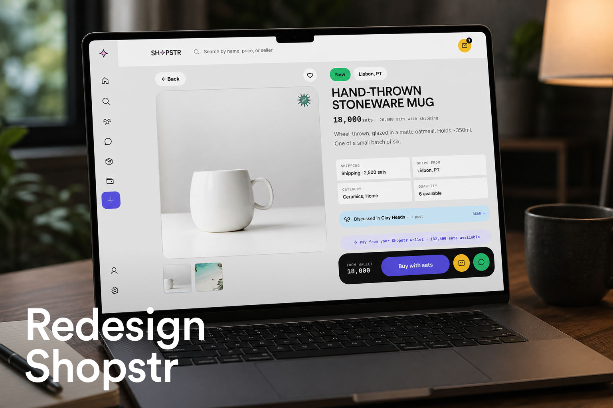

## What I set out to do

For most people, shopping happens on a phone, and the bar is set by mainstream e-commerce apps. If buying something for sats feels harder than buying it with a card, the circular economy never starts. So the brief I wrote for myself had two layers:

- Make browsing, searching, and buying genuinely pleasant on mobile.
- Design the loop itself: the flows that pull a buyer back in as a seller, so sats keep circulating inside the marketplace instead of leaking out after one purchase.

The first six weeks went into research, a feature inventory of the existing app, a UX audit, a new information architecture, and the beginnings of a design language. I wrote about that in my midterm post. This post is about what happened after, because after midterm the project stopped being a redesign proposal and became a product.

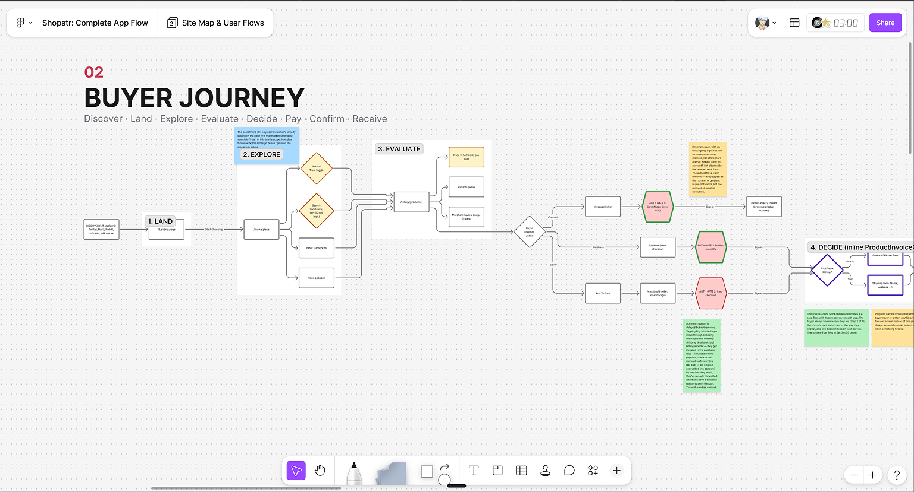

## A design language you can hear from across the room

The neo-brutalist direction came from my maintainer: he wanted the redesign loud and alive, not another grey minimal app. I agreed instantly. Then I spent weeks learning why that brief is so hard to pull off in a real product. Neo-brutalism photographs beautifully and uses terribly: hard strokes, loud color, and shouting type fight legibility, hierarchy, and density on every single screen, and a marketplace has to stay effortlessly shoppable underneath all that personality. Finding the balance took many iterations, and the only way through was writing down principles early and staying ruthlessly grounded to them.

The language those iterations landed on is what I call Sticker Brutalism: neo-brutalist structure, Y2K sticker-pop energy, and loud editorial type. Headlines are Archivo Black, uppercase, tight. Body text is Space Grotesk. And every number that represents value, sats, prices, ratings, is Space Mono with tabular figures, because in a Bitcoin app the numbers are the product.

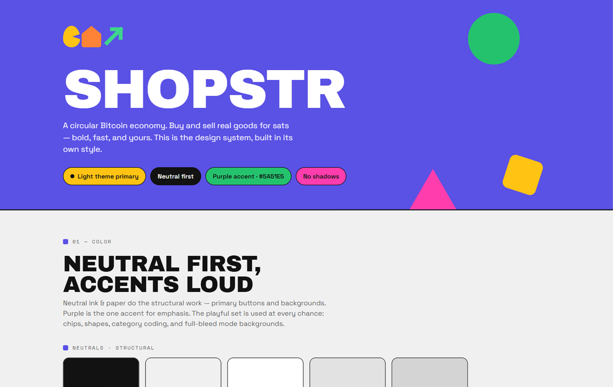

Those grounding principles are what give the language its discipline:

- **Neutral is the primary color.** Surfaces are true-neutral grey, equal RGB channels, zero chroma. Six accent colors (orange, yellow, red, green, blue, pink) plus a purple carry all the personality.
- **No shadows, anywhere.** Separation comes from spacing first, then a hard 1 to 2 pixel stroke. Depth comes from the weight of the grey, never from blur.
- **Shapes are first-class citizens.** Circles, triangles, semicircles, and a library of 21 sticker SVGs work as buttons, bullets, dividers, and rewards. Tap "add to cart" and a sparkle pops in.

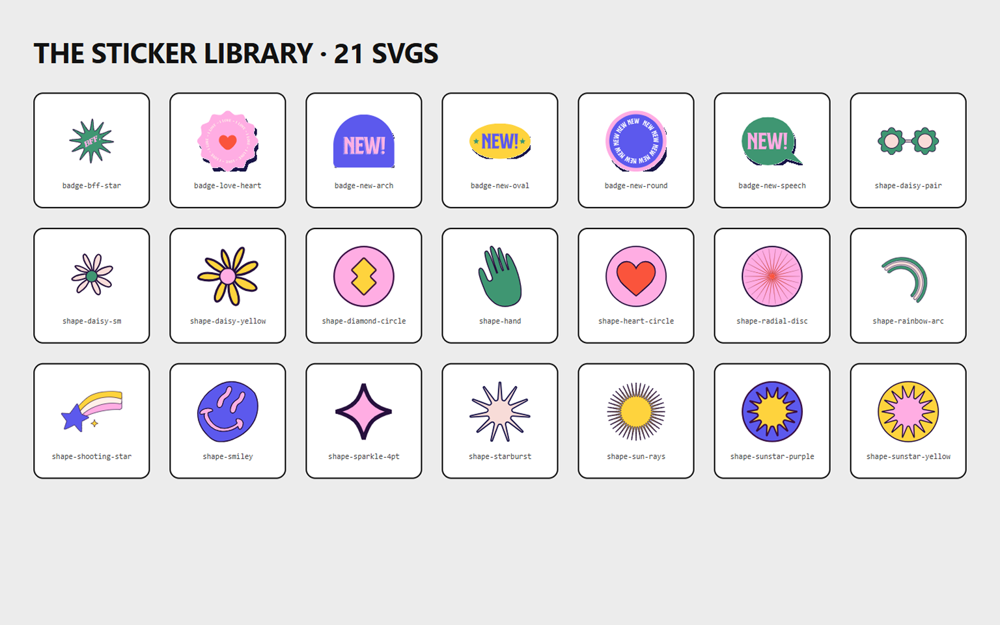

## The plot twist: "can you build it?"

At selection, my deliverable was design and documentation. A few weeks in, my maintainer asked whether I could implement the frontend too, as real code in the real stack. I am not a frontend developer. I said yes anyway.

That yes turned out to be the most valuable decision of my summer. A design system on a Figma canvas is a promise; a design system in code is a fact. Every color, spacing, radius, duration, and easing curve in the redesign lives as a CSS token, and no component is allowed to hardcode a value. The moment one component cheats, the system stops being a system, so the discipline of the boundary became the actual design work.

By the end, the "prototype" had grown into a complete application: about 40 routes built in Next.js, React, TypeScript, and Tailwind, covering the entire journey on both sides of the marketplace.

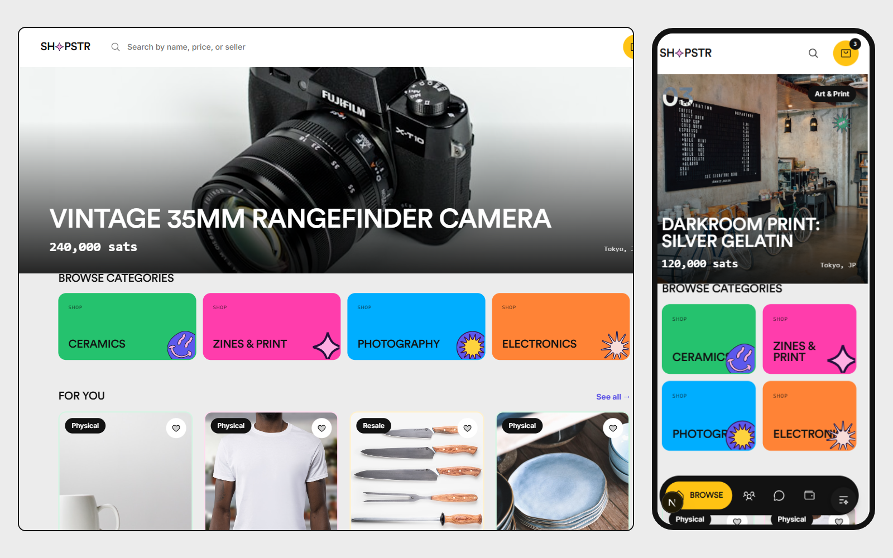

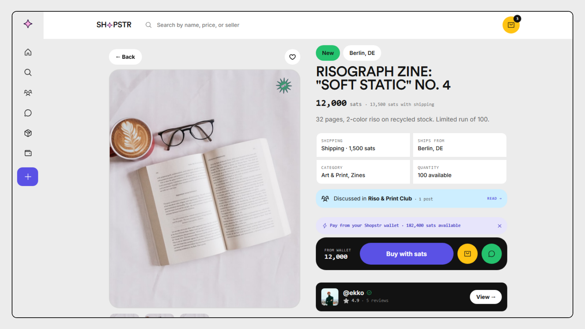

## Designing for the protocol, not around it

The most important lesson of the second half: in a Bitcoin and Nostr app, the protocol is a design material. You do not get to sketch the ideal flow and ask the backend to comply. So after midterm I audited my own redesign against the real Shopstr codebase and fixed every place where my design was prettier than the truth:

- Reviews in Shopstr are a thumbs rating plus named dimensions stored as raw scores (NIP-85), so the redesign computes every rating from raw scores and never stores an average. Honest data, honest UI.
- Shipping is an enum on the listing, so the checkout's fulfilment options are driven by it, not decorated around it.
- Order statuses have role-gated transitions: a buyer and a seller can each only move an order the way the protocol allows.
- Communities are built around NIP-72's actual approval mechanism, with a moderator queue and a digest-first layout, instead of a generic "groups" feature that would not survive contact with reality.
- Checkout became a real, persistent flow with a review-before-pay step, because the current app hides checkout inside the listing page with no URL of its own.

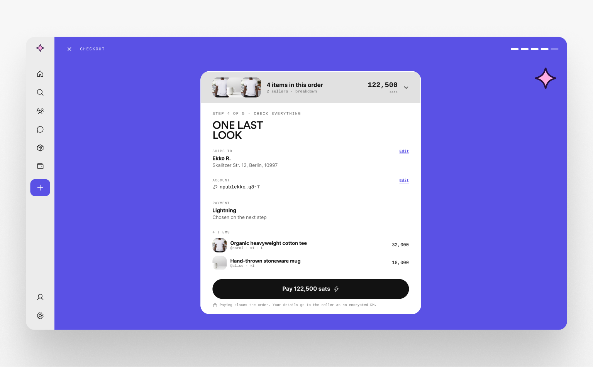

The circular economy thinking shaped the other half of the app. Buying is only half a marketplace; the redesign gives the seller side equal care, a sell dashboard, a low-friction listing flow, and a full wallet (setup, send, receive, claim, withdraw, payout), because a buyer only becomes a seller if listing feels lighter than shipping a parcel.

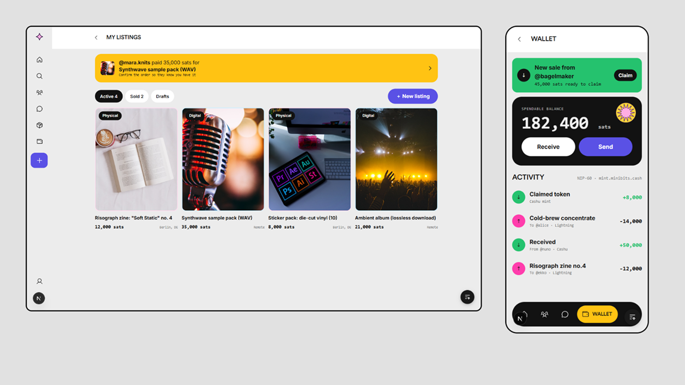

## The unglamorous 20 percent that makes it feel real

Somewhere in week nine I understood why so many redesigns die as pretty screenshots: the screens are the easy part. What makes an app feel shippable is everything that happens when the data is not there yet.

So the redesign implements a five-state rule on every data surface: loading, empty, no results, not found, populated. Loading is never a spinner; there is not a single spinner in the app. Chrome paints immediately and content areas fill with skeletons that match the real card geometry exactly, so nothing reflows when data lands. A true empty state gets a designed page with a sticker, a headline, and a call to action that actually works; a filtered zero keeps the chrome and offers a way back.

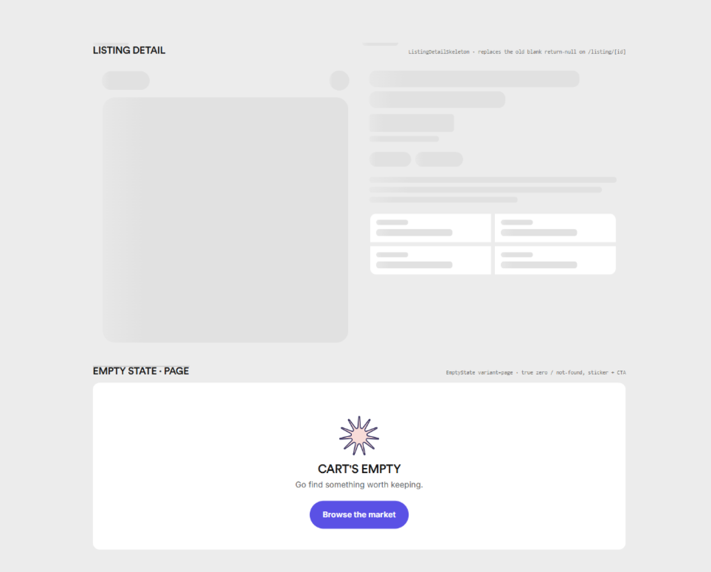

Motion got the same systematization: four durations, four easing curves, one shared vocabulary of presses, pops, and staggers. Hover effects are gated to devices that actually have a pointer, so touch users never get a stuck hover state, and everything respects reduced-motion preferences. Even the 404 got designed.

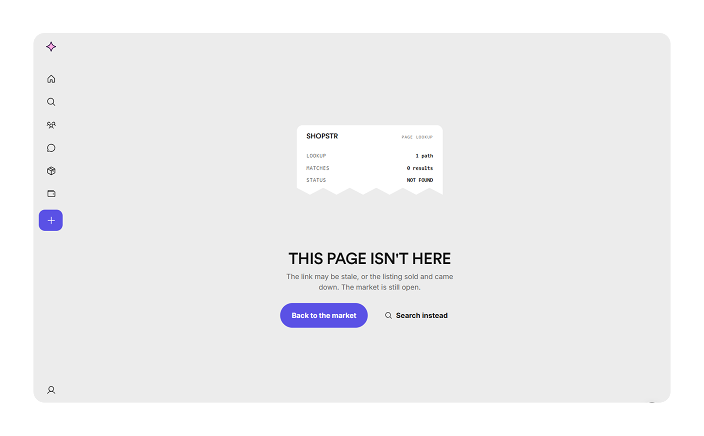

## What shipped, and what remains

What exists today:

- A complete, responsive frontend redesign of Shopstr: roughly 40 routes across browsing, search, product detail, cart, checkout, orders, reviews, messages, communities, selling, wallet, and settings, live at [shopstr-redesign.vercel.app](https://shopstr-redesign.vercel.app) and open at [github.com/Ashu-2006/shopstr-redesign](https://github.com/Ashu-2006/shopstr-redesign).
- The full design system in both Figma and code, with the explorations and cleaned-up final screens in the Figma file.
- Documentation written as system rules, an app map, the state rules, the motion rules, and a domain-gap audit, so the work is portable, not personal.

What remains is the wiring. The frontend runs on mock data today, but it was architected for the handoff from day one: every screen consumes the same small set of data hooks, no component touches a fetch or a relay, money is already integer sats, and identity is already an npub and a handle. Connecting it to the live Nostr backend means swapping the inside of a hook layer, not rewriting screens. That connection is the maintainer's step, and the whole architecture was shaped to make it as small as possible for him.

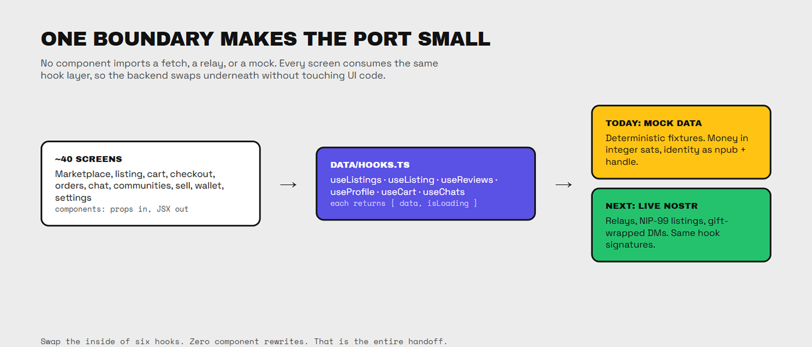

## What twelve weeks actually taught me

I came in believing design and engineering were two stages separated by a handoff. I leave knowing they are one loop. Implementing my own designs taught me what no amount of mockup work could: what is cheap, what is expensive, why interfaces are built the way they are, and how a design system only survives if its boundaries are enforced in code.

The Bitcoin-specific lesson surprised me more. Good marketplace UX is not the removal of all friction. Some friction is load-bearing. Browsing and buying should be frictionless; identity, listing quality, and reviews deserve a little resistance, because that resistance is what keeps a permissionless marketplace trustworthy. Deciding where friction belongs turned out to be the deepest design problem of the summer.

And personally: I started this program as a designer who could not ship frontend code. I end it having built, with AI as a pair programmer and a maintainer who pushed me past my job title, a complete application in a stack I had never touched. That crossing, from someone who draws the interface to someone who can make it real, is the thing I take with me.

## What happens next

The port. The design system, the screens, and the documentation are all packaged for handoff, and the maintainer takes it from here: wiring the hook layer to the live Nostr backend and bringing the redesign into the real Shopstr codebase. I will stay available for design questions as it lands, because I want to see this design in production, with real listings and real sats moving through it. If you are curious, click through the [live app](https://shopstr-redesign.vercel.app), poke at the [repo](https://github.com/Ashu-2006/shopstr-redesign), and go buy something on [Shopstr](https://shopstr.store). The circular economy starts with one purchase.

Thanks to my maintainer for the push that redefined this project, and to Summer of Bitcoin for betting on a designer track in a builder's ecosystem.

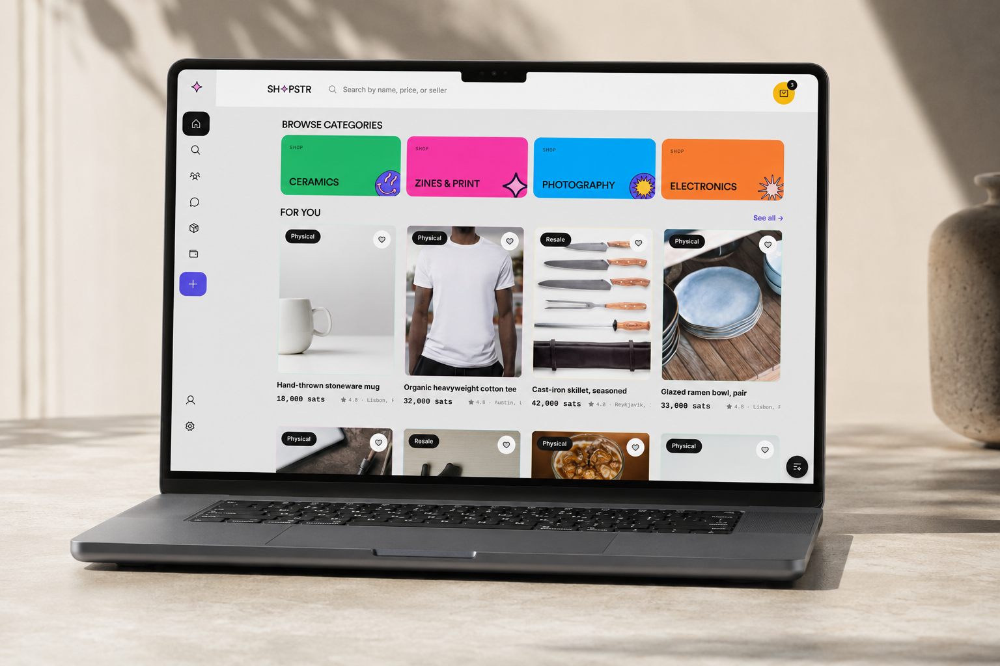
