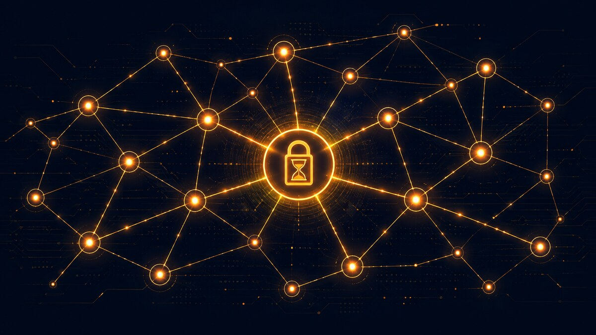

<figure>

<figcaption>Escrow across two payment rails, Cashu ecash and Lightning hold invoices, was the center of my summer.</figcaption>
</figure>

I joined Summer of Bitcoin to work on [Shopstr](https://shopstr.market/), a Nostr-based, self-custodial Bitcoin marketplace, with a project that sounded simple on paper: build escrow. Buyer pays, seller ships, money moves when it's supposed to, and nobody can cheat anyone else. Three sentences. I could have explained it to my parents.

By the end of the summer I had shipped a full 2-of-3 Cashu escrow system, a dispute resolution flow on top of it, and a Lightning hold-invoice escrow system built from the ground up, complete with a real LND node integration I tested by hand on a local Lightning network I'd never touched before this year. The three-sentence version of "build escrow" turned out to hide almost everything that actually mattered.

## Escrow Sounds Simple Until You Ask "Who Can Move The Money"

The first phase was P2PK Cashu escrow. Cashu is ecash, bearer tokens backed by a mint, and the idea was to lock a token to a script that needs signatures from two of three parties, buyer, seller, arbiter, before it can be redeemed. Nobody can move the money alone.

Building the happy path wasn't the hard part. The hard part was every question that started with "what if." What if the seller never ships? What if the buyer just disappears after the item arrives? What if a locktime gets computed once at the wrong moment and every order after that has a broken refund window? I spent a lot of early weeks discovering that "2-of-3 escrow" is a sentence, and the actual system behind that sentence is a pile of edge cases wearing a trench coat.

One of the real bugs I found and fixed during that phase was in the dispute review: an authorship check that was supposed to cross-reference dispute events against the actual order participants, but the lookup it depended on was always empty because nothing in the app ever wrote the value it needed. The check existed. It just silently did nothing, and fell back to trusting whatever event showed up last. Only the integration test passed, because the test seeded the missing data directly with raw SQL, something no real user request would ever do. That was the first time I really understood the difference between code that looks like a safeguard and code that is a safeguard.

## Then I Had To Build The Same Thing On A Rail With No Multisig

Phase two was the harder one architecturally: hold invoice escrow, on Lightning, from scratch. Lightning doesn't give you a scripting language the way Cashu does. There's no way to say "this payment needs two of three signatures" at the protocol level. A hold invoice only understands one thing: does the preimage you're showing me match the hash I was given. That's it.

So the entire trust model had to be rebuilt around a different primitive. Whoever holds the preimage controls the money. That's not a design choice you can engineer around on this rail, it's a fact about how hold invoices work, and the first real lesson of this phase was accepting that and designing honestly around it instead of pretending otherwise.

Once I accepted that, the actual security work became about closing every gap around that one true fact. A buyer confirms receipt by publishing a signed event, but nothing about that event proves anything on its own, since anyone can publish anything. The actual authorization had to compare the event's real signer against the buyer's pubkey recorded in the database at the moment the order was created, not against anything the event claimed about itself. I found and fixed a case where a confirm event for one order could, in theory, get checked against a completely different order's row, and another case where rotating the configured arbiter's key could silently transfer control over money that was already locked up under the old arbiter, if the authorization check pointed at the live key instead of the one that was actually in force when the order began. Neither of those were things I set out looking for. They came from asking "what does this check actually compare, and does that comparison mean what I think it means" one more time than felt necessary.

I also learned to make illegal states physically impossible to reach instead of just discouraged. The functions that check authorization don't return true or false, they throw or they succeed, and success returns a branded type that only the settlement code can accept as a parameter. That means a future version of this code literally cannot compile if someone tries to release funds without passing through the check first. Not "please remember to check this." The type system remembers for you.

## Getting Told I Was Leaning On AI Too Hard, And Actually Sitting With It

Partway through the hold invoice work, I sent my mentor a long, polished-looking message walking through the whole design. He replied asking why it looked like I wasn't putting in the effort to actually study the codebase and existing PRs myself, and was just pasting an AI's doubts as my own.

That stung, and my first instinct was to explain myself. But sitting with it honestly, he was right. I had a real answer, but I hadn't built it myself first, I'd built it in a chat window and then relayed it. There's a real difference between using a tool to think through something you're stuck on and internalize it, versus using it to skip the getting-stuck part entirely. I'd been doing more of the second than I wanted to admit.

What actually changed after that wasn't that I stopped using AI. It's that I started designing things out loud first, in my own words, before ever touching a prompt, and I made myself defend every decision back to myself before it went anywhere near a message to my mentor. The difference showed up almost immediately. I caught real bugs myself, in my own reasoning, before any tool pointed them out to me. That felt different, and better, than anything before it.

## Real Infrastructure Does Not Care About Your Assumptions

The last stretch of the summer was making the hold invoice system actually run against a real Lightning node instead of an in-memory mock. I'd never touched gRPC, never run a Lightning node, never used Polar before this. I set up a small local Lightning network from scratch, opened a real channel, and by hand, using `lncli`, created a hold invoice, paid it, watched it sit locked without settling, and then settled it by revealing the preimage myself. Watching that terminal actually hang mid-payment, waiting, was the first time the whole abstract idea of a hold invoice stopped being a diagram in my head and became something I'd physically made happen.

That hands-on time paid off immediately once I wrote the real provider code. A tiny, single-bit corruption in a TLS certificate, one character flipped while being copied by hand, produced a misleading "self-signed certificate" error that had nothing to do with the actual problem. If I hadn't already known what a correct connection looked like from doing it manually first, I could easily have "fixed" that by weakening TLS verification instead of finding the real cause.

The best catch came from refusing to trust my own mocked tests. Fifty-six unit tests passed, green across the board, for a provider that would have crashed on its very first real call, because a CommonJS module was being loaded in a way that worked fine under plain Node but silently returned `undefined` under the test runner. No mocked test could ever have found that, because mocked tests never touch the real connection code. Only running it against something real did. That's the lesson I keep relearning this summer in different shapes: a test suite tells you your assumptions are internally consistent. It doesn't tell you your assumptions are true.

## What I'm Actually Taking From This

Going in, I thought this summer was about learning Bitcoin protocols and shipping features. It was that, but the thing I actually walked away with was narrower and more useful: a real, physical instinct for the difference between code that looks safe and code that is safe.

A check that exists but reads from a column nobody writes to isn't a check. A test suite that's green because everything underneath it is faked isn't proof. An error message can be honestly wrong about what's actually failing. And the fastest way to find out if any of that is true of your own work is to stop trusting the diagram in your head and go run the real thing.

I also learned something about myself that had nothing to do with Bitcoin: getting told directly that I was cutting a corner, even when it stung, was more useful than any code review comment I got all summer. I'd rather know.

If you want to see what escrow that takes both of those lessons seriously actually looks like, the Cashu P2PK flow is live in Shopstr today, and the hold invoice escrow work is open for review, tested against real infrastructure rather than assumptions about it.

## Links To The Work

- [P2PK Cashu escrow lifecycle PR](https://github.com/shopstr-eng/shopstr/pull/512)
- [Cashu Dispute Escrow](https://github.com/shopstr-eng/shopstr/pull/569)
- [HODL invoice escrow, end to end](https://github.com/shopstr-eng/shopstr/pull/606)
