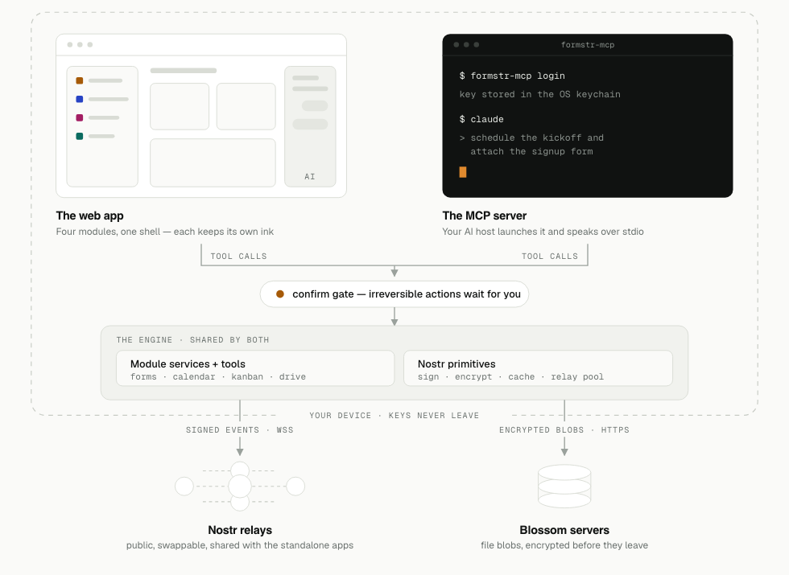

## Who I Am

Hi, I'm Naman Khandelwal, a pre-final year (3rd year) Computer Science student at IIIT Lucknow. This is my Summer of Bitcoin '26 final evaluation, written after a summer spent building the Formstr Super App.

This wasn't my first shot at Summer of Bitcoin. Last year I made it to the proposal round with a different org and got rejected. I hadn't contributed to the org's repos beforehand and hadn't really built any connection with the mentors; I was mostly betting on the proposal alone. This year I did it differently: I dug into the fundamentals I was missing, actually contributed to Formstr's repos before applying, and made sure the mentors knew who I was before proposal season even started. It worked.

## My Project

Today's Nostr productivity tools (forms, calendar, file storage, documents, and polls) each live as separate applications with their own identity, relay connections, and encryption context. Linking related items across them (a feedback form tied to a calendar event, a document attached to a poll) is manual and error-prone, and the underlying login, relay-routing, and signing logic is duplicated in every module.

The project I set out to build is an orchestration layer for the existing and future Formstr modules, bringing all of them under one shared identity, relay set, and encryption layer. Concretely, the Formstr Super App is a pnpm monorepo that orchestrates five existing Formstr modules (`nostr-forms`, `nostr-calendar`, `nostr-docs`, `nostr-polls`, `formstr-drive`) and exposes them to AI agents through an MCP server (`@formstr/mcp`) for tool-calling. Under one unified app, the goal was for a user to be able to:

- Create forms, view responses, share forms
- Add to calendar, create events, share events, approve events
- Make private notes, create polls, answer polls, view results
- Manage files: upload to and view from Drive
- View analytics, overall and per-module
- Do all of the above by just asking an AI agent to do it

All of this inside a single application, with AI as the primary interface rather than a bolt-on feature.

## What I Built

I started by hardening the foundation: CI/tooling setup, a security pass across the core, and a route registry with a coverage gate so linking between modules stayed consistent as more of them got wired in. On top of that I did a full UI overhaul, moving the app from Tailwind/shadcn to Material UI.

From there, the bulk of the work was bringing each existing Formstr module into the super-app as a first-class citizen, one at a time:

- **Forms:** fixed encryption correctness and `MyForms` persistence, split the monolithic `FormsPage` into composable components, added a public fill route with an anonymous responder and shareable links, then a parity batch covering the builder, settings, export, and relay-staleness handling.
- **Calendar:** unstubbed invitations, brought the UI to completion, and landed interop/parity with the super-app. On the upstream `nostr-calendar` repo itself I shipped appointment scheduling, shared events, RSVPs, a per-user busy list, a read-only Android calendar integration, and fixes for recurring-event times and floating RRULE dates.
- **Pages, Polls, and Drive:** brought each into the super-app with interop and parity passes, plus upstream hardening on `formstr-drive` (file-size validation, upload progress, preview fixes for video/PDF, Blossom-server validation, blob deletion on file delete) and on `nostr-polls` (profile-parsing guards, cached-DM expiry on logout).
- **Identity:** adopted `@formstr/signer` as a single identity layer (NIP-07/46/49, multi-account) shared across the super-app, the MCP server, and `nostr-docs`, replacing separate login logic in each module.

The other major piece was the AI orchestration layer itself: `@formstr/mcp`, a universal MCP server exposing all of the above as tools, plus a BYOK agent layer on top of it so an AI provider of the user's choice can actually drive the app. I later went back and closed several safety gaps in that layer: tool gating, a confirm-bypass fix, a proof-of-work cap, and a race condition in same-second listing.

<figure></figure>

One engine, two front doors: the browser UI and the MCP server call into the exact same module services and Nostr primitives, same signing, same relay pool, same confirm gate on irreversible actions, so nothing drifts between what a human clicks and what an agent calls.

Partway through, we decided to drop Polls and Pages from the super-app and replace them with a Kanban module instead. I took ownership of that end-to-end: researched what the Nostr event kinds for a Kanban board should even look like, put together a design that got approved, then implemented it as `@formstr/kanban-sdk` and integrated it into the app's shared packages: boards, membership, roles, and card controls, all publishable to relays like everything else.

Outside the super-app itself, most of this also fed back into the standalone module repos directly, since the super-app orchestrates the real apps rather than forks of them: security and bug fixes in `nostr-calendar`, `formstr-drive`, `nostr-polls`, and `nostr-docs` upstream. I also worked on `nail`, a separate Formstr project rebuilding a Nostr-based mail client. Wired in `@formstr/signer` for login there too, then helped rebuild its mail pipeline on a shared protocol and redesign the client.

## Major Technical/Design Decisions

Two decisions stand out from the rest.

**MCP over intent routing.** The original plan for letting an AI agent drive the app was an intent-router: classify what the user is asking for, then dispatch to the right module handler. I wasn't convinced it would scale cleanly across five modules and their combinations, so I built a small MCP-based demo instead and proposed it to the team. It worked well enough that we dropped the intent-router plan and went all-in on MCP. An MCP server is a much better fit here than an intent router: instead of us having to predict and hand-code every possible user intent, the model itself decides which tool to call and how to chain them, and every module just has to expose its capabilities as tools rather than as routes for a classifier to guess at.

**Designing the Kanban event kinds myself.** Since Kanban replaced Polls and Pages as a new module rather than an adaptation of an existing one, there was no existing Formstr primitive to lean on. I had to research what the Nostr event kinds for a Kanban board should actually look like (boards, cards, membership, roles), get that design approved, then build it as `@formstr/kanban-sdk` from scratch rather than wrapping something that already existed.

Beyond those two, the rest of the build stayed intentionally incremental: bring each existing module in as-is rather than rewrite it, ship as small vertical-slice PRs that are each independently reviewable and user-visible, and keep AI as the primary interface via MCP rather than as a bolt-on feature.

## What Shipped vs. What Remains

By the end, a working initial version of the super-app is live. Forms, Calendar, Docs, Drive, and the new Kanban module all run inside one app under a single identity, relay set, and encryption layer, with the MCP server and AI orchestration layer wired through end to end. You can drive any of it by just asking an agent.

Nothing from the original scope is left outstanding. The main things I'd still want to add, given more time, are end-to-end tests across the super-app and higher unit-test coverage across the individual modules, good to have, but not something the project's initial goals were blocked on.

## What I Learned

The biggest thing I took away from this summer: you don't need to be an expert in Bitcoin, cryptography, or low-level protocol details to contribute meaningfully to this ecosystem. What matters more is your ability to explore and learn whatever the problem in front of you actually needs, and to apply that at the right time.

It's also about the design decisions you make, thinking through scalability, reliability, and the tradeoffs behind them, and just as much about communicating well with your mentors and the rest of the team. Good architecture that nobody understands or agrees with doesn't ship.

## My Mentors

Huge thanks to my mentors, [Abhay](https://github.com/abh3po) and [Rama](https://github.com/geralt-debugs). They ran two weekly standups that pushed me to get a lot better at communicating with the rest of the team: building connection, talking through design choices out loud, and showing our work to each other regularly instead of disappearing into our own corners. Beyond the standups, they were always available on chat and consistently fast and thoughtful with PR reviews.

## What Happens Next

Classes, competitive programming, and placements are going to take up most of my time for the next couple of months, so I won't be shipping at the same pace as this summer. But I'll keep contributing to Formstr in whatever free time I have, this isn't a goodbye to Formstr or to Bitcoin open source.

## Links to My Work

**Main project**
- [formstr-hq/super-app](https://github.com/formstr-hq/super-app)
- Highlighted PRs: [MCP server](https://github.com/formstr-hq/super-app/pull/11) · [AI orchestration layer](https://github.com/formstr-hq/super-app/pull/19) · [Signer identity adoption](https://github.com/formstr-hq/super-app/pull/20) · [Kanban module](https://github.com/formstr-hq/super-app/pull/27) · [Kanban board membership/roles](https://github.com/formstr-hq/super-app/pull/28) · [calendar-sdk integration](https://github.com/formstr-hq/super-app/pull/29)

**Upstream modules**
- [nostr-calendar](https://github.com/formstr-hq/nostr-calendar): appointment scheduling, RSVPs, shared events, Android calendar sync
- [formstr-drive](https://github.com/formstr-hq/formstr-drive): upload validation, preview fixes, Blossom hardening
- [nostr-forms](https://github.com/formstr-hq/nostr-forms): security and reliability fixes
- [nostr-polls](https://github.com/formstr-hq/nostr-polls): login and DM-cache fixes
- [nostr-docs](https://github.com/formstr-hq/nostr-docs): signer adoption, inline comments

**Also worked on**
- [nail](https://github.com/formstr-hq/nail): a separate Formstr project, Nostr-based mail client

---

Thanks for reading, and thanks to Summer of Bitcoin for the program. See you around the Nostr/Bitcoin space.
