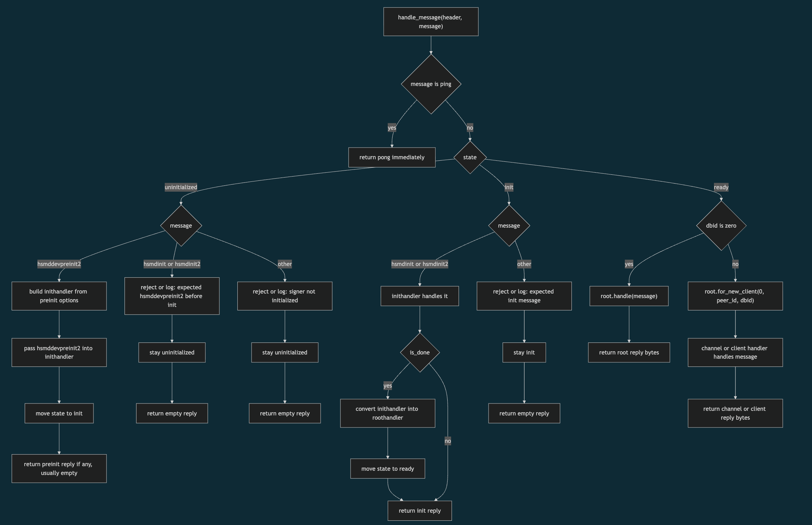
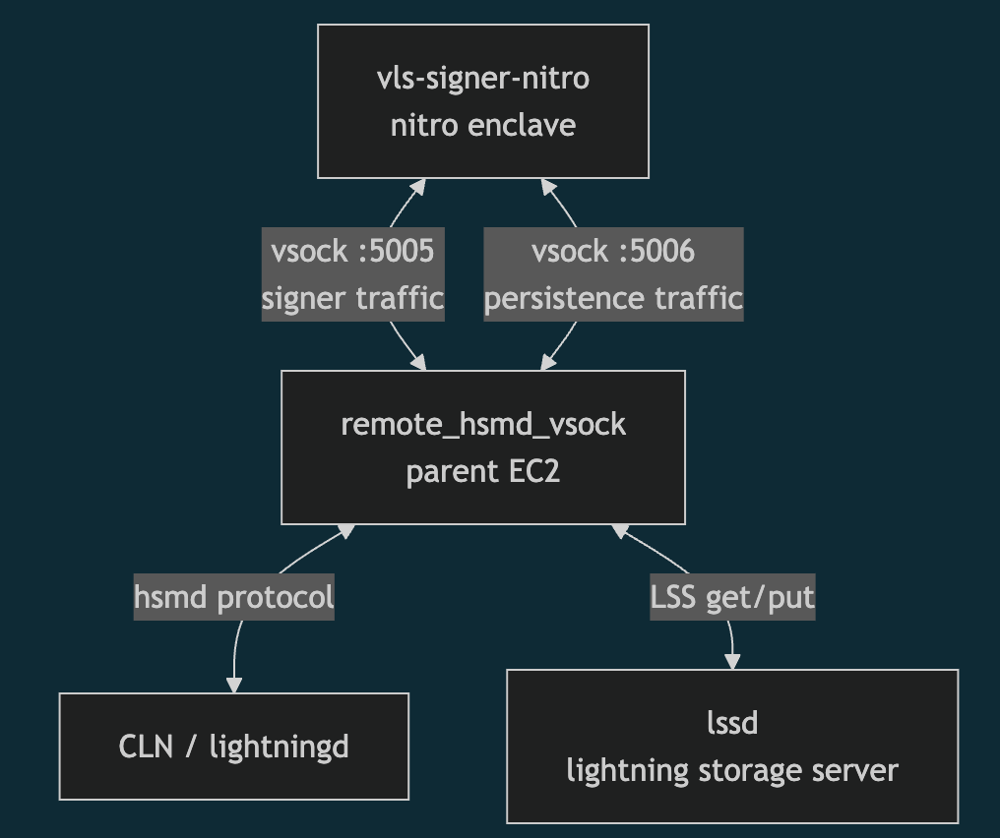
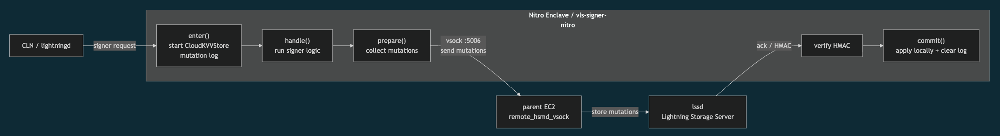

### That Grenade Launcher We Built in Summer of Bitcoin 2026

### Contents
 - [Overview](#Overview)
 - [Deciding The Plan](#Plan)
 - [First Ever Lightning Signer in Nitro Enclave](#M3)
 - [vsock Transport](#M3-Continued)
 - [Persistence](#M4)
 - [CLN Tests](#CLN-Tests)
 - [Future Work](#Future-Work)
 - [Benefit to The Community](#Benefit)

<a id="Overview"></a>

### Overview
[Summer of Bitcoin (SoB)](https://www.summerofbitcoin.org/) program is one of the numerorous ways to dive into Rust or Bitcoin or OSS or à la mode tech or all of them at the same time.

[Validating Lightning Signer (VLS)](https://vls.tech/) is an open-source Rust library for secure, self-custodial Lightning signers. Unlike hot wallets, VLS keeps your private keys off the node and validates each signing request, ensuring only legitimate channel operations are approved. You keep custody of your funds and get strong security at the same time.

I'm [Vatsal Keshav](https://gitlab.com/vatsalkeshav224) and my SoB'26 project was about ["Running a Lightning signer inside an AWS Nitro Enclave"](https://gitlab.com/lightning-signer/validating-lightning-signer/-/merge_requests/881). VLS previosly ran as a normal server process(as vlsd) that talked to the Lightning node over gRPC.  The goal of this project was to run it inside an AWS Nitro Enclave: an isolated VM on an EC2 instance with no network, no disk, and no shell, so the host OS cannot look inside. If an attacker takes over the Lightning node host, the keys inside the enclave stay safe.

Checkout : [validating-lightning-signer !881](https://gitlab.com/lightning-signer/validating-lightning-signer/-/merge_requests/881)

<a id="Plan"></a>

### Deciding The Plan
__And learning the anatomy of a grenade__

We were essentially building a signer from scratch and with some of the _[awesome people building VLS](https://vls.tech/team/) - [Daniel Feichtinger](https://www.auxilit.com/), [Jack Ronaldi](https://x.com/JackRonaldi), [ZmnSCPxj](https://zmnscpxj.github.io/about.html), Sulaiman Aminu Barkindo_ - we decided to go with a waterfall development plan:
```sh
m1 - vsock echo 
m2 - vsock framed echo
m3 - vls in nitro enclave with in-memory persistence
m4 - persistence
```
`m1` and `m2` were prototypes, mainly a learning opportunity for me to understand the request/response frames and magic bytes a Lightning signer speaks:
```sh
# signer request frame
0xaa55 | sequence  | peer_id | dbid | len | payload

# signer response frame
0x5aa5 | sequence | len | payload
```

<a id="M3"></a>

### M3 : First Ever Lightning Signer in Nitro Enclave
__Learning how to throw a grenade__

AWS Nitro Enclave is isolated from the parent EC2 instance which has no TCP networking or public IP or direct access to the parent filesystem, so the standard communication channel between parent and enclave is vsock: a local, host/enclave socket mechanism using _CID + port_ instead of _IP + port_ - that meant the existing VLS/CLN signer paths could not be used as-is. CLN expects `hsmd` (its Hardware Security Module daemon) to run as a local subdaemon, talking over file descriptors with CLN's hsmd wire protocol. Inside a Nitro Enclave the signer is a separate, isolated process behind vsock. So we needed:

1. a new signer lifecycle wrapper and 
2. a nitro-specific vsock transport

Referring to earlier lifecycle implementations in vlsd and `vls-signer-stm32` - STM32 being the main reference because it is also a standalone signer binary — we built the nitro-signer state machine:



This gave us a proof-of-concept `vls-signer-nitro` binary. We tested the state transitions with fake request frames, since the vsock transport to talk to LDK or CLN had not landed yet.

<a id="M3-Continued"></a>

### M3 Continued : vsock Transport 
__Grenade Launcher__

we also needed a _vsock-specific transport/bridge_ to carry CLN/hsmd signer traffic between the parent EC2 instance and the nitro-signer. Since CLN can only launch a local hsmd, we mimic it with a bridge that CLN launches, which relays messages between CLN and the nitro-signer

Luckily the STM32 transport `remote_hsmd_serial` was an excellent reference. We copied it, changed the config to use a CID + port instead of a serial device, and named the result `remote_hsmd_vsock` to work as a bridge for the nitro-signer to CLN.

```sh 
# serial_main.rs
  VLS_SERIAL_PORT
  default /dev/ttyACM1

# vsock_main.rs
  VLS_NITRO_CID
  default 16
  VLS_NITRO_PORT
  default 5005
```

We tested it against a seemingly simple CLN test, `tests/test_pay.py::test_pay`. It failed. Following a precedent from a similar earlier situation, we demoted `policy-sweep-fee-range` from error to warning, but only on regtest and only for the nitro-signer.

<a id="M4"></a>

### M4 : Persistence 
__Remembering stuff about our grenades and inventory so that when we wake up and somebody tries to cross us we can double cross them__

Next, we moved on to m4 to implement persistence so the nitro-signer remembers channel/revocation state after enclave restart, and can still safely detect and punish a counterparty broadcasting an old revoked commitment and problems of similar kind.


Persistence was hard because a Nitro enclave does not give us normal durable local storage. If the enclave restarts, anything held in memory is gone. We could not reuse the STM32 persistence model: it relies on local storage, which an enclave restart wipes out. The quickest and reasonably robust solution was to externalize persistence to _LSS(Lightning Storage Server)_

On _ZmnSCPxj's_ advice, we decided against multiplexing persistence traffic over the vsock port 5005 and went with a two-port architecture:



When a signer request arrives from CLN, the nitro-signer calls `enter()` to start an in-memory CloudKVVStore mutation log, so state writes are recorded before they are committed.

Then `handle()` does whatever the request asks for: create a channel, update commitment state, revoke an old commitment, track chain state, and so on, without knowing anything about LSS.

After the handler finishes, `prepare()` collects any state mutations from CloudKVVStore.

The nitro-signer sends these mutations to the parent over vsock port 5006. The parent relays them to `lssd`, which stores them and returns an acknowledgment with an HMAC.

Only after the nitro-signer verifies the HMAC (proof that LSS accepted the mutations) does it call `commit()`, which applies the changes to the enclave's in-memory store and clears the mutation log.



This way, after a restart the nitro-signer restores its state from LSS, verifies the HMACs, rebuilds state, and continues safely.

<a id="CLN-Tests"></a>

### CLN Tests
__Testing our grenade launcher and grenades to make sure they'll fire and explode (respectively) in the worst of the worst__

VLS has a custom `vls-hsmd` suite that runs it against CLN's own tests in addition to VLS's tests. The nitro-signer needs slightly different handling (a fresh enclave and a fresh LSS instance for each test), but the result: full parity with the reasonably mature STM32 signer.

<a id="Future-Work"></a>

### Future Work
__Keep The Launcher Launching__

For automated testing of nitro-signer, we plan to integrate QEMU's Nitro Enclave emulation (with vhost-device-vsock mimicking vsock) into the vls-hsmd suite, together with enclave and LSS restarts for each test.

KMS attestation support is also planned. Ideas from _ZmnSCPxj_ under discussion:

 - __Stable-Loader PCR Approach for Attestation__

    The idea is to attest a small, stable loader image with trusted developer public keys instead of the nitro-signer - the parent sends the VLS binary + signature, stable loader verifies it, then runs that binary inside the enclave. This way VLS can update without changing trusted PCRs every time

 - __RAID + Quorum Based Persistence__

    The risk with LSS-based persistence is that it lives on the parent, so a compromised parent could reboot the nitro-signer into a rolled-back, malicious state. This can be solved with multiple nitro-signer replicas that keep their in-memory state independent of the parent's LSS. On reboot, a nitro-signer queries each replica for its copy of the state, using a random nonce challenge to make sure the state is the latest.

<a id="Benefit"></a>

### Benefit to The Community
__To The Grenade Launching Community only__

For users keen to keeping their lightning funds safe and node-as-a-service providers like Greenlight, this project is a robust reference for running a lightning signer inside a trusted execution environment(TEE). 

This also paves way - along with og VLS in STM32 implementation ofcourse - for future TEE support such as Intel SGX/Intel TDX or AMD SEV-SNP
