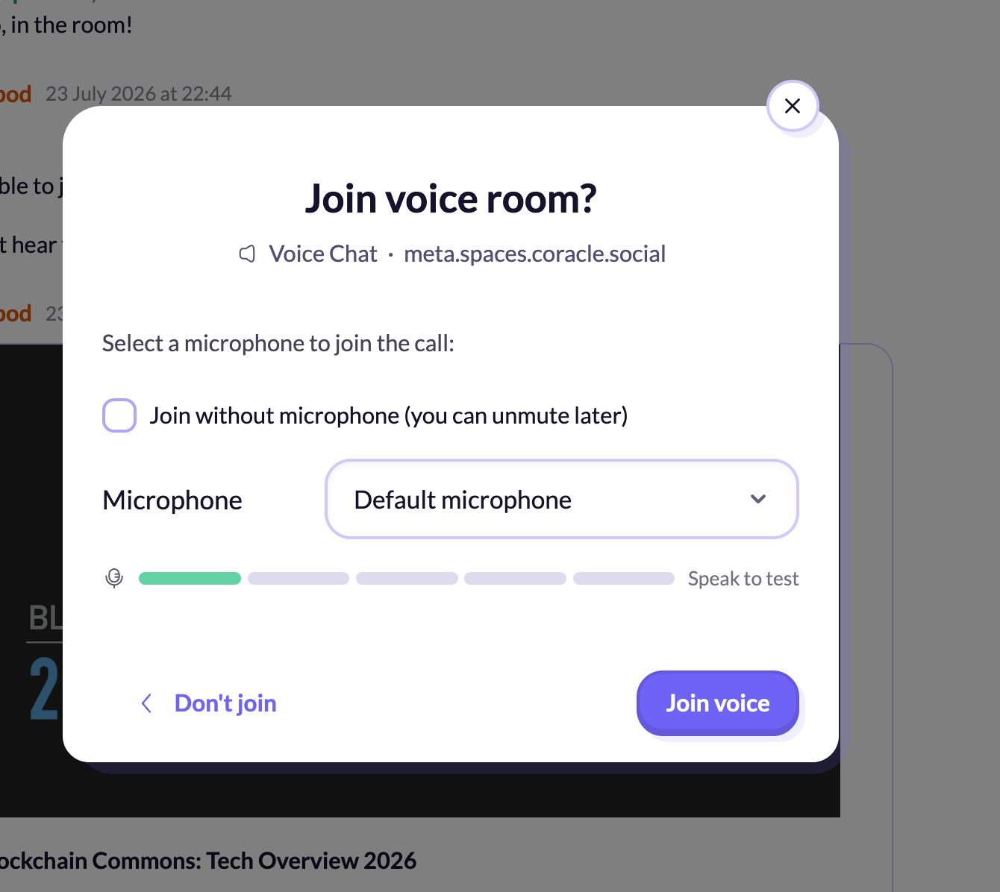
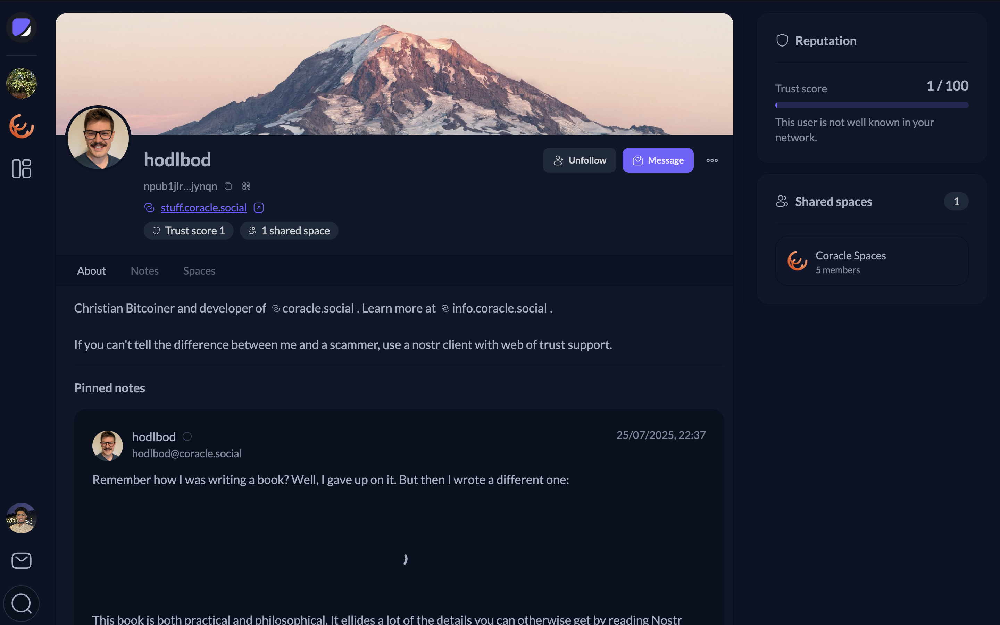
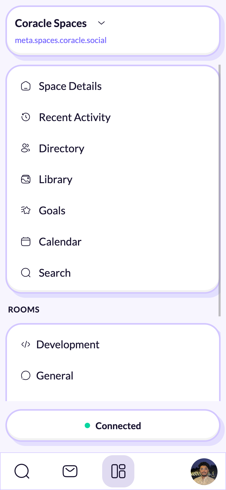

## Who I am and what I worked on

I am Aditya Chaudhary, and for Summer of Bitcoin 2026 I worked on [Flotilla](https://gitea.coracle.social/coracle/flotilla), a group chat client built on the Nostr protocol, under the mentorship of hodlbod. This post is my final report for the program: what I set out to do, what I actually built, the decisions that shaped it, what shipped, what is left, and what I learned along the way.

## What I set out to do

I joined the project wanting to work on the parts of a chat client that are the hardest to get right: real time features that have to hold up on a flaky mobile connection, and the everyday interface details that decide whether an app feels finished or half built. Going in, my goal was fairly simple to state and hard to execute: make Flotilla feel like a dependable messaging app. That meant voice calls that survive a dropped connection instead of quietly breaking, notifications people can actually trust, and screens, like user profiles, that felt complete rather than like placeholders.

## What I built

Over the course of the summer, my work spanned voice calling, notifications, messaging and rooms, a full profile page, mobile interface work, and a handful of authentication and trust related fixes. Here is some of what that looked like.

**Voice and video calling.** I redesigned the call control interface, replacing hover only tooltips with persistent labeled controls, adding a live microphone level meter to the join dialog so people can confirm their mic works before they enter a call, and building a call banner that stays visible across pages while a call is active. Underneath that UI, I worked through a string of reliability problems: microphone state that silently broke after a phone's screen locked, participant state that fell out of sync after a reconnect, and a leave button that stopped responding during screen sharing.

  

<em>The join dialog I built for voice rooms, including a live microphone level meter so people can confirm their mic works before joining a call.</em>

**Notifications.** I built a read state system that stays in sync across devices, and generalized unread badges so they cover not just chat, but threads, goals, classifieds, calendar events, and polls too. Before this work, unread state was inconsistent enough that people could not fully trust the badges they were looking at.

**A full profile page**, built from scratch at `/people/[npub]`, including a banner and bio header, follow and message actions, note management for a person's own profile, a trust score and shared connections panel, and a share flow with QR codes for npub and nprofile links.

  

<em>The finished profile page: banner and bio, follow and message actions, trust score and shared spaces in the sidebar, and pinned notes on the page itself.</em>

Alongside these, I worked on a card based redesign of the mobile sidebar, replacing an older layout that was cramped and hard to navigate on small screens.

  

<em>The redesigned mobile sidebar, laid out as a stack of cards instead of a single dense menu.</em>

On the messaging and rooms side, I added room invite links that combine space and room level joining in one step, a way to convert a single room message into its own thread, composer drafts that survive navigation instead of getting lost, and a redesign of the threads view into a simpler, forum style layout. I also moved trust and reputation scoring away from computing follow and mute graphs locally, switching instead to scores from Vertex, a data vending machine reachable over NIP-90, and fixed a handful of authentication and protocol correctness issues, including clearer error messages during login and a fix to how the app applies NIP-70 protected tags so it stops getting rejected by relays that do not support them.

Beyond all of that, I fixed a long tail of smaller bugs, several of which I noticed and filed as issues myself before fixing them.

## Major technical and design decisions

A few decisions shaped this work more than others.

I separated microphone mute state into its own store instead of letting it live as part of the larger call session object. That change fixed an early video tile flicker bug on its own, and more importantly, it is what made every later reliability fix, reconnect handling and screen lock recovery included, possible without fighting the same reactivity problems over and over.

Message pinning turned out to need a protocol level change, not just a client one. My first implementation signed pin events with the user's own key, but the relay expected those events to be signed by the relay itself under NIP-29. My mentor added the missing relay side support while I kept iterating on the client interface, the pinned message banner, its animation, and its click target, against that new behavior. It was a good example of client work and protocol work meeting in the middle.

For trust scoring, we moved away from computing follow and mute graphs locally and switched to scores from Vertex, a data vending machine reachable over NIP-90. That traded local control over the computation for a real gain: the app no longer needs to run expensive, network wide graph fetches every time someone opens a profile, which matters a lot on mobile.

The profile page went through several full rounds of design review with my mentor. Tabs were removed in favor of a single consolidated view, the thresholds for trust indicators were retuned, and the share flow was reworked entirely into a dedicated dialog. The version that shipped looks fairly different from my first draft, and it is better for having gone through that process.

## What shipped

By the end of the program, 48 pull requests of mine were merged into the main codebase, spanning calling, notifications, messaging and rooms, mobile interface work, authentication, and trust scoring. The full list is visible on [Gitea](https://gitea.coracle.social/coracle/flotilla/pulls?type=all&state=closed&poster=userAdityaa). If I had to point to two artifacts first, they would be the voice calling reliability and interface work as a whole, and the [profile page PR](https://gitea.coracle.social/coracle/flotilla/pulls/307), which is the clearest single example of a feature going from a first draft through real design iteration to something people use every day.

## What remains

One pull request is still open: [#371](https://gitea.coracle.social/coracle/flotilla/pulls/371), a fix for layout issues in the voice room interface. My mentor asked for a broader rework, controls that recenter or shift depending on whether chat is open, rather than the narrower fix I had proposed, so that is pending a follow up pass. There is also a feature request I filed myself, [#347](https://gitea.coracle.social/coracle/flotilla/issues/347), asking for drag to reorder space icons in the sidebar. It has been acknowledged but not yet built, since it has a real design problem around icon overflow that needs solving first.

## What I learned

The biggest technical lesson was that reliability bugs in real time features almost never show up in a development environment. They show up on an actual phone, on a real network, with a screen that locks in the middle of a call. Testing on device, rather than trusting an emulator, made a real difference in how quickly I could find and understand these bugs.

On the collaboration side, I learned to bring a working implementation into design discussions instead of a proposal. Having something concrete gave my mentor a real target to react to, and both the profile page and the calling interface improved substantially because of that back and forth. I also learned when to let go of my own approach. A few of my pull requests were closed in favor of a simpler fix my mentor wrote directly, and in every case the replacement was genuinely better, not just different.

If I could go back, I would spend more time upfront on Bitcoin and Nostr protocol fundamentals: NIP conventions, event kinds, and how relays actually behave. Some of the friction I ran into, like message pinning needing relay side NIP-29 support I had not anticipated, would have been easier to navigate with that grounding already in place.

## What happens next

I plan to keep contributing to Flotilla after the program ends. I have already told my mentor this directly. The next concrete step is finishing the layout rework in #371, and after that, picking up the sidebar reordering feature, which is a small, well scoped piece of design work. More broadly, I want to keep working on the reliability side of real time Nostr clients. That is the part of this project I found most interesting, and it is still one of the least solved problems across the ecosystem.
