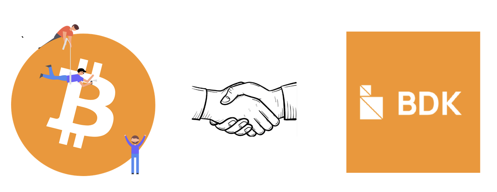

I did not enter university knowing that I wanted to work on Bitcoin. My path started with a hackathon in my first year of engineering. It was my first hackathon, our project was based on blockchain, and our team won a $500 cash prize.

The prize was exciting, but what stayed with me was the technology. I wanted to understand what was happening beneath the applications: how decentralized systems reach agreement, how ownership is represented, and why Bitcoin had survived while so many other projects came and went.

That curiosity eventually led me from learning Rust to contributing to the Bitcoin Development Kit as a Summer of Bitcoin intern.

  

### Falling down the rabbit hole

After the hackathon, I started learning Rust. The language was difficult at first, but its focus on correctness and explicit design decisions made it feel suited to the kind of systems work I wanted to explore.

At the same time, I was looking beyond the broad idea of “blockchain” and trying to understand decentralization properly. That search brought me to [Bitshala](https://bitshala.org/), where I joined two cohorts: one based on *Mastering Bitcoin* and another focused on learning Bitcoin through the command line.

After those cohorts, I also completed the [Saving Satoshi](https://savingsatoshi.com/) challenge. It gave me another practical way to test what I was learning and helped me become more comfortable approaching Bitcoin development problems on my own.

Working through Bitcoin at the protocol and command-line level changed the way I saw it. Transactions, scripts, keys, nodes, and wallets stopped being abstract words. I was now able to connect the ideas to real software. By my second year of engineering, I had fallen far enough down the rabbit hole to discover [Summer of Bitcoin](https://www.summerofbitcoin.org/).

The selection process involved three levels of developer challenges. Completing them was demanding, but each level made me more certain that I wanted to work in Bitcoin open source. When I was selected, I joined the BDK project and began working with my mentor, [Steve Myers](https://github.com/notmandatory).

Steve was an amazing mentor throughout the summer. Our weekly calls never felt like formal status meetings; they felt like honest conversations where I could explain what I had tried and admit what I did not understand. Whenever I got stuck while working during the week, we would use our meeting to debug the problem together. Working through those issues alongside Steve showed me how an experienced developer approaches a failure: how he narrows down the problem, checks assumptions, reads the relevant code, and decides what to try next. Those sessions helped me understand not only the fix, but also the reasoning that led us to it.

He also taught me how Bitcoin open source works beyond the code in a single pull request. Steve explained how ideas begin in community discussions, how they develop through issues and review, how BDK fits into the wider Bitcoin ecosystem, and how current priorities are connected to decisions made years ago. He regularly kept me updated on ongoing work and maintainer discussions, which helped me understand why our priorities sometimes changed. That context made my tasks feel less like isolated tickets and more like small pieces of a much larger effort. His balance of guidance and trust made me more confident with every contribution.

### What I set out to build

My project focused on improving the CI infrastructure around [`bdk_wallet`](https://github.com/bitcoindevkit/bdk_wallet). The main goals were to make Minimum Supported Rust Version (MSRV) testing reproducible, enforce signed commits, and automate stale issue and pull-request triage.

MSRV testing sounds simple: choose the oldest Rust version a project supports and confirm that the project still builds. In practice, Cargo's dependency resolution can make the result change over time. A dependency release that requires a newer compiler can break an old-toolchain job even when the project's own source code has not changed.

My largest planned deliverable was therefore a migration to [`cargo-rbmt`](https://github.com/bitcoindevkit/cargo-rbmt) in [`bdk_wallet` PR #494](https://github.com/bitcoindevkit/bdk_wallet/pull/494). The goal was to generate and audit lockfiles for both minimal and recent dependency resolutions, then test those exact resolutions locally and in CI.

The important design decision was to treat dependency resolution as an input that should be checked, not as an invisible detail left to every CI run. Committed lockfiles allow a maintainer to reproduce the same dependency graph and make drift visible during review.

### The dependency problem hidden underneath

Implementing the workflow exposed a deeper issue. A true minimal dependency resolution selected versions that did not compile together under the expected feature combinations. The failure was not just in the CI YAML; it crossed crate boundaries and involved `rust-miniscript`, `bdk_chain`, and `bdk_core`.

  

I traced one of those failures to `serde` support in `rust-miniscript` under `no_std`. The fix became [`rust-miniscript` PR #987](https://github.com/rust-bitcoin/rust-miniscript/pull/987), which was merged. I also opened [`bdk` PR #2227](https://github.com/bitcoindevkit/bdk/pull/2227) for the corresponding `no_std` dependency correction in BDK.

The `cargo-rbmt` migration itself is implemented, but it cannot be merged cleanly until the required `rust-miniscript` release is available and BDK updates the related `bdk_chain` and `bdk_core` versions. This was an important lesson: sometimes the correct status of a contribution is not “merged” or “failed,” but “ready and blocked on an upstream release.”

### Smaller workflows with immediate impact

Alongside the larger migration, I worked on two repository-maintenance workflows that could ship independently.

[`bdk_wallet` PR #496](https://github.com/bitcoindevkit/bdk_wallet/pull/496) added signed-commit enforcement. The workflow checks incoming commits and makes the repository's trust policy automatic instead of relying on maintainers to verify every commit manually.

[`bdk_wallet` PR #497](https://github.com/bitcoindevkit/bdk_wallet/pull/497) added automated stale issue and pull-request triage. Its timings and exemptions were discussed with maintainers so that the automation would reduce maintenance work without closing active conversations too aggressively. Both workflows were merged.

I later carried the same triage work to the main BDK repository in [`bdk` PR #2259](https://github.com/bitcoindevkit/bdk/pull/2259), which remains open for review.

### When the project changed direction

During the second half of the program, priorities shifted toward `rust-esplora-client` and its relationship with the mempool.space API. At first, the change felt a little like starting over. I gradually carried what I had learned in the first half into the new codebase: understand the dependency boundary, make the behavior reproducible, and keep each pull request reviewable.

Esplora provides an HTTP API that wallets can use to query blockchain data, while `rust-esplora-client` gives Rust applications a typed client for that API. mempool.space exposes an Esplora-compatible API, but it has gradually added endpoints and response types that do not belong to the core Esplora API. Keeping those differences inside one client was becoming harder to maintain, so our work explored clearer boundaries between shared types, the Esplora client, and a future mempool.space client.

I contributed to the design and implementation of separating Esplora-specific data structures from the client in [`rust-esplora-client` PR #229](https://github.com/bitcoindevkit/rust-esplora-client/pull/229). I also worked on a draft mempool.space client architecture in [`PR #238`](https://github.com/bitcoindevkit/rust-esplora-client/pull/238), where the main challenge was deciding which types could be shared and where the APIs had genuinely diverged.

I also volunteered to pick up two additional issues. [`PR #242`](https://github.com/bitcoindevkit/rust-esplora-client/pull/242) added self-auditing lockfiles and updated `cargo-rbmt`; it was merged. [`PR #245`](https://github.com/bitcoindevkit/rust-esplora-client/pull/245) added asynchronous GET request pipelining and was merged on August 20.

The review of pipelining produced a useful correction. Enabling it during general request construction would also have affected POST requests, where that assumption was unsafe. I moved the behavior into the GET retry path so only asynchronous GET requests are pipelined. That small placement decision mattered more than the number of changed lines.

### Learning when not to merge an implementation

Not every piece of work should land in its original form. I worked on wallet signing in [`bdk_wallet` PR #438](https://github.com/bitcoindevkit/bdk_wallet/pull/438), but maintainers were moving away from wallet-owned signers. We closed the PR by agreement rather than merging an API that no longer matched the project's direction.

A proposed TRUC-related fix in [`PR #442`](https://github.com/bitcoindevkit/bdk_wallet/pull/442) was also superseded by the broader work in [`issue #477`](https://github.com/bitcoindevkit/bdk_wallet/issues/477) and [`PR #478`](https://github.com/bitcoindevkit/bdk_wallet/pull/478).

Before this summer, I tended to think that closing a PR meant the effort had been wasted. Open source taught me otherwise. A prototype can reveal the right boundary, a review can change the design, and a closed PR can prevent the project from committing to the wrong abstraction.

  

  <em>“Git” by Randall Munroe, <a href="https://xkcd.com/1597/">xkcd #1597</a>, licensed under <a href="https://creativecommons.org/licenses/by-nc/2.5/">CC BY-NC 2.5</a>.</em>

### What shipped

By the end of the program, the following contributions had been merged:

- Signed-commit enforcement for `bdk_wallet`: [PR #496](https://github.com/bitcoindevkit/bdk_wallet/pull/496)
- Automated stale triage for `bdk_wallet`: [PR #497](https://github.com/bitcoindevkit/bdk_wallet/pull/497)
- The `rust-miniscript` `no_std`/`serde` fix: [PR #987](https://github.com/rust-bitcoin/rust-miniscript/pull/987)
- Self-auditing lockfiles and a `cargo-rbmt` update for `rust-esplora-client`: [PR #242](https://github.com/bitcoindevkit/rust-esplora-client/pull/242)
- Async GET request pipelining for `rust-esplora-client`: [PR #245](https://github.com/bitcoindevkit/rust-esplora-client/pull/245)

The main `cargo-rbmt` migration remains blocked on upstream releases. The Esplora/mempool.space separation, the mempool client draft, the BDK `no_std` follow-up, and the main-repository stale workflow remain open or under review.

### What I learned

The biggest change this summer was not a single Rust technique. It was becoming comfortable working in a real open-source project, where the answer is rarely contained in one file and a good review can completely reshape the first implementation.

Following the `cargo-rbmt` failure across several repositories taught me to investigate the cause rather than patch the first visible symptom. It also changed how I think about CI. Reproducible checks are not background plumbing; they are part of how a project keeps its promises to users and future contributors.

Some of the most valuable work was less visible. I attended weekly BDK standups, reviewed a pull request from Luis Schwab, joined discussions about architecture and `no_std` support, and picked up the lockfile-auditing and async-pipelining issues when they became useful to the project. Steve and the BDK maintainers guided the priorities and long-term design, while trusting me to investigate failures, implement changes, respond to reviews, and carry fixes across related repositories.

I also stopped measuring a contribution only by whether it merged immediately. Sometimes the useful outcome is a merged workflow. Other times it is a clearly documented upstream blocker, a design that improves during review, or the decision not to merge an API that no longer fits the project's direction.

### What happens next

The next step for the original project is to revisit [`bdk_wallet` PR #494](https://github.com/bitcoindevkit/bdk_wallet/pull/494) after the required `rust-miniscript` release and the corresponding `bdk_chain` and `bdk_core` version updates. The open Esplora and mempool.space work will continue through maintainer review and further iteration.

For me, the summer did not feel like the end of a short internship. It felt like the point where learning Bitcoin stopped being something I did only through books and cohorts and became something I could do through code, review, and collaboration.

I am especially grateful to Steve for his patience, his honest feedback, and the freedom he gave me to make mistakes and learn from them. I could always bring an unfinished idea or a confusing failure to our call without feeling judged. I am also thankful to the BDK maintainers and the Summer of Bitcoin community for welcoming me into the project and treating my questions seriously.

The first hackathon gave me the curiosity. Bitshala gave me the foundation. Summer of Bitcoin gave me the opportunity to contribute. Now I want to keep going deeper into the rabbit hole and keep leaving the code a little better than I found it.

  

