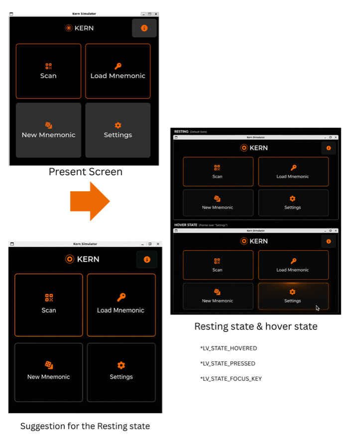
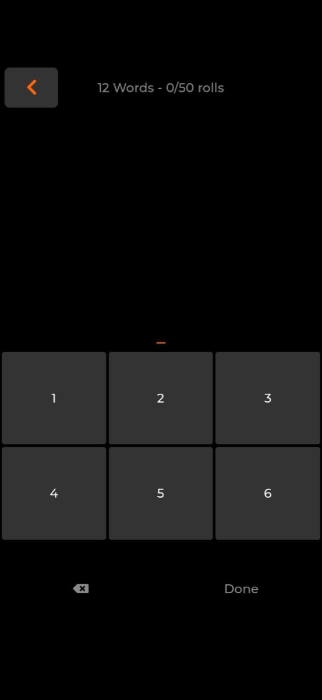
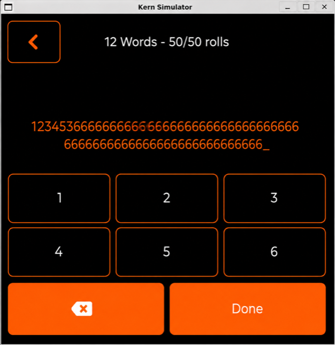
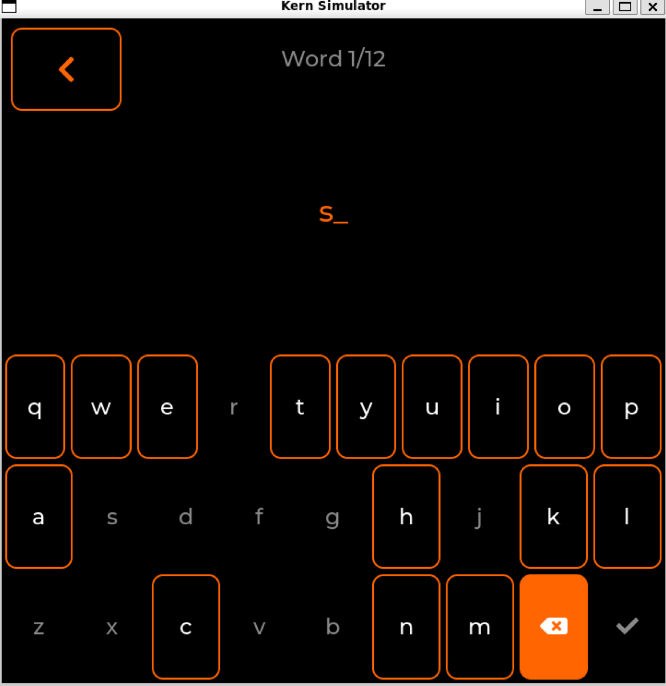
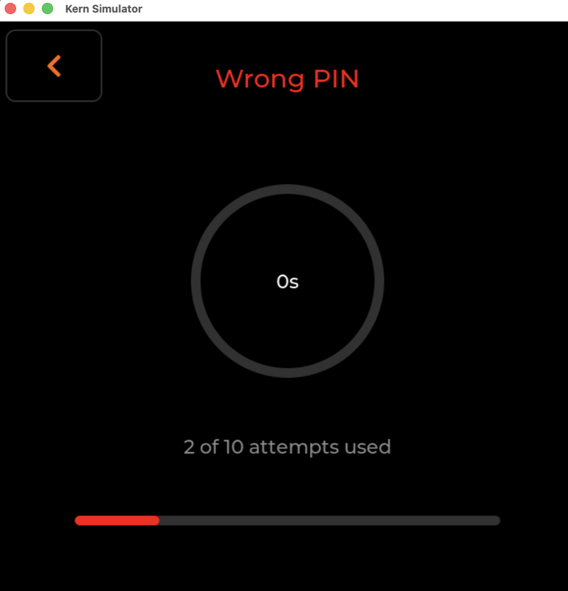

### Congratulations! You are accepted in the Summer of Bitcoin Programme

When I was selected for Summer of Bitcoin, to be very honest I couldn't believe that I could crack a Global open source. My story highlights me from being under confident to a journey of self belief and a realisation I can do that too!

I was always interested in UI/UX and something that spoke the language of design. I own a brand named OItijhya designs and I have delivered 37+ products all across.

I was selected for [KERN](https://github.com/odudex/Kern) - Icon and Visual Language System and then came the most difficult part. My experience limited me to Figma, canva and basic Frontend development using React framework but at Kern it demanded LVGL and C knowledge. I was initially fearful but later I realised Knowledge is meant to be expanded and never aimed to limit someone's ability to implement meaningful changes.

> Here comes a brief introduction about my project — KERN represents a pioneering open-source initiative, serving as an air-gapped signing firmware designed specifically for Bitcoin on ESP32-P4 touchscreen platforms. It features a meticulously crafted LVGL user interface that strictly avoids radio communication, relying exclusively on QR codes and SD cards for data input and output.

I am really thankful to Adi Shankara for allowing me this wonderful opportunity and my mentor [Odudex](https://github.com/odudex) who has been kindly patient with me giving me broader perspective on my PRs, allowing me to make mistakes and learn from them and ideate freely with an open canvas which is named Kern.

## What I built that got Shipped?

My very first PR —

- [**#31** — battery: replace text-only percentage with icon family](https://github.com/odudex/Kern/pull/31) — Solves: replaces text-only battery percentage with icons for clearer, more compact battery state display.
- [**#77** — feat(ui): add icons, semantic colours, and responsive flex layout](https://github.com/odudex/Kern/pull/77) — Solves: enhances UI with icons, semantic colours and responsive layout for better presentation and accessibility.
- [**#84** — docs: add UI design guidelines for colour, icons, typography and dialogs](https://github.com/odudex/Kern/pull/84) — Solves: (duplicate/docs variant) supplies UI design guidelines for consistent styling.
- [**#96** — Feat/pin delay arc dots](https://github.com/odudex/Kern/pull/96) — Solves: provides a visual "delay" indicator (arc dots) for PIN input timing.
- [**#101** — feat(backup): color-coded numbered rows for mnemonic word list](https://github.com/odudex/Kern/pull/101) — Solves: makes mnemonic word lists easier to read by adding color-coded, numbered rows.
- [**#113** — fix(capture_entropy): add missing back button for cancel path](https://github.com/odudex/Kern/pull/113) — Solves: restores a missing back button on the cancel path so users can navigate back.
- [**#115** — feat(pin): add step progress bar to PIN setup flow](https://github.com/odudex/Kern/pull/115) — Solves: adds a progress indicator so users know which step they're on during PIN setup.
- [**#126** — feat(ui): redesign login screen as a 2x2 card grid with hover glow](https://github.com/odudex/Kern/pull/126) — Solves: replaces the old login layout with a 2x2 card grid that adds hover glow for better visual.
- [**#128** — fix(ui): make textarea border orange](https://github.com/odudex/Kern/pull/128) — Solves: fixes inconsistent textarea styling by applying the expected orange border.
- [**#133** — feat(ui): highlight primary action keys on button-matrix keypads](https://github.com/odudex/Kern/pull/133) — Solves: improves usability by visually emphasising primary action keys on button-matrix keypads.
- [**#146** — fix(ui): mask passphrase entry like every other secret field](https://github.com/odudex/Kern/pull/146) — Solves: prevents passphrases from being shown in plaintext by masking the passphrase input.

## In this Process the major technical decisions that I took were

### Login screen unfilled cards redesign

### Keyboard Redesign

### Pin Delay arc Dots

## Reflections

Kern represents a pioneering open-source initiative, serving as an air-gapped signing firmware designed specifically for Bitcoin that physically lacks the capacity to connect to any network. While it remains a research-oriented endeavor and not yet a finalized consumer product, it provides a unique platform for experiential learning and testnet operations within the open-source community. The project maintains a rigorous threat model by implementing essential security features like encrypted storage and masked secrets, ensuring that user trust is built upon a foundation of verifiable hardware-based confirmations rather than blind reliance.

The things that I learnt is how to implement meaningful changes, adapt good testing practices before actually concluding the implementation. To be continuously involved in feedback for better execution and most important do a lot of research and be able to justify the context of changes and the problem the change will actually solve….

Coming from Figma and React, LVGL was a real shift — there's no DOM or CSS, just a C widget tree you build and style directly, with flex layouts, states (hovered/pressed/focused) and event callbacks all wired by hand. The Kern desktop simulator became my actual design tool: build with CMake, run it in an SDL2 window on my laptop, and see every icon, colour and hover state exactly as it would look on the real touchscreen, no hardware required. It's also how I caught a real cross-platform build bug — the simulator's SDL2 setup only worked by accident on Linux, and broke on macOS until I traced it to how Homebrew packages its headers differently. That loop, edit C, rebuild, watch it render, taught me to treat the simulator as ground truth rather than trusting how a mockup merely looks on paper.

The most beautiful thing is Summer of Bitcoin gave me the identity of an open source contributor and henceforth I see myself being passionately crazy with my thoughts in the contributors section of repositories. I feel obsessed with open source codebases and the amount of joy it gives me whether im able to fix a bug or introduce a feature or simply understand the codebase everything feels like the fascinating Hogwarts to me….
