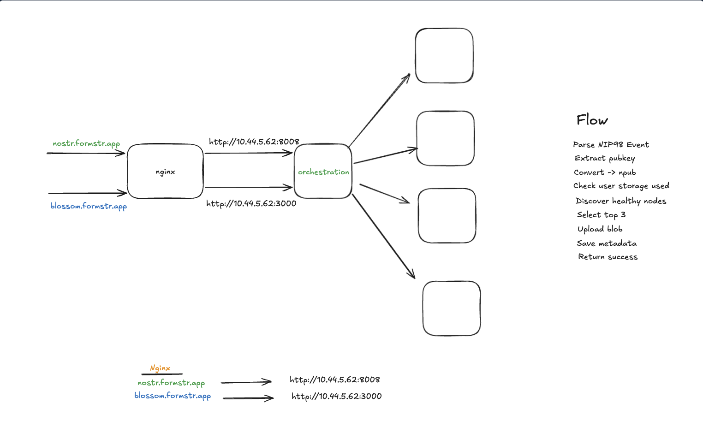
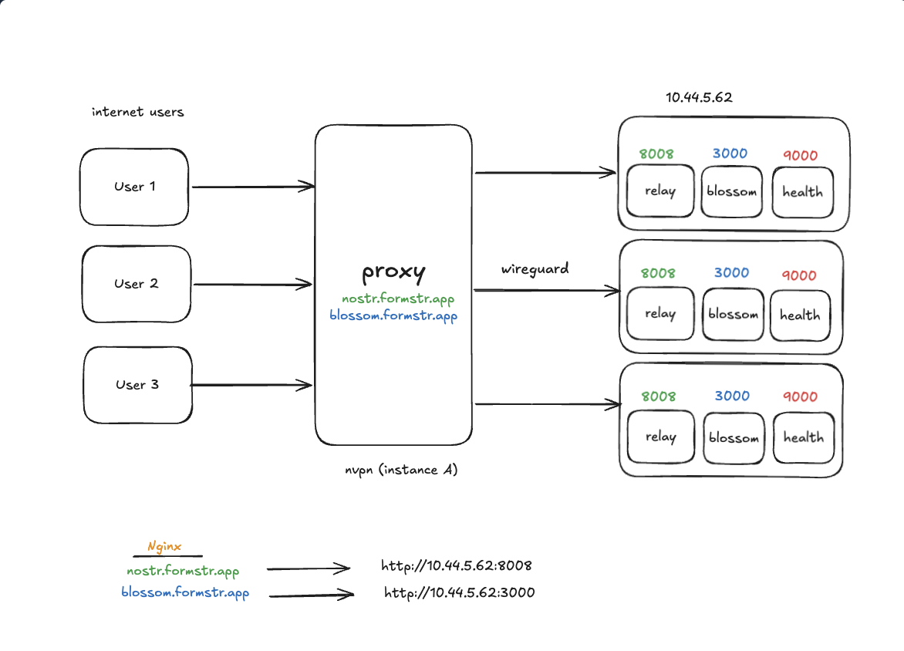

Many Nostr applications decentralize identity and messaging, then quietly reintroduce centralization at the storage layer. An app might sign data with a user's key and publish events over Nostr, but still depend on a single relay or file server to stay online. If that backend goes down, the application's data path becomes fragile — even though the protocol around it is decentralized.

During Summer of Bitcoin 2026, I worked on closing that gap. My main project was local AI: moving inference out of a centralized API and running it directly in the browser. Alongside that, I also worked on [nostr-storage-orchestrator](https://github.com/formstr-hq/nostr-storage-orchestrator), a Nostr-aware proxy that connects clients to both Nostr relays and Blossom blob servers.

## Turning spare machine capacity into relay and storage space

The orchestrator's other effect is on who can afford to host in the first place. Paired with a Nostr VPN, it lets someone turn their own machine into a relay and a Blossom host, contributing storage space to the network without provisioning cloud infrastructure or registering a domain. No cloud bill, no domain to manage — just a machine you already have, exposed and serving relay and Blossom traffic.

That matters for cost as much as for topology. Skipping cloud infra and domains makes hosting cheaper for the person running the node, and a network with more of those small, independently run nodes is more robust than one propped up by a handful of large hosted providers. Every additional relay or Blossom host is one more place data can live, and one fewer single point of failure for the network as a whole.

## How the proxy routes a request

The Blossom path begins with a Nostr-signed authorization event attached to the HTTP request. The proxy validates that event, resolves the user's public identity, checks upload and quota rules, and selects healthy Blossom backends. It uploads the blob to as many backends as the configured replication plan requires, then records the blob's metadata and storage usage through an internal database API.

The relay path follows the same separation of concerns over WebSockets. It runs a NIP-42-style authentication challenge, validates signed `EVENT` writes, forwards `REQ` subscriptions, and publishes accepted events to healthy backend relays. Metadata updates go through the internal database service, while authentication, ownership, duplicate handling, and quota decisions stay in the public-facing proxy.

Conceptually, the flow looks like this:

```text
client -> auth and protocol validation -> healthy backend selection
       -> Blossom blob servers or Nostr relays
       -> internal metadata and usage accounting
```



This doesn't magically make any single backend impossible to fail, and replicating an event or blob across multiple backends is a capability the client application has to actually use — it depends on whether the app takes advantage of it. What the proxy does provide is a single relay endpoint from the client's point of view: an app connects to one WebSocket URL, and under the hood the proxy can write the same event out to several backend relays (or the same blob to several Blossom servers), so one backend going down doesn't cost you your data. That's the practical resilience gain: clients are no longer tied to the uptime or implementation details of any one relay or blob host.



## What this changes for developers

Without a proxy layer, every application has to solve authentication, backend health, replication, quota accounting, and failure handling on its own. Consolidating those responsibilities into one open-source orchestrator lowers the barrier to building Nostr applications that need durable storage. It also gives storage operators a clear way to contribute capacity while keeping the client-facing protocol familiar.

For the broader network, combining relays and Blossom matters because decentralization should cover both the event graph and the files attached to it. A signed event isn't very useful if the content it points to survives on only one machine.

## A second track: local AI with GGUF models

I applied the same idea to AI features: remove a mandatory centralized service from the critical path. Using the `@wllama/wllama` package, GGUF models can be loaded and run directly in the browser — on WebGPU when it's available, falling back to WebAssembly otherwise. Because inference happens on-device, an app can offer AI features without sending form content or writing context to a hosted API, and without asking users to separately install and run something like Ollama just to get local inference working.

In [nostr-docs PR #59](https://github.com/formstr-hq/nostr-docs/pull/59), I added this Wllama-based browser integration for loading GGUF models. The work included local text suggestions and corrections, capability feedback, a mobile-friendly in-memory fallback when browser storage is unavailable, and tests covering model loading and feature toggling. [PR #60](https://github.com/formstr-hq/nostr-docs/pull/60) continued this track with local proofreading and more flexible GGUF model selection.

I then carried the same inference path into a real form-building workflow with [nostr-forms PR #504](https://github.com/formstr-hq/nostr-forms/pull/504). The integration lets a user choose the local Wllama provider, load a GGUF file, and generate form content in the browser. The model weights, prompts, and generated content stay on the user's device throughout — the LLM serves every request locally, so the application no longer needs a centralized inference API, and users get privacy and data integrity without any extra setup.

## What I learned and what comes next

Storage orchestration and local inference look like separate projects, but they taught me the same lesson: decentralization only becomes meaningful when users can replace infrastructure without rewriting the application. Protocol-compatible boundaries are what make that possible.

Next, I want to keep improving deployment ergonomics, backend observability, and the local-model experience across different devices. If you're building on Nostr, try the [storage orchestrator](https://github.com/formstr-hq/nostr-storage-orchestrator), test it against your own relay or Blossom server, and tell me what breaks. Contributions and review are also welcome on [nostr-docs](https://github.com/formstr-hq/nostr-docs) and [nostr-forms](https://github.com/formstr-hq/nostr-forms). The best way to make these tools resilient is to have more people run, inspect, and improve them.

This is a first version, and feedback is what makes it better — try it out and tell me what's missing or wrong.


## Links

* [Formstr on GitHub](https://github.com/formstr-hq/)
* [More about Formstr](https://about.formstr.app/)