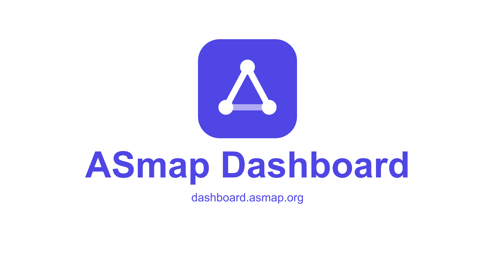

<figure>

</figure>

This is my final report for Summer of Bitcoin 2026. I spent the summer building a public website that keeps Bitcoin Core's map of the internet next to a daily list of reachable Bitcoin nodes, and shows how an old map still groups those nodes compared to a new one.

A short version, for anyone who has not read my [midterm post](https://blog.summerofbitcoin.org/measuring-asmap-and-learning-how-fragile-open-source-really-is/). A Bitcoin Core node can pick its peers based on which internet network they are in, so it is harder for one hosting company to occupy all of those chosen peers. That grouping uses a file called an ASmap. But routing on the internet moves, so the file ages. These ASmaps in [bitcoin-core/asmap-data](https://github.com/bitcoin-core/asmap-data) are built with [Kartograf](https://github.com/asmap/kartograf) from public routing data, in coordinated runs. I wrote up how a run works [on my personal site](https://www.jorisstrakeljahn.de/blog/asmap-collaborative-launch/). The site I built is the [ASmap dashboard](https://dashboard.asmap.org).

The first half of the summer is already in that [midterm post](https://blog.summerofbitcoin.org/measuring-asmap-and-learning-how-fragile-open-source-really-is/). What ASmap is in more detail, why an old map can hurt peer diversity, and how my only data source went offline in the first week of the program. I am not going over that again. This post is the rest. I turned a prototype into a tool that runs without me, and building it changed where I want to spend my time.

## What I set out to do

The project, mentored by [fjahr](https://github.com/fjahr) with [jurraca](https://github.com/jurraca) co-mentoring, had one job: make those maps measurable. New builds have been published since early 2024, but there was no public site to see that history, compare two versions, or score an old map against the nodes that are reachable today.

By midterm a first version was online, and I asked for feedback in a [bnoc thread](https://bnoc.xyz/t/asmap-dashboard-first-version-looking-for-feedback/140) and on [Delving Bitcoin](https://delvingbitcoin.org/t/asmap-dashboard-tracking-the-asmap-data-history-against-the-observed-network/2652). What was left for the second half was a daily update instead of putting data in by hand, a real home on an [asmap.org](https://asmap.org) subdomain, and enough documentation that the site can keep running after the internship.

## What I built

The finished dashboard does two jobs. You can look at the maps on their own: pick any two versions and see which parts of the internet changed between them. You can also take the daily list of reachable Bitcoin nodes from [bitnod.es](https://bitnod.es/) and ask how each map places those nodes, from plain coverage (does this IP still appear on the map?) to how concentrated they are across internet operators. The question I applied with, how wrong a map becomes as it ages, now has an answer you can read off a chart. On the dashboard right now, a one-year-old map places about 5% of today's reachable nodes in a different network than the newest map does.

After midterm I spent the rest of the summer getting the site to run without me. The node list now comes from one public crawler, refreshed every day. The site lives at [dashboard.asmap.org](https://dashboard.asmap.org), a subdomain of [asmap.org](https://asmap.org), and I also wrote down what every number on the page means, and how the daily update works, so the next person does not have to reconstruct it from my head. The write-ups live in the [dashboard repo](https://github.com/jorisstrakeljahn/asmap-dashboard).

One decision from those weeks is worth keeping here. Earlier versions mixed node lists from different crawlers into the same chart. A Bitcoin crawler connects to nodes, asks them who they know, tries those addresses, and writes down who actually answers. What you get is a snapshot of the reachable part of the network, not the whole thing. Different crawlers see different nodes, so every time the source changed the line jumped, and it looked as if the map had moved when really the observer had. The site now uses a single public source and keeps the raw files. How much those public lists disagree with each other turned into its own topic. I wrote that up on bnoc in [this post](https://bnoc.xyz/t/live-bitcoin-dns-seeders-and-crawler-datasets/153/2).

## What I learned

I applied to build a website and spent half the summer inside those node lists instead. Scoring maps against "the network" keeps asking a question the charts cannot answer alone: which network, seen by whose crawler, on which day. I ended up caring about that at least as much as about the site itself. I find that exciting, but I did not get there on my own.

Summer of Bitcoin is why any of this exists. The program put me on a real project with mentors who had context and opinions, instead of a side repository nobody reviews. fjahr and jurraca caught early mistakes that would have looked fine on a chart, pulled me into the releases of new maps, and treated the dashboard as asmap work rather than an intern exercise. I would recommend the program to anyone who has been circling Bitcoin development without a way in.

The other thing it did, which I had not planned on, is that I now write in those threads instead of only reading them. I know where the people who review patches, publish maps, run crawls, and argue about numbers in public talk, and I have work there. I do not want that to stop when the program does.

## What happens next

The dashboard keeps running every night. After the program I still want to look at the Bitcoin network: which nodes are reachable, who hosts them, and whether a jump on a chart is a real change or just a different crawler. Those questions showed up while I was scoring maps, and they are the ones I want to keep working on.

But there is more I want to understand. When the network is behaving strangely, can we see it earlier than we do now? A crawler going quiet, a lot of new addresses showing up at once, one hosting company suddenly holding more of the reachable nodes. Some of that is just the network moving, but some of it is a bug or an attack, and from a public chart it is hard to tell which. I want to spend time on that. Look at the data, write the analyses down, and help with the tools that make this kind of watching possible.

## Thanks

Thanks to [fjahr](https://github.com/fjahr), who answered fast from the first week and kept the reviews specific. Thanks to [jurraca](https://github.com/jurraca) for co-mentoring the whole way, and to the Summer of Bitcoin team for building the on-ramp. I had a good summer, and I am curious what comes after it.

## Links

- [Live dashboard](https://dashboard.asmap.org)
- [Dashboard repository](https://github.com/jorisstrakeljahn/asmap-dashboard)
- [Midterm post](https://blog.summerofbitcoin.org/measuring-asmap-and-learning-how-fragile-open-source-really-is/)
- [How a collaborative asmap-data launch works](https://www.jorisstrakeljahn.de/blog/asmap-collaborative-launch/)
- [Project page on my site](https://www.jorisstrakeljahn.de/projects/asmap-dashboard/)
