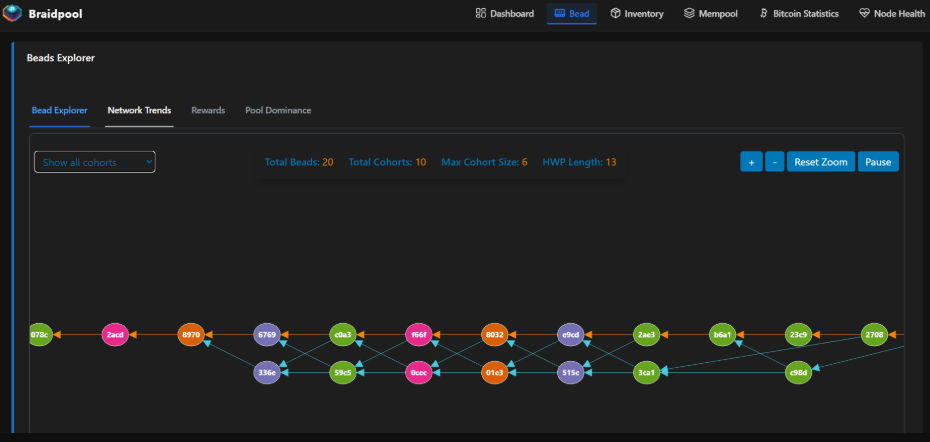
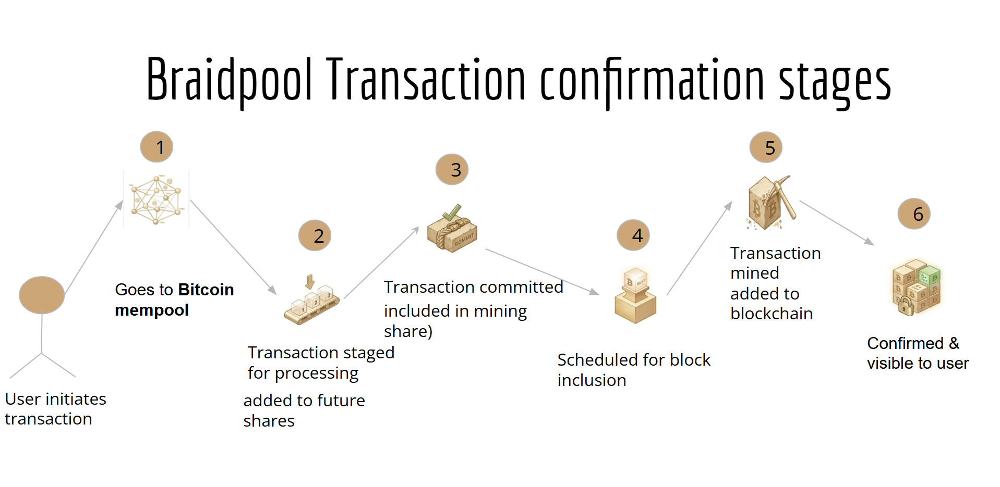
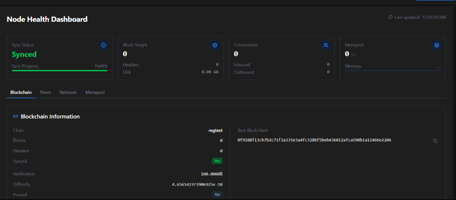

I've been contributing to [Braidpool](https://github.com/braidpool/braidpool) for over a year now. The dashboard has existed for a while; it had a DAG visualization, a miner management panel, a transactions view,a mempool stats view, and a node health page. It looked like a working product.

The problem was that it wasn't showing Braidpool node data. Because the node's own RPC layer wasn't ready yet, the dashboard relied on external services like [mempool.space](https://mempool.space) and [Esplora](https://github.com/Blockstream/esplora) to pull Bitcoin data as a stand-in. The miner panel had function stubs with no persistence or discovery. The transactions view was showing Bitcoin transactions fetched from those external sources, not anything confirmed through the Braidpool node. The React frontend and the Rust backend had WebSocket RPC infrastructure between them, but they were barely talking to each other.

I'm Priya ([GitHub](https://github.com/priyashuu)), and this is my Summer of Bitcoin 2026 final report. This summer's focus was to close that gap: replace the external dependencies with live data from the node itself, and build the backend APIs that made it possible.

---

## A little context on Braidpool

Most mining pools today are centralized. You point your ASIC at a pool server, the server decides who gets paid and how much, and you trust them. Braidpool takes a different approach: it uses a DAG (directed acyclic graph) of cryptographically linked work shares (called "beads") to distribute payouts trustlessly. The node itself is Rust all the way down.

The dashboard is what node operators use to see the state of their node: the bead DAG growing in real time, which miners are connected, transaction status, network health. Getting all of that to actually reflect the node's state was the work.

---

## The shape of the problem

I applied to this project thinking it was a frontend problem. React, TypeScript, some charts, all territory I knew. The first week I spent reading code cured me of that assumption fast.

Every frontend fix I wanted to make ran into the same wall: *there's no API for this.* The DAG was pulling from mempool.space and Esplora because the node's own RPC hadn't been implemented yet. The miner panel had no backend because nobody had built one. The transactions view was empty on the Braidpool side because there was no RPC method that served node transaction state.

So I stopped thinking of my work as frontend and started thinking differently: start from the data, build backward to the screen.

---

## The foundation work

Before the bigger features, I spent the first part of the program building the groundwork, the things that had to exist before anything else could.

I started outside the main repo entirely. [PR #3 on rust_cpunet_miner](https://github.com/braidpool/rust_cpunet_miner/pull/3) added an Axum-based HTTP API for miner statistics and health checks, with CORS support so the dashboard could actually talk to it. It was my first real piece of Rust in this project and it established the pattern I'd follow everywhere: build the API first, wire the frontend second.

Back in the main repo, [PR #406](https://github.com/braidpool/braidpool/pull/406) improved the braid visualisation, moving it to a proper Bead Explorer view and fixing the zoom behaviour. Then [PR #427](https://github.com/braidpool/braidpool/pull/427) integrated real Braidpool node data into the dashboard through WebSocket RPC for the first time, the first moment the dashboard was actually connected to the node rather than pulling data from external sources.

[PR #469](https://github.com/braidpool/braidpool/pull/469) removed unused dependencies. [PR #470](https://github.com/braidpool/braidpool/pull/470) added ARIA labels to the download buttons, accessibility work that rarely gets noticed until it's missing. [PR #471](https://github.com/braidpool/braidpool/pull/471) added database-backed miner management with CRUD operations and periodic data refresh, the first real version of the miner management system that would later grow into PR #527.

All of these merged. They're not the flashiest PRs in the list, but they're why the later work was possible.

---

## The DAG: connecting to the node

The DAG visualization was the most visible gap. It was pulling data from mempool.space and Esplora because the node's own RPC wasn't ready when the dashboard was first built. That stand-in had worked as a placeholder, but it meant the dashboard had no awareness of what the actual Braidpool node was doing.

I wired it to the node's WebSocket JSON-RPC directly. The frontend now subscribes to bead events and updates the graph incrementally as beads arrive. I added reconnection logic so the dashboard doesn't go blank if the node restarts; it re-subscribes automatically once the connection comes back.

The part that took the most iteration was the subscription race condition. Braidpool's RPC pushes events over the same connection you use to subscribe. Between the moment you send the subscription request and the moment the server confirms it, new beads can arrive. If you're not careful, those beads fall into a gap and your initial state is stale before you even render it. Getting that handoff right, so you never miss a bead and never double-count one, was probably three days of work that isn't visible anywhere in the PR.

**[PR #519: Live DAG WebSocket RPC](https://github.com/braidpool/braidpool/pull/519)** *(Under review)*

---

## Transactions: building the API that didn't exist

The transactions view had columns, rows, and a search bar, but it was only showing Bitcoin transactions fetched from external sources. There was no backend method on the node side that served Braidpool transaction state.

I built a set of custom JSON-RPC methods covering the full transaction lifecycle: from first appearance in the mempool through confirmation in a committed bead to final settlement. Since committed transactions weren't indexed for fast lookup in the current node architecture, I added an index. Without it, the RPC would have had to do full scans on every query, which isn't something you want firing on every dashboard refresh.

I kept the API design close to Braidpool's existing RPC conventions: composable methods, consistent error shapes, useful both for the dashboard and for anyone else building tooling on top of the node.

**[PR #515: Transaction lifecycle RPCs](https://github.com/braidpool/braidpool/pull/515)** *(Under review)*

---

## ASIC discovery: the detour that was worth taking

My original proposal said to build miner discovery using Pyasic, a Python library with solid ASIC coverage. Reasonable choice on paper. Wrong choice once I was inside the codebase.

Braidpool is a Rust project. Everything runs in one process, one binary. Adding Pyasic would have meant a Python sidecar process, some form of IPC, a second runtime to deploy and maintain, and a dependency that has nothing to do with how the rest of the node is built. Three weeks in, I found `asic-rs`, a Rust crate the project was already pointing toward for exactly this purpose.

I scrapped the Pyasic plan and built `miner-api-rs` instead: a Rust wrapper around `asic-rs` that adds automatic LAN subnet scanning. It walks the local network, finds ASICs, and reports their status back to the node. No Python, no sidecar, no IPC.

That pivot taught me something I'll carry into every project: *reading the codebase before writing any code is not optional.*

**[PR #513: Miner API & ASIC discovery](https://github.com/braidpool/braidpool/pull/513)** ✅ **Merged**

---

## Miners: from discovery to full lifecycle management

Knowing a miner exists on your LAN is one thing. Tracking it across reboots, IP changes, and restarts is another problem entirely.

I built the full miner management stack: CRUD APIs, SQLite persistence, a background polling loop for telemetry, and WebSocket pushes so the dashboard gets live status without hammering the API. There was a real design question buried in it.

ASICs don't have static IP addresses. They get new DHCP leases. If your miner identity is tied to an IP, your database gets a new record every time that happens, and a miner you've been tracking for weeks becomes an unknown stranger. I caught this early ([Issue #485](https://github.com/braidpool/braidpool/issues/485)), documented it, and switched to MAC addresses as the stable identifier. Small decision, real consequence.

**[PR #527: Miner management & monitoring](https://github.com/braidpool/braidpool/pull/527)** *(Under review)*

---

## Node Health: more signal, less noise

The Node Health page showed basic status. I redesigned it around what an operator actually needs to know quickly: real-time inbound and outbound bandwidth, with selectable time ranges so you can see whether a spike happened in the last ten minutes or has been building for hours. All live, over WebSocket, no page refresh.

The visual changes look simple. The underlying work was adding the right RPC methods on the Rust side to actually expose that data in a usable shape.

**[PR #520: Node Health redesign](https://github.com/braidpool/braidpool/pull/520)** *(Under review)*

---

## The quieter work

Two smaller PRs that don't make headlines but matter:

- **[PR #529](https://github.com/braidpool/braidpool/pull/529):** Tower/Tower-HTTP middleware integration and transaction-fetching cleanup, wiring how the frontend connects to the transaction fetcher and how the transaction fetcher connects to the node.
- **[PR #521](https://github.com/braidpool/braidpool/pull/521):** Replaced a non-standard `ActionIconButton` with the project's standard button component for download functionality. Tiny, but consistency in a shared codebase compounds.

---

## What this summer taught me

I came in thinking the hard part would be the React code. The hard part was Rust. Not the syntax, that's just reading. The hard part was understanding the *shape* of a production Rust codebase: where state lives, how errors are meant to propagate, what a PR that fits looks like versus one that technically works but fights the conventions. That took weeks of reading before it clicked.

I also learned that filing an issue is not admitting defeat. Before this, I would have either silently fixed something or ignored it. Now I understand that documented problems with good reproduction steps are genuinely valuable, sometimes more valuable than a half-finished fix. A few of those issues have already attracted other contributors. That wasn't something I expected to be proud of, but I am.

On the mentorship side: the implementation, every line of Rust and TypeScript in those PRs, every design decision, every bug I found before review, was my work. My mentor and the maintainers gave me something different and equally valuable: architectural instincts I didn't have yet. When I was about to build the Pyasic integration, my mentor helped me see why `asic-rs` was the right call. That's what good open-source mentorship looks like, not someone building things for you, but people around who've already made the mistakes you haven't made yet.

---

## One last thing

There's still a lot of empty space in this dashboard. Some PRs are still in review. More features are planned that I didn't get to. The codebase is young and fast-moving.

But when you open the Braidpool dashboard today and look at the DAG, you're watching your actual node. The beads are real. The miner status is real. The transaction history is real. A dashboard that shows you the actual state of your system, not a proxy for it, is not a small thing.

That's what I came here to build, and that's what I built.

Priya
