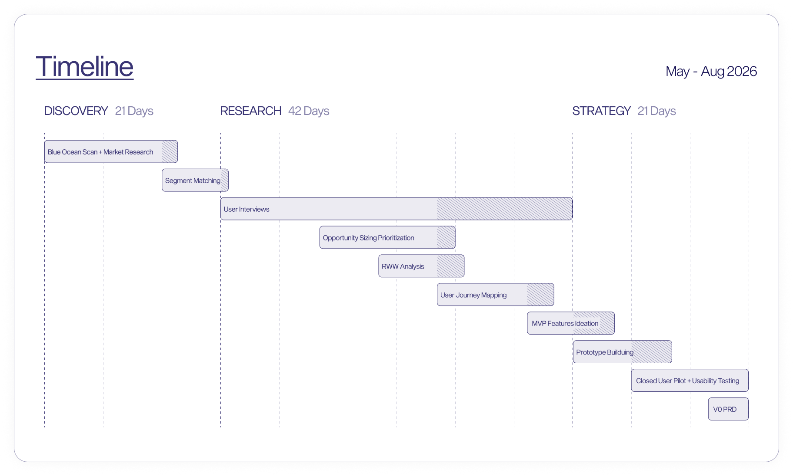
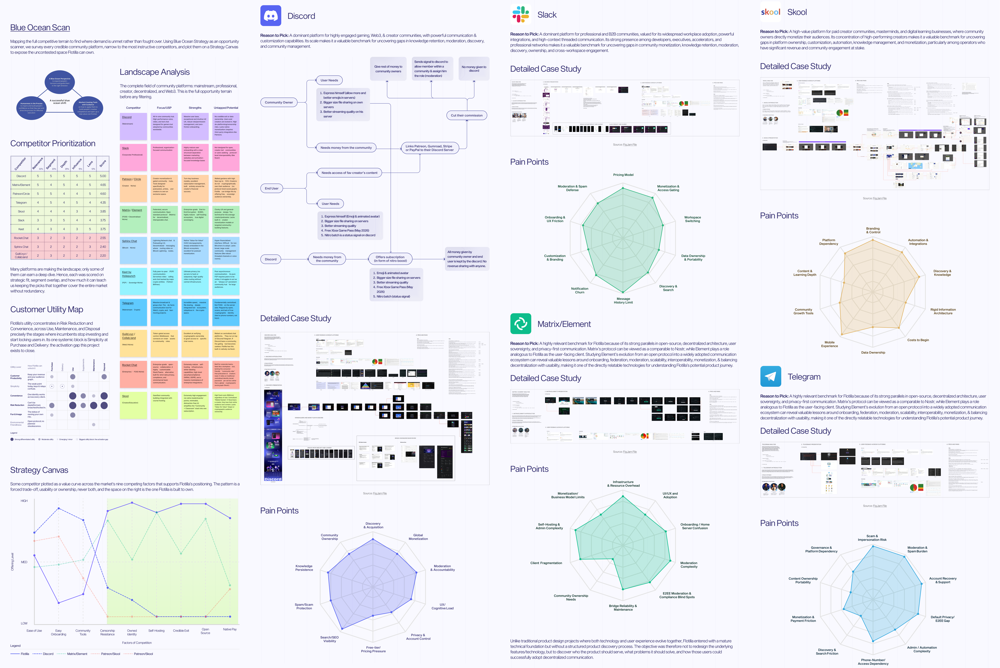
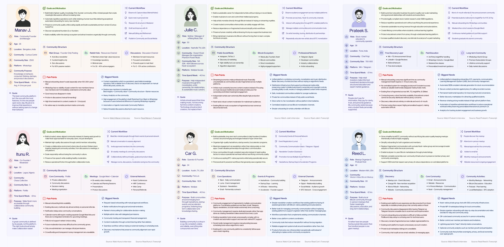

## 1. What I Set Out to Do

During my **Summer of Bitcoin 2026** fellowship, I joined **Flotilla**, a free, open-source, and self-hosted community platform created by **Jon Staab (hodlbod)**. Built on the **Nostr protocol**, Flotilla was designed as a sovereign, decentralized alternative to Discord.

> *"Provide digital tools for individual and community sovereignty that support cultures and economies situated in the real world."*  
> - **Jon Staab**, Creator of Flotilla

Flotilla entered this project in a classic **post-technology, pre-Product-Market Fit (PMF)** state. It possessed a robust Nostr-native engineering foundation, but lacked a validated Ideal Customer Profile (ICP), an activation strategy, and a structured product discovery process.


My mission was to lead an intensive 12-week product discovery process to discover who Flotilla should serve, identify high-stakes user pain points, take extensive user interviews and synthesize them, create a simple prototype and validate the core value propositions of our hypothesis and finally craft a validated product strategy for mainstream adoption, all without compromising Nostr's / Flotilla's esabilishd decentralization principles.

---

## 2. What I Built

In the timeline shown below, you will be able to find that withn 12 weeks, I built a structured Discovery, Research and Strategy framework where each section served the synthesis to fulfilment of the next. A complete documentation of the Market/UXR/Interviews/Testing, along with v0 PRD, and interactive prototype (not serving UI/UX or Functionality but is just to validate our core vlaue propositions through usability testiing) is deployed live at **[flotilla-prototype.vercel.app](https://flotilla-prototype.vercel.app/)**.



---

## 3. Major Technical & Design Decisions

### A. The "Post Offices" Analogy (Protocol vs. UX)

Just for understanding purposes I wanted to explain that Nostr separates **relays** (data transmission nodes) from **clients** (user applications). What is powerful at the protocol layer can be unintuitive at the UX layer, For exmaple below is an example of Nostr message which is just a bunch of text formatted in JSON:

```json
{
  "from": "Saksham",
  "message": "Hello World",
  "pubkey": "npub1...",
  "sig": "3045022100..."
}
```

Imagine writing a letter and centralized platforms (Discord/Slack) acting as post offices, you hand your letter to one of these post office. If they dislike you or find you unfit, they burn your letter.

On Nostr, **relays act like 100 independent post offices**. You broadcast your signed message to multiple relays simultaneously. Even if 99 post offices burn your letter, if 1 delivers it, your message lives on and there is always option to set-up your own post office on Nostr. 

Hence this becomes a fixed aspect of the project which cannot be changed in the journey of finding the PM, in conventional research you will find that researchers drop every aspect of a project and completely divert the course of project to take it towards PMF. But the Decision to be mindful of the Fixed aspects like Digital Soverginity, Credible Exit, Lightning Payments, etc during research and respecting them was a major highlight.

### B. Prioritization and Synthesis

Every section and progress in the porject involved analysis and synthesis of the data accummulated. Now this data pointed us to many different directions and sections like these compounding oiver time would take us to a completely different path. Hence the prioritization and synthesis of this gathered data was a major defining point with respect to decision making. 

---

## 4. What Shipped

### A. Strategy Canvas & Blue Ocean Positioning Research



Mapping the full competitive terrain to find where demand is unmet rather than fought over. Using Blue Ocean Strategy as an opportunity scanner, we survey every credible community platform, narrow to the most instructive competitors, and plot them on a Strategy Canvas to expose the uncontested space Flotilla can own.

### B. Interviews & Usability Testing Outcomes
We conducted qualitative user interviews and unmoderated usability sessions with real community owners/managers/leaders:



### C. Live Interactive Prototype
This prototype in any way was not focused on the design of UI/UX, It was there to validate core value proposition of our hypothesis before committing engineering bandwidth, I built and deployed an interactive prototype:
**Live Demo**: **[flotilla-prototype.vercel.app](https://flotilla-prototype.vercel.app/)**

### D. Production V0 PRD
We synthesized our findings into the **Flotilla Wedge PRD**.

---

## 5. What Remains

While the product strategy and V0 PRD are complete, the following steps remain for production handoff:
* **Translation of the v0 PRD into exceptional UI/UX Screens**: The v0 PRD directs you towards the right direction but bringing those instructions to a fruitful and rightfully serving expectations Product Design is still a challenege which is reamining as it was not part of the scope of these 12 weeks.
* **Usability Testing on Production Implementation**: The usability testing on a prototype is great to identify and validate the flows to transfer to the production but the quality and functionality expectations shifts when they are being tested on the production evnironment and surfaces newer and much richer insights.

---

## 6. What I Learned

1. **In depth Market Knowledge**: Since, I studied so many projects in extreme detail, did Blue ocean scan and strategies, synthesized the data points. Hence I belive I have gathered an immense Knowledege about the feild.
2. **PFM Research and Technical Feasibility Understadning**: While doing research, understadning the feasibilty of any proposition is something that can only be learnt in environments such as the one I recieved with a fantastic mentor.
3. **Strengthened my understanding of User Profiles for different Platforms**: During this project, I got to learn the capability of understanding how to very precisely distinguish the user personas / customer profiles and select the correct one for solving problem in a platform with complex tech  like Flotilla.

---

## 7. What Happens Next

* **Design Engineering**: How V0 PRD is utilized by the team to design production ready features.
* **Production Engineering**: How V0 PRD is utilized by the team to build production ready features.
* **Design Partner Beta**: Onboarding 5+ classified-tier community operators for closed beta testing on production builds.
* **Advocating Freedom Tech**: Continuing to advance Digital Localism, user data ownership, and open-source communication tools.

Special thanks to my mentor **Jon Staab (hodlbod)**, the **Summer of Bitcoin** team, and all community owners/managers who participated in our research! 🚀
