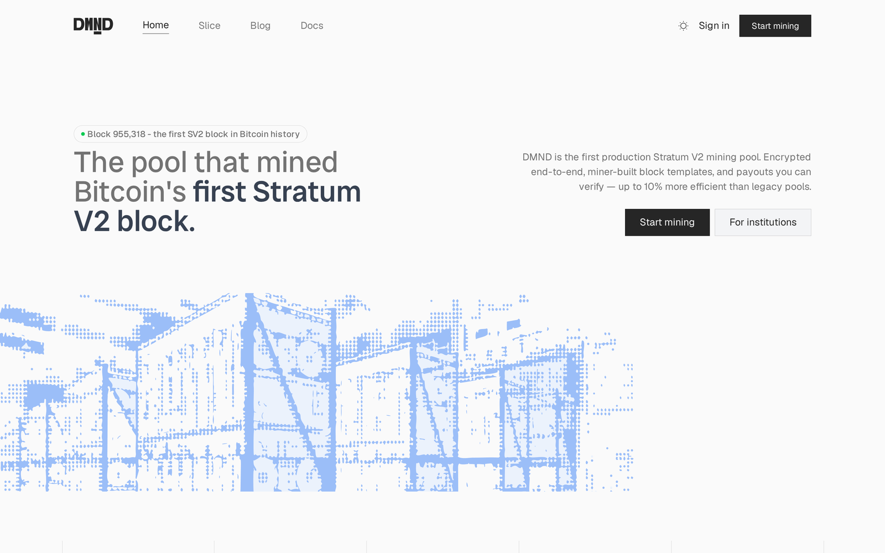
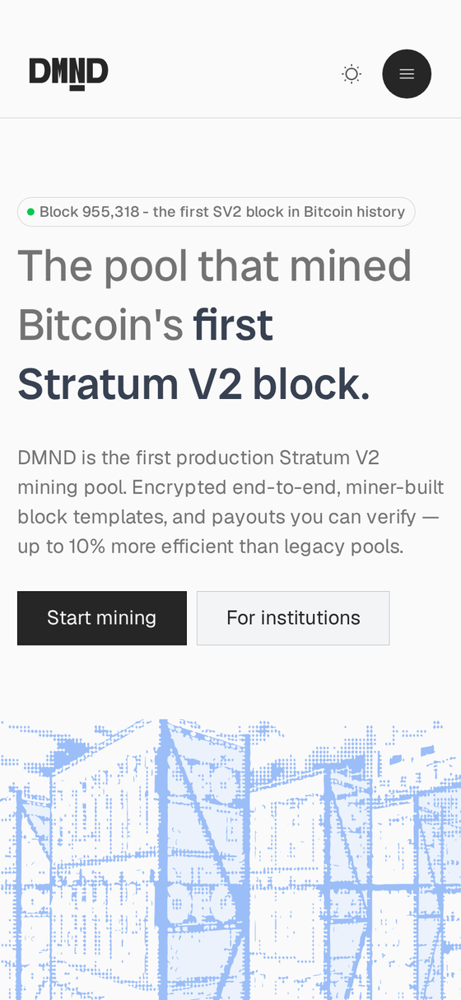

## Overview

I am Jyotiraditya Panda (rx18-eng), a Summer of Bitcoin 2026 contributor at DMND, the first production Stratum V2 mining pool. My project was the open-source miner dashboard at [dmnd-pool/sv2-ui](https://github.com/dmnd-pool/sv2-ui).

At the midterm, four pull requests were merged. Fifteen are merged now, and the dashboard covers the full set of screens a miner needs: authentication, home, workers, subaccounts, payouts, generated BTC, watcher links, settings, help, an aggregated multi-account mode, a separate broker dashboard, and the merge-mining setup guides. The test suite runs 276 tests.

I also built DMND's public marketing site, which is a separate repository and is currently in review.

## Architecture

The dashboard reads from two independent sources. Account-level data (subaccounts, payouts, generated BTC, watcher links, worker statistics) comes from the DMND cloud API over authenticated HTTP. Node-level data comes from a locally running dmnd-client instance, reached through the bundled Express server. A miner running only the hosted setup sees the cloud half; a miner running their own node sees both.

That split determines most of the UI decisions in the project. Every screen has to render correctly when one source is available and the other is not, which is why loading, empty and error states are handled per data source rather than per page.

_Miners connect through dmnd-client to the DMND pool; the dashboard reads from the cloud API and the local client._

## What I shipped in the second half

**Payouts and Generated BTC** ([#23](https://github.com/dmnd-pool/sv2-ui/pull/23)). Payout history with filtering, pagination and CSV export, plus the daily generated-BTC table. Generated BTC applies only to FPPS accounts, since PPLNS accounts are paid per block and have no daily figures. Rather than hiding the page for PPLNS users, the navigation entry stays visible and the page explains why it has no data.

**Watcher links** ([#24](https://github.com/dmnd-pool/sv2-ui/pull/24)). Read-only shareable links with two permission tiers, a revoke flow, and a public view that renders without an authenticated session.

**Settings and Help** ([#25](https://github.com/dmnd-pool/sv2-ui/pull/25)), followed by a pass closing the remaining gaps between the shipped pages and the design ([#26](https://github.com/dmnd-pool/sv2-ui/pull/26)).

**Aggregated dashboard and account switcher** ([#32](https://github.com/dmnd-pool/sv2-ui/pull/32)). Selecting the main account plus any set of subaccounts recomputes hashrate, the performance chart, worker counts and earnings across that selection. This changed the data layer, the charts, the stat cards and the navigation together rather than adding a new page. All 23 changed files went through a security review before merge, and the branch was rebased from 16 commits into 1.

**Design pass across the dashboard** ([#34](https://github.com/dmnd-pool/sv2-ui/pull/34)), 91 files brought in line with the design specification.

**Broker dashboard and Build Your Block guides** ([#35](https://github.com/dmnd-pool/sv2-ui/pull/35)). The broker view is a distinct role with its own data surface, and the guides publish the real configuration keys used for merge mining.

_The dashboard home. Pool passwords are blanked out in this screenshot._

## The marketing site

The public site is a separate repository, [dmnd-pool/home-page#3](https://github.com/dmnd-pool/home-page/pull/3). Fifteen sections, built with Astro and Tailwind, with no JavaScript shipped to the browser.

The design specifies two widths, 1440 and 375, and the mobile layout is a distinct composition rather than a scaled desktop one. The statistics strip transposes from five columns into five rows, several card groups reorder, a logo row becomes a horizontal scroll region, and one section's navigation rail rotates from a vertical column into a horizontal strip.

_The landing page at 1440._

_The same page at 375._

## Verification approach

Matching a design at two breakpoints by visual inspection does not scale, and the failure mode is a small drift that surfaces later. I used two automated checks instead.

The first reads computed geometry out of the rendered page and asserts it against the values extracted from the design file, covering 260 assertions across box positions, dimensions, type sizes, colours and stroke weights.

The second is a regression gate. It captures every top-level block at 1440 before and after each change and diffs them, so a rule intended for mobile that leaks into the desktop layout is caught immediately. It caught three regressions that visual review had missed, the smallest being three dropped hairline dividers that accounted for 0.05 percent of one section's pixels.

One technical detail is worth recording. A Figma frame that scrolls and a frame that clips its overflow are indistinguishable from dimensions and child bounds alone. They differ by a single property, `overflowDirection`. I initially built one section as a clipped frame because its content exceeded its height, and it is in fact a scroll region containing five cards rather than the four I had rendered. Reading that property is now part of my extraction step, and it identified a second scroll region elsewhere on the same page.

## Mentors

I was mentored by Esraa ([jbesraa](https://github.com/jbesraa)) and Prisca ([Priceless-P](https://github.com/Priceless-P)) at DMND.

Their reviews were consistently specific enough to act on without follow-up. Corrections came with the underlying reasoning rather than just a fix, which is how I learned the authentication model, the payout schemes, and the review standards the repository holds to. They also left implementation decisions to me where the choice was mine to make.

## Current status

Three pull requests remain open.

The marketing site ([home-page#3](https://github.com/dmnd-pool/home-page/pull/3)) is complete and verified, opened on 20 August and awaiting review.

[dmnd-client#218](https://github.com/dmnd-pool/dmnd-client/pull/218) fixes a race condition in SharesMonitor that can drop shares during a send. It has been reviewed and squashed as requested, and is awaiting merge.

[dmnd-pool/stratum#20](https://github.com/dmnd-pool/stratum/pull/20) tracks the Bitcoin target in the proxy channel from the SetNewPrevHash nbits field. It has not been reviewed yet.

A short list of design questions is attached to the marketing site pull request rather than resolved in code, covering typographic artefacts in the mobile frames and one section whose content extends past the 375 viewport. Those are design decisions and are left to the design owner.

## Contributing

The dashboard is open source under [dmnd-pool/sv2-ui](https://github.com/dmnd-pool/sv2-ui). It runs against the DMND API and, optionally, a local dmnd-client node. Issues are tracked in the repository, and the setup steps are in the README. Anyone interested in Stratum V2 tooling can run it locally and contribute.

## Links

Merged into [dmnd-pool/sv2-ui](https://github.com/dmnd-pool/sv2-ui): [#5](https://github.com/dmnd-pool/sv2-ui/pull/5), [#6](https://github.com/dmnd-pool/sv2-ui/pull/6), [#7](https://github.com/dmnd-pool/sv2-ui/pull/7), [#11](https://github.com/dmnd-pool/sv2-ui/pull/11), [#13](https://github.com/dmnd-pool/sv2-ui/pull/13), [#15](https://github.com/dmnd-pool/sv2-ui/pull/15), [#16](https://github.com/dmnd-pool/sv2-ui/pull/16), [#17](https://github.com/dmnd-pool/sv2-ui/pull/17), [#23](https://github.com/dmnd-pool/sv2-ui/pull/23), [#24](https://github.com/dmnd-pool/sv2-ui/pull/24), [#25](https://github.com/dmnd-pool/sv2-ui/pull/25), [#26](https://github.com/dmnd-pool/sv2-ui/pull/26), [#32](https://github.com/dmnd-pool/sv2-ui/pull/32), [#34](https://github.com/dmnd-pool/sv2-ui/pull/34), [#35](https://github.com/dmnd-pool/sv2-ui/pull/35)

Open: [home-page#3](https://github.com/dmnd-pool/home-page/pull/3), [dmnd-client#218](https://github.com/dmnd-pool/dmnd-client/pull/218), [stratum#20](https://github.com/dmnd-pool/stratum/pull/20)

Midterm report: [Building DMND's miner dashboard in the open](https://blog.summerofbitcoin.org/building-dmnd-miner-dashboard-in-the-open/)
