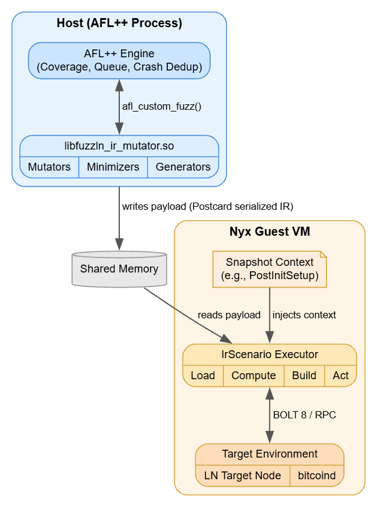

## Project Summary

Bitcoin's Lightning Network has seen growing adoption and routing capacity, with over $400 million in Bitcoin now locked in public channels, making security a top priority.

Fuzz testing is a valuable tool for improving the security and robustness of Lightning Network implementations, but it has received limited attention from LN maintainers. [Smite](https://github.com/lnfuzz/smite) is a coverage-guided fuzzing framework aimed at addressing this gap. This project involved implementing four advanced structural mutators for Smite, along with a statistically rigorous framework for evaluating their effectiveness.

## The Problem at Hand

A core component of any fuzzer, including Smite's, is its mutators — functions or algorithms that take an existing input (a seed) and modify it to produce a new test case designed to trigger bugs or exercise new code paths. Since Smite's inputs are programs representing protocol flows (e.g., opening a channel, creating a transaction), we can't rely on AFL++'s default mutators, which operate at the byte level and would simply corrupt our program's structure.

Before this project, two mutators already existed: [`InputSwap`](https://github.com/lnfuzz/smite/blob/14f06a241aa304e00929987e16f45d09b26deda6/smite-ir/src/mutators/input_swap.rs) and [`OperationParam`](https://github.com/lnfuzz/smite/blob/14f06a241aa304e00929987e16f45d09b26deda6/smite-ir/src/mutators/operation_param.rs). Both, however, operate at the value level — they can only change the value associated with an operation. To exercise a wider range of adversarial protocol flows, we need a way to modify the *structure* of the program (e.g., sending a gossip message in the middle of channel establishment). This project addresses that by adding four structural mutators to Smite's programs: `InstructionDelete`, `InstructionReorder`, `GeneratorInsertion`, and `SpliceInsertion`.

There are countless ways — and algorithms — for restructuring a program this way, so we also need a way to determine which ones actually help our fuzzer. This project addresses that too, via an end-to-end fuzzing pipeline for evaluating the effectiveness of different mutator combinations, based on code coverage and informed by the latest fuzzing research.

## Work Done

The four structural mutators:

- `InstructionDelete` ([#60](https://github.com/lnfuzz/smite/pull/60)). Merged to master.

- `InstructionReorder` ([#61](https://github.com/lnfuzz/smite/pull/61)). Merged to master.

- `GeneratorInsertion` ([#126](https://github.com/lnfuzz/smite/pull/126)). Merged to master.

- `SpliceInsertion` ([#135](https://github.com/lnfuzz/smite/pull/135)). Open.

The end-to-end effectiveness evaluation pipeline. This includes:

- Documentation explaining the framework ([#115](https://github.com/lnfuzz/smite/issues/115)). Published as an issue.

- An orchestrator script that parallelizes and automates the trials needed to generate the required fuzzing data (edge coverage, among others) ([#153](https://github.com/lnfuzz/smite/pull/153)). Merged to master.

- An analysis script that ingests the directory produced by the orchestrator script and writes a Markdown report after running A/B testing on two different configurations ([#125](https://github.com/lnfuzz/smite/pull/125)). Merged to master.

This pipeline was used to generate the effectiveness reports for each of the structural mutators added above. They can be found at the same link as the framework documentation ([#115](https://github.com/lnfuzz/smite/issues/115)).

Separately, early in development I ran into what I've called the implicit-dependency issue — resolving the implicit dependencies that instructions can have within the program graph. You can read more about it in the corresponding issue ([#75](https://github.com/lnfuzz/smite/issues/75)). Solving it required implementing the concept of Affine Types for Smite IR ([#97](https://github.com/lnfuzz/smite/pull/97)).

## What's Left

`SpliceMutator` has not yet been merged. The effectiveness evaluation showed its current architecture underperforming relative to our expectations, so it remains pending merge until we find — and demonstrate — a concrete improvement. We discussed a few ideas for this (using only a prefix of the spliced program, allowing only a single splice per round, etc.), but couldn't test them due to time and compute constraints.

## Future Work

The immediate priority is to redesign `SpliceMutator`, re-evaluate it, and get it merged.

More broadly, this project's origins trace back to Smite's IR architecture and design plan ([#5](https://github.com/lnfuzz/smite/issues/5)). It was one of many milestones listed there, and plenty remain — the most immediate being support for more areas of the Lightning Network, since we currently cover only a small subset of it. I'm especially interested in building a custom scheduler for the mutators; the current one just picks a mutator uniformly at random. There are plenty of other interesting ideas in the plan too, so anyone interested in contributing should take a look!

## Closing Thoughts

This is my second time participating in Summer of Bitcoin. My first stint was also fuzzing-related, but this round was really where I got to see how broad and innovative this field is — and how such a simple concept can be adapted in so many ways to secure real-world software at scale. I got to implement one of the most crucial parts of a fuzzer, its mutators, for a tool I believe will become the most critical security infrastructure for the Lightning Network going forward.

If you'd like to know more about how this project evolved, you can check out my mid-term report here: [Breaking Lightning (Constructively): My SoB Mid-Term Reflections](https://blog.summerofbitcoin.org/breaking-lightning-constructively-my-sob-mid-term-reflections/).